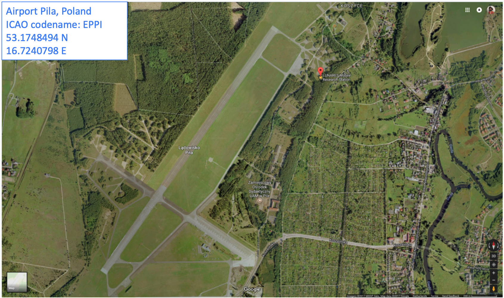

*****************
Wdrożenie systemu
*****************

System jest aktywnie działającym oprogramowaniem, które znajduje zastosowanie w bazie kosmicznej. Poza tym jest również projektem badawczym, który pozwala na rozpoznanie problemów charakterystycznych dla prowadzenia misji eksploracyjnych głębokiej przestrzeni kosmicznej. Aplikację można wykorzystać w nowoczesnym i inteligentnym budownictwie przy zarządzaniu czujnikami, analizie danych i wykrywaniu anomalii. Obecne rozwiązania dostępne na rynku nie pozwalają na podejście holistyczne scalające informacje biomedyczne wraz z danymi środowiskowymi oraz kontrolą budynku.

Wybór jednostki badawczej
=========================
System został wdrożony w polskim habitacie znajdującym się na terenie byłego lotniska wojskowego (*ICAO: EPPI*, :numref:`figure-process-lunares-map`) w Pile 100 km na północ od Poznania. Powodem wdrożenia systemu w tej placówce było bezpośrednie zaangażowanie autora pracy w tworzenie bazy kosmicznej oraz przygotowanie symulacji.

    Mapa satelitarna lotniska w Pile z zaznaczoną lokalizacją umiejscowienia habitatu. Źródło: *Google Maps*.

Autor pracy brał udział w trzech symulacjach misji kosmicznych w charakterze astronauty. Ponadto uczestniczył w czterech misjach w roli *CAPCOM* (osoba komunikująca się z astronautami) jak również operatora centrum kontroli misji (ang. *Mission Control Center*, *MCC*) oraz głównego badacza (ang. *Primary Investigator*, *PI*).

Doświadczenie zdobyte w trakcie uczestnictwa w symulacjach zarówno jako członek *MCC* jak i astronauta pozwoliło na zaprojektowanie oraz stworzenie systemu dedykowanego do rozwiązania realnie istniejących problemów w tej placówce naukowej.

Habitat (:numref:`figure-process-lunares-outside`, :numref:`figure-process-lunares-inside`), jest budynkiem posiadającym na chwilę obecną ponad 220 inteligentnych sensorów, tj. czujniki dymu, CO2, czujniki temperatury i wilgotności względnej, otwarcia zaworów, otwarcia drzwi, kontrolerów oświetlenia, itp. pozwalających na stałe monitorowanie parametrów środowiskowych. Uczestnicy zamykani są na dwutygodniowe symulacje misji kosmicznych, podczas których zbierane są dodatkowo dane biomedyczne. Charakter izolacji pozwala na lepszą jakość danych oraz mniejszą liczbę szumu. Jest to sytuacja pożądana w przypadku rozwoju systemu w trakcie jego wykorzystania.

.. figure:: img/lunares-outside.png
    :name: figure-process-lunares-outside

    Zdjęcie z wykorzystaniem bezpilotowego statku powietrznego przedstawiające habitat z lotu ptaka. Zdjęcie wykonano 8 sierpnia 2018 r. Źródło: John Trzinski. :cite:`Trzinski2018`

.. figure:: img/lunares-inside.jpg
    :name: figure-process-lunares-inside

    Zdjęcie wnętrza habitatu zrobione w sierpniu 2018 roku.

Metody wdrożenia systemu
========================
System został wdrożony w habitacie w 2017 roku. Od czasu uruchomienia aplikacja działa bezawaryjnie i nie zdarzyły się przypadki braku dostępu ani utraty danych. Przy jego wykorzystaniu przeprowadzono 4 misje, podczas których projekt był wsparciem dla innych systemów oraz 2 misje korzystające wyłącznie z niego. W każdej dwutygodniowej misji brało udział 6 analogowych astronautów różnych narodowości oraz drugie tyle osób w *MCC*.

Od strony użytkownika do korzystania z systemu wymagane jest posiadanie wyłącznie nowoczesnej przeglądarki internetowej. Ze względu na zastosowanie technologii sieci *web* wdrożenie systemu sprowadzało się jedynie do podania adresu internetowego, założenia imiennych kont oraz szkolenia uczestników symulacji z użytkowania systemu.

Od strony serwerowej do uruchomienia systemu konieczna jest instalacja platformy *Docker*. Oprogramowanie to dostępne jest na dowolną dystrybucję systemu *Linux* oraz najnowsze wersje *macOS*. Istnieje możliwość uruchomienia aplikacji na serwerowej edycji systemu *Windows*, lecz nie jest to oficjalnie wspierane rozwiązanie.

Wersja systemu, która wykorzystywana jest w projekcie uruchomiono na platformie chmurowej o nazwie *Heroku*. Usługa ta zapewnia kontener uruchomieniowy *Docker* oraz stabilną i dostępną bazę danych. Codziennie o północy wykonywana jest automatyczna kopia zapasowa.

Dostęp do systemu
=================
Każdemu z użytkowników założono konta imienne oraz wygenerowano tymczasowe hasło, które musiało zostać zmienione przy pierwszym logowaniu.

Sprawdzanie uprawnień w systemie polega na weryfikacji przynależności do grup. Członkom symulacji w charakterze astronautów przypisano grupę *Astronauts*. Kontrolerom *MCC* grupę odpowiednią do roli, tj.:

    - *Mission Control* (wszyscy członkowie *MCC*),
    - *Medical Doctors* (lekarze misji z dostępem do danych medycznych),
    - *Psychologists* (psychologowie z dostępem do danych psychologicznych i socjodynamicznych),
    - *Primary Investigators* (pozostali naukowcy, których eksperymenty były wykonywane podczas misji),
    - *OS Administrators* (administratorzy systemu).

Konto administratora systemu posiada nieograniczony dostęp do wszystkich danych w systemie. Przed rozpoczęciem misji służy jedynie do wstępnej inicjacji profili użytkowników i nadania im tymczasowego hasła. Na czas misji ze względów bezpieczeństwa konto jest wyłączane, a dostęp do niego blokowany. W przypadku awarii możliwe jest przywrócenie konta w celu usunięcia niepożądanych skutków.

Szkolenia dla uczestników symulacji
===================================
Przed każdą misją uczestnicy symulacji zarówno z *MCC* jak i astronauci byli przeszkoleni w zakresie obsługi systemu. Szkolenie trwało 60 minut i kończyło się stworzeniem profilu dla użytkownika.

Podczas szkolenia poruszano tematy związane z użytkowaniem systemu, wprowadzaniem danych i wymagalnością pól, systemem czasu i synchronizacji zegarów, opóźnień komunikacyjnych oraz możliwości generowania wykresów dla parametrów środowiskowych.

W trakcie jednej z symulacji system był wykorzystywany również przez osobę niewidomą wykorzystującą czytnik ekranu. Astronauta ten nie miał problemów z poruszaniem się po aplikacji i wprowadzaniem danych. Uwagi dotyczące użyteczności ekranów zostały uwzględnione w kolejnych poprawkach do systemu.
