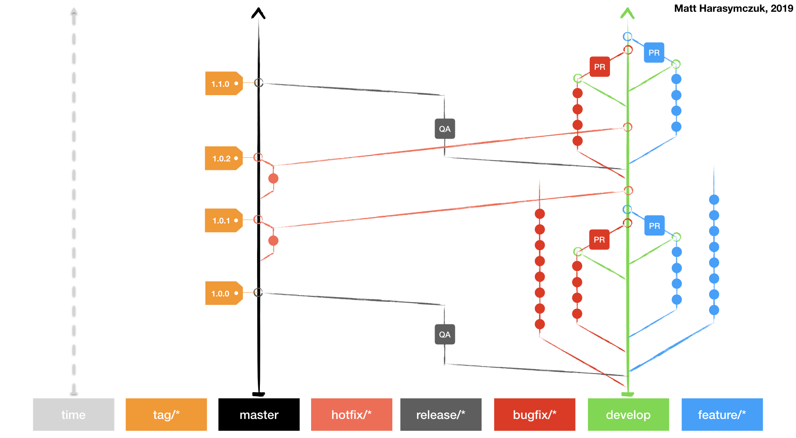

*******
Summary
*******

Agility
=======
.. figure:: img/agility-v1.png
    :scale: 50%
    :align: center

.. figure:: img/agility-v2.png
    :scale: 50%
    :align: center

Scrum
=====

Ecosystem
=========
.. figure:: img/ecosystem-big-picture.png
    :scale: 50%
    :align: center

.. figure:: img/ecosystem-tools.png
    :scale: 50%
    :align: center

Docker
======
.. figure:: img/docker-container-layers.png
    :scale: 50%
    :align: center

Git and Git Flow in CI/CD
=========================

.. figure:: img/gitflow-github.png
    :scale: 50%
    :align: center

.. figure:: img/gitflow-lean.png
    :scale: 50%
    :align: center

.. figure:: img/gitflow-pull-request.png
    :scale: 50%
    :align: center

CI/CD
=====
.. figure:: img/cicd-pipeline.png
    :scale: 50%
    :align: center

.. figure:: img/cicd-failing.png
    :scale: 50%
    :align: center

.. figure:: img/cicd-success.png
    :scale: 50%
    :align: center

.. figure:: img/cicd-strategy.png
    :scale: 50%
    :align: center

Testing
=======
.. figure:: img/testing-mutation-1.jpg
    :scale: 50%
    :align: center

.. figure:: img/testing-mutation-2.png
    :scale: 50%
    :align: center

.. figure:: img/testing-mutation-3.jpg
    :scale: 50%
    :align: center
