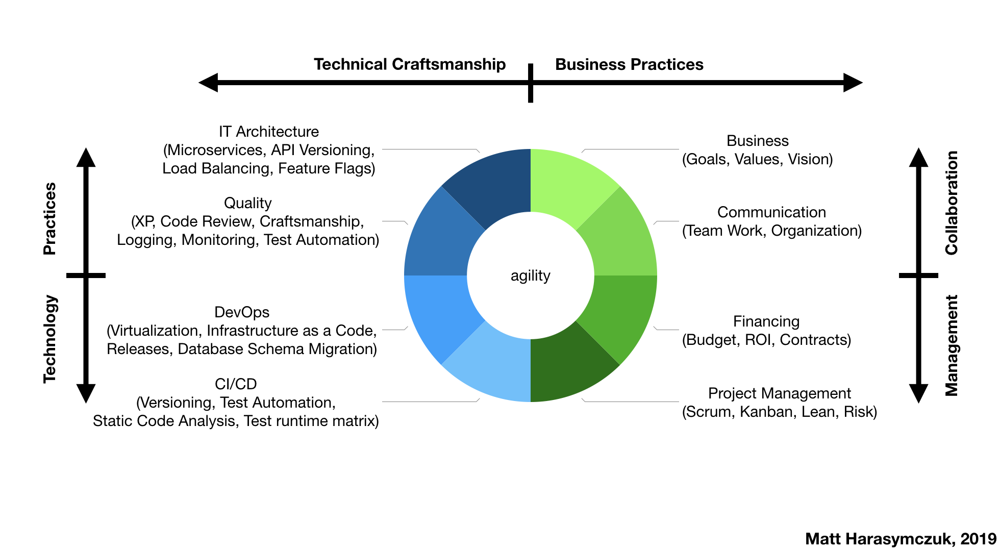

***********************************************
Standardy zarządzania projektem i pracą zespołu
***********************************************

Agile można rozumieć jako sześć spójnych i łączących się dyscyplin:

* miękkie:

    * zarządzanie projektami,
    * biznes i produkty,
    * komunikacja i organizacja,

* techniczne:

    * devops,
    * architektura IT,
    * jakość i praktyki.

    Agility is achieved only by combining Business Practices and Technical Craftsmanship. Agile is not only about Scrum.

Firma dostrzegając zalety wytwarzania oprogramowania w sposób zwinny wprowadził usprawnienia w swoim procesie mające na celu umiejscowienie go w czołówce firm IT. Metodyki prowadzenia projektów i współpracy tj. Scrum i Kanban pozwalają firmie dostarczać wartość zamawiającemu zgodną z jego oczekiwaniem.

U podstaw adaptacji powyższych szkieletów organizacyjnych leży iteracyjność oraz stała współpraca z klientem. Do codziennych zastosowań stosowane jest połączenie metodyk Scrum i Kanban w zależności od projektu oraz zapotrzebowania.

W Agile w wytwarzaniu oprogramowania nacisk kładziony jest na dostarczanie software'u dostosowanego do potrzeb klienta w stałej współpracy z nim. W porównaniu z tradycyjnymi metodykami zarządzania projektami podejście to cechuje się odpowiedzią na zmiany wymagań, priorytetów oraz zakresów w trakcie trwania projektu.

Scrum jest systemem zarządzania pracą oraz frameworkiem komunikacyjnym. System ten przyjął się na świecie jako najpopularniejszy sposób prowadzenia projektów informatycznych. Obecnie wykorzystują go największe firmy z branży IT i nie tylko.


W myśl SCRUMu, oprogramowanie wytwarzane jest iteracyjnie i przyrostowo, a projekt jest podzielony na mniejsze, tygodniowe lub dwu tygodniowe fazy, zwane iteracjami lub Sprintami, następujące bezpośrednio po sobie.

Podstawowym celem metodyki SCRUM jest zatem kreowanie wartości na każdym ze stadiów przygotowania i realizowania projektu, mając na uwadze jego indywidualną specyfikę interakcje i współpracę z Klientami, dynamicznie zmieniające się otoczenie i dostosowywanie się do zmian oraz potencjał ludzki.

W Firmie zespoły odpowiedzialne za rozwój oprogramowania tworzą samoorganizujący i wielofunkcyjny zespół, tzw. SCRUM Team, w którego w skład wchodzą: Product Owner, Development Team, SCRUM Master.

Podczas planowania uczestnicy spotkania podejmują decyzje, które zadania będą wchodziły następnej iteracji, a co za tym idzie, jakie funkcjonalności zostaną oddane po kolejnym przyroście. Spotkanie w zależności od trwania Sprintu trwa od 2 do 4 godzin. Jego celem jest ustalenie w jaki sposób zostanie wyprodukowana część oprogramowania – precyzuje się dużo drobnych zadań, członkowie zespołu sami wybierają zadania dla siebie i na każde z nich przeznaczają maksymalnie 2 dni.

Aby uzyskać jak najlepsze wsparcie dla zwinnego wytwarzania oprogramowania Firma wdrożyła system JIRA. Oprogramowanie to pozwala na tworzenie tzw. Backlogów czyli spriorytetyzowanych list zadań oraz dzielenie ich na poszczególne Sprinty - iteracje. JIRA pozwala na podgląd zarówno, krótkoterminowych zadań operacyjnych jak i wizji długoterminowej całego projektu. Dzięki jej zastosowaniu zespoły dostały do dyspozycji narzędzie, które pozwala im na pracę wg. wymagań biznesowych i częste rozliczenie się z klientem.

Agile
=====
Filozofię Agile w prowadzeniu projektu najlepiej definiują 4 cechy stanowiące główne przesłanie tego podejścia a będące jego manifestem:

* ludzie i interakcje ponad procesy i narzędzia,
* działające oprogramowanie ponad obszerną dokumentację,
* współpraca z klientem ponad formalne ustalenia,
* reagowanie na zmiany ponad podążanie za planem.

Pełna treść manifestu Agile znajduje się w osobnym załączniku do tego dokumentu.

Scrum
=====

Scrum jest systemem zarządzania pracą oraz frameworkiem komunikacyjnym. System ten przyjął się na świecie jako najpopularniejszy sposób prowadzenia projektów informatycznych. Obecnie wykorzystują go największe firmy z branży IT i nie tylko.

W myśl SCRUMu, oprogramowanie wytwarzane jest iteracyjnie i przyrostowo, a projekt jest podzielony na mniejsze, tygodniowe lub dwu tygodniowe fazy, zwane iteracjami lub Sprintami, następujące bezpośrednio po sobie. Cały proces produkcji oparty jest na 3 filarach:

* Przezroczystości - istotne informacje widoczne są dla odpowiedzialnych osób oraz stosowany jest wspólny język,
* Weryfikacji - dokonuje się regularnych przeglądów postępów prac, wyszukiwania artefaktów oraz identyfikacji wszelkich odchyleń,
* Adaptacji - dotyczy procesu i produktów, wprowadzana jest natychmiast.

Podstawowym celem metodyki SCRUM jest zatem kreowanie wartości na każdym ze stadiów przygotowania i realizowania projektu, mając na uwadze jego indywidualną specyfikę, interakcje i współpracę z Klientami, dynamicznie zmieniające się otoczenie i dostosowywanie się do zmian oraz potencjał ludzki.

..  figure:: ../_img/scrum-week-01.png
    :scale: 100%
    :align: center

    Rozłożenie spotkań w tygodniu pracy zespołu SCRUM.

Scrum precyzyjnie określa sposób współpracy biznesu z IT w ramach projektu lub/i konkretnego modułu aplikacji. Scrum definiuje pięć rodzajów spotkań:

* Sprint Planning,
* Backlog Refinement,
* Sprint Review,
* Retrospective,
* Daily Scrum.

Celem organizowania tych wydarzeń jest zapewnienie regularności w komunikacji wewnątrz SCRUM Teamu, minimalizacja ilości spotkań, zachowanie przezroczystości, weryfikacja oraz adaptacja. Ważną cechą spotkań jest ograniczenie czasowe.

Scrum sprawdza się wszędzie tam, gdzie jesteśmy w stanie stworzyć rejestr zmian oraz listę funkcjonalności do wprowadzenia w projekcie tzw. backlog. Dzięki niemu oraz priorytetyzacji poszczególnych elementów listy zespół ma świadomość wagi oraz kolejności wprowadzania poprawek do oprogramowania. Pracę można zaplanować a oddawanie kolejnych kawałków aplikacji odbywa się w krótkich przyrostach tj. tygodniowe lub dwutygodniowe sprinty. Należy podkreślić, że implementacja części zasad SCRUMa nie jest SCRUMem.

Wszystkie pojęcia związane z tą metodyką, tj. Scrumem, znajdują się w osobnym załączniku w tym dokumencie.
