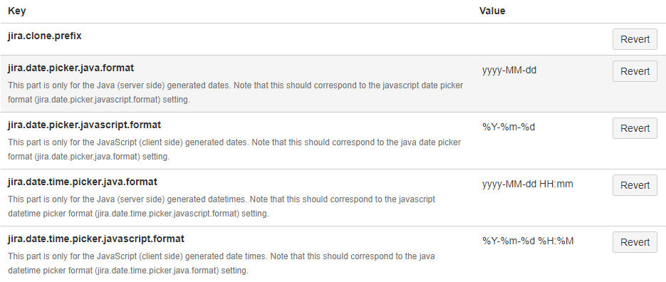

Konfiguracja
============
- Skrót klawiszowy ``gg``

Scheme
------
- Issue Type Schemes
- Workflow Scheme
- Screen Scheme
- Field Configuration Scheme
- Permission Scheme
- Notification Scheme
- Priority Scheme

Konfiguracja Jiry
-----------------
- Time Tracking
- Priorytetyzacja i dobre praktyki
- Estymacja różnych issuetype (nie tylko Story)
- Re-index
- Application Links
- Zaawansowane opcje konfiguracyjne
- Zmiana formatu daty

    Zmiana formatu daty w zaawansowanych opcjach konfiguracyjnych

Jira Administration
-------------------
- Zarządzanie licencjami
- Backup systemu
- Tworzenie instancji testowych
- Instalacja i upgrade + dobre praktyki
- Tunning JVM pod Jirę
- Dobre praktyki z Custom

Tworzenie Custom Field
----------------------
- Dobre praktyki
- Ile?
- Konsekwencje
- CF w bazie dancyh
- Javascript w opisie (nie używać)

Dirty hacks
-----------
- Manipulacje na bazie
- Django Inspect DB + Jira = Django ORM
- Skryptowanie
- Time tracking

Pluginy
-------
- Kiedy instalować
- Licencje pluginów
- Różnice między pliginami w Cloud a Server

    - Atlassian Connect vs p2

- Stategia update'ów

    - pluginy darmowe
    - pluginy komercyjne

- Instalacja dodatkowych języków
- Pluginy a wykorzystywane zasoby:

    - Pamięć RAM
    - Baza danych
    - System operacyjny
    - Zasoby sieciowe

- ``Jira Agile Cards``
- Dane pluginów w bazie danych Jiry

Assignments
-----------

Prosta Administracja
^^^^^^^^^^^^^^^^^^^^
#. Wyłącz obsługę gravatar
#. Włącz obsługę Attachmentów
#. Ustaw maksymalny rozmiar attachmentów na 100 MB

Priorytety
^^^^^^^^^^
#. Zmień priorytety na MoSCoW, zmień ikony i kolory (czerwony, zielony, szary)

Role
^^^^
#. Dodaj rolę "Scrum Master"
#. Dodaj do roli w projekcie użytkownika z JIRY
#. Zmień w Permission scheme, aby tylko Scrum Master mógł otwierać i zamykać sprinty

Custom Field
^^^^^^^^^^^^
#. Stwórz Custom Field "People Assigned":

    - W polu mamy mieć możliwość przypisywania wielu użytkowników do zadania
    - Pole dodaj ekranu dla zadań w projekcie
    - Stwórz filtr który wyszuka zadania w których jesteś wymieniony w tym Custom Field
    - Na podstawie filtru stwórz tablicę Kanban, z zadaniami które są do Ciebie przypisane w tym Custom Fieldzie
    - Pole ma wyświetlać się w widoku Backlog w kolumnie po prawej stronie
    - Podpowiedź: typ ``User Picker (Multiple Users)``

#. Stwórz Custom Field "Team Assigned":

    - Dodaj 4 zespoły: Team A, Team B, Team C, Team D
    - Można wybrać więcej niż jeden zespół
    - Pole dodaj ekranu dla zadań w projekcie
    - Pole ma być wymagane przy tworzeniu nowego zadania
    - Podpowiedź: typ ``Checkbox``

#. Stwórz Custom Field "Manhours":

    - Pole dodaj ekranu dla zadań w projekcie
    - Stwórz nowy board do projektu z estymacją w Manhours
    - Stwórz filtr, który wyciągnie wszystkie zadania z projektu
    - Na filtrze mają być kolumny: Key, Summary, Original Time Estimate, Manhours, Status
    - Podpowiedź: typ ``Number``

