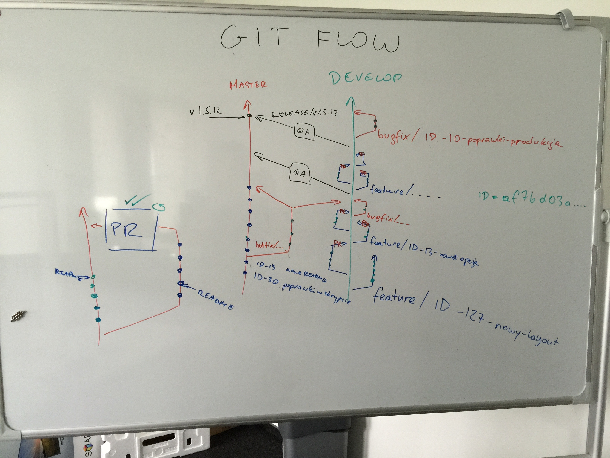

GIT Flow
========

    GIT Flow

.. figure:: ../../img/build-strategy.jpg
    :scale: 100%
    :align: center

    Build Strategy

Konwencje nazewnicze
~~~~~~~~~~~~~~~~~~~~

-  ``master``
-  ``develop``
-  ``release/1.5``
-  ``feature/ID-1337-short-summary``
-  ``bugfix/ID-1337-short-summary``
-  commit message: ``"ID-1337 short summary"``

Więcej szczegółów w http://arch.astrotech.io -> `Proces wytwarzania oprogramowania` -> `Wersjonowanie` -> `git-flow`
