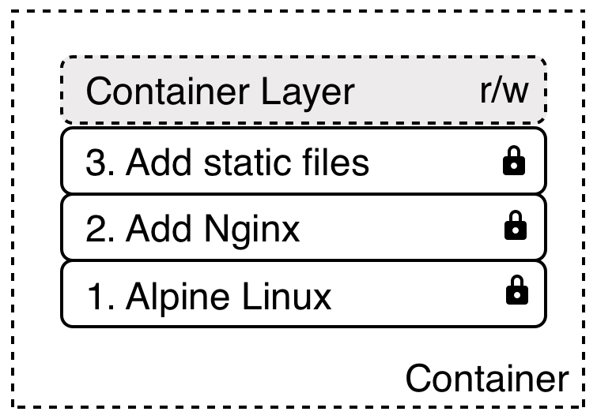
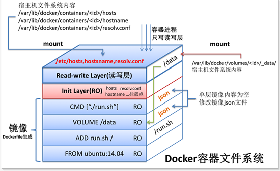

Docker
======

What is docker?
---------------
.. figure:: ../../img/docker-vs-lxc.png
    :scale: 50%
    :align: center

    Docker vs LXC

Installing
----------
- `macOS <https://docs.docker.com/docker-for-mac/install/>`_
- `Ubuntu <https://docs.docker.com/engine/getstarted/linux_install_help/>`_
- `Linux <https://docs.docker.com/engine/installation/>`_
- `Windows <https://docs.docker.com/docker-for-windows/>`_

Install docker from terminal
^^^^^^^^^^^^^^^^^^^^^^^^^^^^
* https://get.docker.com

.. code-block:: console

    curl -fsSL get.docker.com -o get-docker.sh
    sh get-docker.sh

Requirements for workshop
^^^^^^^^^^^^^^^^^^^^^^^^^
.. code-block:: console

    docker pull python:3.7 \
        && docker pull postgres \
        && docker pull ubuntu \
        && docker pull bash

Nomenclature
------------
* Container (How to run your application)
* Image (How to store your application)
* Layer
* LTS version
* Edge version
* Host

.. figure:: ../../img/docker-layer-images.png
    :scale: 50%
    :align: center

    Layers

.. figure:: ../../img/docker-layers.png
    :scale: 50%
    :align: center

    Layers

    Container Layers

    Container Layers

CLI - Command Line Interface
----------------------------

Docker Management commands
^^^^^^^^^^^^^^^^^^^^^^^^^^
.. code-block:: text

      checkpoint  Manage checkpoints
      config      Manage Docker configs
      container   Manage containers
      image       Manage images
      network     Manage networks
      node        Manage Swarm nodes
      plugin      Manage plugins
      secret      Manage Docker secrets
      service     Manage services
      stack       Manage Docker stacks
      swarm       Manage Swarm
      system      Manage Docker
      trust       Manage trust on Docker images
      volume      Manage volumes

Docker commands
^^^^^^^^^^^^^^^
.. code-block:: text

      attach      Attach local standard input, output, and error streams to a running container
      build       Build an image from a Dockerfile
      commit      Create a new image from a container's changes
      cp          Copy files/folders between a container and the local filesystem
      create      Create a new container
      deploy      Deploy a new stack or update an existing stack
      diff        Inspect changes to files or directories on a container's filesystem
      events      Get real time events from the server
      exec        Run a command in a running container
      export      Export a container's filesystem as a tar archive
      history     Show the history of an image
      images      List images
      import      Import the contents from a tarball to create a filesystem image
      info        Display system-wide information
      inspect     Return low-level information on Docker objects
      kill        Kill one or more running containers
      load        Load an image from a tar archive or STDIN
      login       Log in to a Docker registry
      logout      Log out from a Docker registry
      logs        Fetch the logs of a container
      pause       Pause all processes within one or more containers
      port        List port mappings or a specific mapping for the container
      ps          List containers
      pull        Pull an image or a repository from a registry
      push        Push an image or a repository to a registry
      rename      Rename a container
      restart     Restart one or more containers
      rm          Remove one or more containers
      rmi         Remove one or more images
      run         Run a command in a new container
      save        Save one or more images to a tar archive (streamed to STDOUT by default)
      search      Search the Docker Hub for images
      start       Start one or more stopped containers
      stats       Display a live stream of container(s) resource usage statistics
      stop        Stop one or more running containers
      tag         Create a tag TARGET_IMAGE that refers to SOURCE_IMAGE
      top         Display the running processes of a container
      unpause     Unpause all processes within one or more containers
      update      Update configuration of one or more containers
      version     Show the Docker version information
      wait        Block until one or more containers stop, then print their exit codes

Containers
----------

Searching
^^^^^^^^^
* https://hub.docker.com

.. code-block:: console

    docker search NAME

Pulling from Docker Hub
^^^^^^^^^^^^^^^^^^^^^^^
* Only pull, not run

.. code-block:: console

    docker pull NAME
    docker pull ubuntu  # will pull latest
    docker pull ubuntu:latest
    docker pull ubuntu:18.10

Run containers
^^^^^^^^^^^^^^
* Check ``hostname``
* Check ``PS1`` (bash prompt)
* Will pull automatically

.. code-block:: console

    docker run bash

* ``-t`` - run pseudo terminal and attach to it
* ``-i`` - interactive, keeps stdin open
* ``--rm`` - Automatically remove the container when it exits

.. code-block:: console

    docker run -it bash

* ``ctrl + p + q`` - quit container without stopping it
* ``ctrl + d`` - exits and stops the container

.. code-block:: console

    docker run -it ubuntu:latest bash

* ``-d`` - daemon (runs in the background)

.. code-block:: console

    docker run -d -it ubuntu:latest bash

* ``--name`` - named container

.. code-block:: console

    docker run -d -it --name bash ubuntu:latest bash

Show containers
^^^^^^^^^^^^^^^
* show running:

    .. code-block:: console

        docker ps

* Show all containers, even not running:

    .. code-block:: console

        docker ps -a

Attach to running containers
^^^^^^^^^^^^^^^^^^^^^^^^^^^^
* Attach local standard input, output, and error streams to a running container:

    .. code-block:: console

        docker attach CONTAINER_NAME_OR_ID

* Attach to running container and execute bash

    .. code-block:: console

        docker exec -u 0 -it CONTAINER_NAME_OR_ID bash

What application is running inside the container?
^^^^^^^^^^^^^^^^^^^^^^^^^^^^^^^^^^^^^^^^^^^^^^^^^
.. code-block:: console

    docker top CONTAINER_NAME_OR_ID

Stop containers
^^^^^^^^^^^^^^^
* Filesystem inside container is ephemeral (it will be deleted after stop)

.. code-block:: console

    docker stop CONTAINER_NAME_OR_ID

.. code-block:: console

    docker kill CONTAINER_NAME_OR_ID

Remove container
^^^^^^^^^^^^^^^^
.. code-block:: console

    docker rm IMAGE

Images
------

Build images
^^^^^^^^^^^^
.. code-block:: console

    docker build -t docker .

List images
^^^^^^^^^^^
.. code-block:: console

    docker images

Remove images
^^^^^^^^^^^^^
.. code-block:: console

    docker rmi IMAGE

Volumes
-------
* A data volume is a specially-designated directory within one or more containers that bypasses the Union File System.
* Data volumes provide several useful features for persistent or shared data:

    - Volumes are initialized when a container is created.
    - If the container’s base image contains data at the specified mount point, that existing data is copied into the new volume upon volume initialization. (Note that this does not apply when mounting a host directory.)
    - Data volumes can be shared and reused among containers.
    - Changes to a data volume are made directly.
    - Changes to a data volume will not be included when you update an image.
    - Data volumes persist even if the container itself is deleted.

* Data volumes are designed to persist data, independent of the container’s life cycle.
* Docker therefore never automatically deletes volumes when you remove a container, nor will it “garbage collect” volumes that are no longer referenced by a container.

.. note:: You can also use the VOLUME instruction in a Dockerfile to add one or more new volumes to any container created from that image.

Creating persistent storage
^^^^^^^^^^^^^^^^^^^^^^^^^^^
.. code-block:: console

    docker run -it -v /data --name bash ubuntu:latest /bin/bash
    echo 'hello' > /data/hello.txt
    # exit with ``ctrl+q+p``

.. code-block:: console

    ls /var/lib/docker/containers/volumes/.../

Attaching local dir to docker container
^^^^^^^^^^^^^^^^^^^^^^^^^^^^^^^^^^^^^^^
* Will mount ``/tmp/my_host`` from host to ``/data`` inside container

.. code-block:: console

    docker run -v <host path>:<container path>[:FLAG]

.. code-block:: console

    docker run -d -P --name web -v /home/myproject:/data ubuntu /bin/bash

Mount read-only filesystem
^^^^^^^^^^^^^^^^^^^^^^^^^^
.. code-block:: console

    docker run -d -P --name web -v /home/myproject:/data:ro ubuntu /bin/bash

Creating Volumes
^^^^^^^^^^^^^^^^
.. code-block:: console

    docker volume create -d flocker --opt o=size=20GB myvolume
    docker run --detach -P -v myvolume:/data --name web ubuntu /bin/bash

Volume container
^^^^^^^^^^^^^^^^
.. code-block:: console

    docker create -v /dbdata --name dbstore training/postgres /bin/true
    docker run --detach --volumes-from dbstore --name db1 training/postgres

Docker network
--------------
* https://docs.docker.com/network/bridge/

- ``bridge`` networks are best when you need multiple containers to communicate on the same Docker host.
- ``host`` networks are best when the network stack should not be isolated from the Docker host, but you want other aspects of the container to be isolated.
- ``overlay`` networks are best when you need containers running on different Docker hosts to communicate, or when multiple applications work together using swarm services.
- ``macvlan`` networks are best when you are migrating from a VM setup or need your containers to look like physical hosts on your network, each with a unique MAC address.
- Third-party network plugins allow you to integrate Docker with specialized network stacks.

.. figure:: ../../img/docker-networking.png
    :scale: 35%
    :align: center

    Docker network

Expose ports
^^^^^^^^^^^^
.. code-block:: console

    docker run -d -p 5432:5432 --name postgres postgres
    docker run -d -p 5432:5432 --name postgres postgres:10.5
    docker run -d -p 192.168.56.101:5432:5432 --name postgres postgres

Create network
^^^^^^^^^^^^^^
.. code-block:: console

    docker network create mynetwork

.. code-block:: console

    docker network create -d bridge --subnet 192.168.0.0/24 --gateway 192.168.0.1 mynetwork

.. code-block:: yaml

    version: '3'

    services:
      db:
        image: some/image
        networks:
          - mynetwork

    networks:
      mynetwork:
        external: true

List networks
^^^^^^^^^^^^^
.. code-block:: console

    docker network ls

Delete network
^^^^^^^^^^^^^^
.. code-block:: console

    docker network rm mynetwork

Connect container to network
^^^^^^^^^^^^^^^^^^^^^^^^^^^^
.. code-block:: console

    docker run --net bridge -d -p 5432:5432 --name postgres postgres

.. code-block:: console

    docker run --net mynetwork -d -p 5432:5432 --name postgres postgres

Connect running container to network
^^^^^^^^^^^^^^^^^^^^^^^^^^^^^^^^^^^^
.. code-block:: console

    docker network connect mynetwork CONTAINER_NAME_OR_ID

Inspect network
^^^^^^^^^^^^^^^
.. code-block:: console

    docker network inspect

How to make two containers talk with each other?
^^^^^^^^^^^^^^^^^^^^^^^^^^^^^^^^^^^^^^^^^^^^^^^^
- Create a new docker network and connect both containers to that network
- Containers on the same network can use the others container name to communicate with each other

.. code-block:: console

    docker network create mynetwork
    docker run -d -p 80:80 --name web mywebimage
    docker run -d --name my_service myapiimage

Dockerfile
----------
* Build an image from a ``Dockerfile``
- https://docs.docker.com/engine/reference/builder/

Creating and building ``Dockerfile``
^^^^^^^^^^^^^^^^^^^^^^^^^^^^^^^^^^^^
.. code-block:: dockerfile

    FROM python:latest
    CMD python

.. code-block:: console

    docker build -t mypython:1.0.0 .
    docker run mypython:1.0.0

.. code-block:: console

    docker build -t mypython:latest .
    docker run mypython

.. code-block:: console

    docker images

FROM
^^^^
* The FROM instruction initializes a new build stage and sets the Base Image for subsequent instructions.

.. code-block:: dockerfile

    FROM python:3.7

.. code-block:: dockerfile

    FROM python:latest

.. code-block:: dockerfile

    FROM alpine

.. code-block:: dockerfile

    FROM ubuntu
    FROM ubuntu:latest   # always current LTS
    FROM ubuntu:rolling  # released every 6 months (also LTS, if it was LTS release)
    FROM ubuntu:devel    # released every 6 months (only devel)

``RUN``
^^^^^^^
.. code-block:: dockerfile

    RUN ["/bin/bash", "-c", "echo hello"]

``CMD`` vs ``RUN``
^^^^^^^^^^^^^^^^^^
* There can only be one ``CMD`` instruction in a Dockerfile
* If you list more than one ``CMD`` then only the last ``CMD`` will take effect
* The ``RUN`` instruction will execute any commands in a new layer on top of the current image and commit the results.
* The resulting committed image will be used for the next step in the Dockerfile

``CMD`` vs ``ENTRYPOINT``
^^^^^^^^^^^^^^^^^^^^^^^^^
* The main purpose of a ``CMD`` is to provide defaults for an executing container.
* An ``ENTRYPOINT`` helps you to configure a container that you can run as an executable.

:ENTRYPOINT:
    .. code-block:: dockerfile

        FROM alpine
        ENTRYPOINT ["/bin/ping"]

    .. code-block:: console

        docker run myping 127.0.0.1

:CMD:
    .. code-block:: dockerfile

        FROM alpine
        CMD ["/bin/ping", "127.0.0.1"]

    .. code-block:: console

        docker run myping

* 127.0.0.1 will be an argument to ``ENTRYPOINT``

``EXPOSE``
^^^^^^^^^^
* The ``EXPOSE`` instruction does not actually publish the port
* It functions as a type of documentation between the person who builds the image and the person who runs the container, about which ports are intended to be published

.. code-block:: dockerfile

    EXPOSE 80/tcp
    EXPOSE 80/udp
    EXPOSE 443

``ENV``
^^^^^^^
.. code-block:: dockerfile

    ENV <key> <value>
    ENV <key>=<value> ...

.. code-block:: dockerfile

    ENV ENVIRONMENT=docker

``COPY`` vs ``ADD``
^^^^^^^^^^^^^^^^^^^
* ``ADD`` allows <src> to be a URL
* If the <src> parameter of ``ADD`` is an archive in a recognised compression format, it will be unpacked
* Best practices for writing Dockerfiles suggests using COPY where the magic of ``ADD`` is not required.

.. code-block:: console

    COPY requirements.txt /www

``VOLUME``
^^^^^^^^^^
* The ``VOLUME`` instruction creates a mount point with the specified name and marks it as holding externally mounted volumes from native host or other containers.

.. code-block:: console

    VOLUME ["/data"]

``WORKDIR``
^^^^^^^^^^^
* The ``WORKDIR`` instruction sets the working directory for any RUN, CMD, ENTRYPOINT, COPY and ADD instructions that follow it in the Dockerfile

.. code-block:: console

    WORKDIR /path/to/workdir

Run Django App in container
^^^^^^^^^^^^^^^^^^^^^^^^^^^
.. code-block:: dockerfile

    FROM python:3.7

    COPY . /data
    WORKDIR /data
    RUN pip install -r /data/requirements.txt
    ENV ENVIRONMENT docker
    EXPOSE 8000 8000/tcp

    CMD ["python", "manage.py", "runserver", "0.0.0.0:8000"]

Apache 2
^^^^^^^^
.. code-block:: dockerfile

    FROM debian:stable

    RUN apt-get update && apt-get install -y --force-yes apache2
    EXPOSE 80 443
    VOLUME ["/var/www", "/var/log/apache2", "/etc/apache2"]

    ENTRYPOINT ["/usr/sbin/apache2ctl", "-D", "FOREGROUND"]

Docker Hub
----------
- https://hub.docker.com/

Publishing
^^^^^^^^^^
.. code-block:: console

    docker build -t habitatos:1.0.0 .
    docker tag habitatos:1.0.0 astromatt/habitatos:latest

.. code-block:: console

    docker login
    docker push astromatt/habitatos:latest

.. code-block:: console

    docker image remove habitatos:1.0.0
    docker run astromatt/habitatos

Docker-compose
--------------
Compose is a tool for defining and running multi-container Docker applications.

- https://docs.docker.com/compose/django/

``Docker-compose`` ``Django`` application
^^^^^^^^^^^^^^^^^^^^^^^^^^^^^^^^^^^^^^^^^
* ``docker-compose.yaml``

.. code-block:: yaml

    version: '3'

    services:
      db:
        image: postgres
        ports:
          - "5432:5432"

      web:
        build: .
        command: python manage.py runserver 0.0.0.0:8000
        volumes:
          - .:/www
        ports:
          - "8000:8000"
        depends_on:
          - db

.. code-block:: console

    docker-compose up -d

.. code-block:: console

    docker swarm init
    docker stack deploy -c docker-compose.yml my-stack

Docker compose CI/CD ecosystem
^^^^^^^^^^^^^^^^^^^^^^^^^^^^^^
* ``docker-compose.yaml``

.. code-block:: yaml

    version: '3'

    networks:
      mynetwork:
        driver: bridge

    volumes:
      jenkins-data:

    services:

      jenkins:
        image: jenkins/jenkins
        container_name: jenkins
        restart: always
        ports:
          - "8080:8080"
        networks:
          - mynetwork
        volumes:
          - /tmp/jenkins:/var/lib/jenkins/
        depends_on:
          - sonar
          - gitlab
          - artifactory
        environment:
          - SONAR_PORT=9000

      sonar:
        image: sonarqube
        container_name: sonarqube
        restart: always
        ports:
         - "9000:9000"
         - "9092:9092"
        networks:
          - mynetwork

      gitlab:
        image: gitlab/gitlab-ce:latest
        container_name: gitlab
        restart: always
        volumes:
          - /tmp/gitlab/config:/etc/gitlab
          - /tmp/gitlab/logs:/var/log/gitlab
          - /tmp/gitlab/data:/var/opt/gitlab
        ports:
         - "443:443"
         - "80:80"
         - "2222:22"
        networks:
          - mynetwork

      artifactory:
        image: docker.bintray.io/jfrog/artifactory-oss:latest
        container_name: artifactory
        restart: always
        ports:
          - "8081:8081"
        networks:
          - mynetwork

.. code-block:: console

    docker-compose up -d

Visualizing docker container
----------------------------
* https://portainer.io

Limiting resources
------------------
* https://docs.docker.com/config/containers/resource_constraints/#--memory-swap-details

Where docker store containers
-----------------------------
* ``docker info``
* ``/var/lib/docker/containers``

Kubernetes
----------
* Kubernetes is a framework for building distributed platforms
* Master node
* Cluster
* https://www.youtube.com/watch?v=_vHTaIJm9uY&list=PLF3s2WICJlqOiymMaTLjwwHz-MSVbtJPQ

Deploying
^^^^^^^^^
* Automatic health checks
* Autohealing
* Rollback deployment

Scaling
^^^^^^^
* Services
* Load ballancing
* Same machine or different machines
* Scaling container within Service

Monitoring
^^^^^^^^^^

Swarm
-----

Mesos
-----

Assignments
-----------

Ehlo World
^^^^^^^^^^
#. Zainstaluj ``Docker``
#. Czym różni się ``Docker`` od ``Vagrant``?
#. Wyświetl ``Ehlo World!`` z wnętrza kontenera ``Docker``
#. Wyświetl listę działających kontenerów ``Docker``

Create container and run
^^^^^^^^^^^^^^^^^^^^^^^^
#. Ściągnij repozytorium https://github.com/AstroTech/sonarqube-example-java-maven-junit
#. Zbuduj projekt za pomocą ``mvn install``
#. Przygotuj obraz oraz uruchom aplikację wykorzystując ``Docker``
#. Użyj pliku ``Dockerfile`` do opisu środowiska kontenera

Dockerfile
^^^^^^^^^^
#. Na bazie czystego Ubuntu stwórz własnt kontener dla ``PostgreSQL``

Docker Compose
^^^^^^^^^^^^^^
#. Ściągnij repozytorium https://github.com/AstroTech/sonarqube-example-java-maven-junit
#. Zbuduj projekt za pomocą ``mvn install``
#. Przygotuj obraz oraz uruchom aplikację wykorzystując ``Docker``
#. Użyj pliku ``docker-compose.yaml`` do opisu środowiska kontenera
