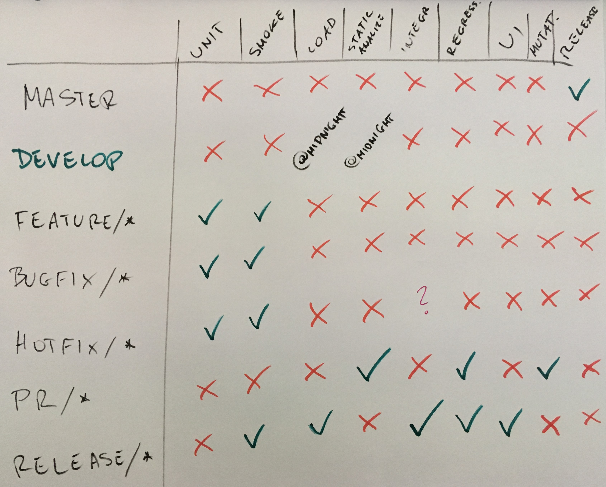

Jenkins
=======
- https://jenkins.io/
- https://jenkins.io/doc

.. figure:: img/devops-continuous.png
    :scale: 75%
    :align: center

    Continuous Integration -> Continuous Delivery -> Continuous Deployment

Jenkins in Devtools Ecosystem
-----------------------------
.. figure:: img/ecosystem-big-picture-01.png
    :scale: 50%
    :align: center

    Ecosystem Big Picture

Architecture
------------
- Local executors (default: 2)
- Remote workers via SSH and labels
- Docker build
- New UI (Blue Ocean) currently accessible as a plugin, but soon to be default
- Jenkins uses Groovy scripts in ``Jenkinsfile`` in repository main directory

Administration
--------------

User Management
^^^^^^^^^^^^^^^
- Always use LDAP (OpenLDAP or Active Directory)
- name groups as ``jenkins-users`` or ``jenkins-administrators``
- local administrator ``jenkins-administrator`` only for fixing bugs with LDAP
- use ``jenkins@example.com`` (for easy email fiterling)
- use ``jenkins.example.com`` as domain name with Firewall blocking external access

Plugin installation
^^^^^^^^^^^^^^^^^^^
- Dependencies hell
- Plugin support (especially those free ones)
- Open Source plugins
- Plugin and upgrades
- Once given out, cannot be easily taken away

Build Triggers
^^^^^^^^^^^^^^
- Build after other projects are built
- Build periodically
- GitHub hook trigger for GITScm polling
- Poll SCM
- Trigger builds remotely (e.g., from scripts via REST API) - https://wiki.jenkins.io/display/JENKINS/Remote+access+API

.. code-block:: console

    curl -X POST http://localhost:8080/job/JOB_NAME/build \
      --user USER:TOKEN \
      --data-urlencode json='{"parameter": [{"name":"id", "value":"123"}, {"name":"verbosity", "value":"high"}]}'

Notifications
-------------
- Email
- Slack / HipChat
- IRC

SonarScanner
------------
- https://docs.sonarqube.org/display/SCAN/Analyzing+with+SonarQube+Scanner
- https://sonarsource.bintray.com/Distribution/sonar-scanner-cli/sonar-scanner-cli-3.0.3.778-linux.zip
- SonnarScanner requires Java 8
- https://docs.sonarqube.org/display/PLUG/Java+Plugin+and+Bytecode
- https://docs.sonarqube.org/display/SONAR/Analysis+Parameters

If your code is in other version:

.. code-block:: properties

    # Required metadata
    sonar.projectKey=MyProject
    sonar.projectName=MyProject
    sonar.projectVersion=1.0

    sonar.sources=src/main/java
    sonar.java.binaries=target/classes

    # java version used by source files:
    sonar.java.source=7

Large repos
-----------
- is a sign of git missuse, and should be tackled with GIT LFS
- Use command line git rather than jGit
- command line git handles memory better
- Use reference repository (bare)
- Shallow clone (GIT from 1.9+ can push from shallow clones)
- Don't fetch tags
- Narrow refspec - only clone specific branches (honor refspec on initial clone)
- Pipeline stash / unstash (sparse checkout on master node, and then stash checkout, and unstash on remotes)
- Sparse checkout (Subset of working tree - single directory [exclude or include on per file basis])

Blue Ocean
----------
- New UI
- Interoperable with old UI
- Accessible at ``/blue/`` in the URL after "Blue Ocean" plugin installation.
- Pipeline editor

Environment Variables
---------------------
.. csv-table::
    :header-rows: 1

    "Variable", "Description"
    "BUILD_NUMBER", "The current build number, such as '153'"
    "BUILD_ID", "The current build id, such as ``2005-08-22_23-59-59`` (YYYY-MM-DD_hh-mm-ss, defunct since version 1.597)"
    "BUILD_URL", "The URL where the results of this build can be found (e.g. ``http://localhost:8080/job/MyJobName/1337/``)"
    "NODE_NAME", "The name of the node the current build is running on. Equals ``master`` for master node."
    "JOB_NAME", "Name of the project of this build. This is the name you gave your job when you first set it up. It's the third column of the Jenkins Dashboard main page."
    "BUILD_TAG", "String of ``jenkins-${JOB_NAME}-${BUILD_NUMBER}``. Convenient to put into a resource file, a jar file, etc for easier identification."
    "JENKINS_URL", "Set to the URL of the Jenkins master that's running the build. This value is used by Jenkins CLI for example"
    "EXECUTOR_NUMBER", "The unique number that identifies the current executor (among executors of the same machine) that's carrying out this build. This is the number you see in the 'build executor status', except that the number starts from 0, not 1."
    "JAVA_HOME", "If your job is configured to use a specific JDK, this variable is set to the ``JAVA_HOME`` of the specified JDK. When this variable is set, ``PATH`` is also updated to have ``$JAVA_HOME/bin``."
    "WORKSPACE", "The absolute path of the workspace."
    "SVN_REVISION", "For Subversion-based projects, this variable contains the revision number of the module. If you have more than one module specified, this won't be set."
    "CVS_BRANCH", "For CVS-based projects, this variable contains the branch of the module. If CVS is configured to check out the trunk, this environment variable will not be set."
    "GIT_COMMIT", "For Git-based projects, this variable contains the Git hash of the commit checked out for the build (like ``ce9a3c1404e8c91be604088670e93434c4253f03``) (all the ``GIT_*`` variables require git plugin)"
    "GIT_URL", "For Git-based projects, this variable contains the Git url (like ``git@github.com:user/repo.git`` or ``https://github.com/user/repo.git``)"
    "GIT_BRANCH", "For Git-based projects, this variable contains the Git branch that was checked out for the build (normally ``origin/master``)"

Groovy syntax
-------------
.. literalinclude:: code/groovy-variable.groovy
    :language: groovy
    :caption: Variable

.. literalinclude:: code/groovy-contitional.groovy
    :language: groovy
    :caption: Conditional

.. literalinclude:: code/groovy-control-structure.groovy
    :language: groovy
    :caption: Control structure

.. literalinclude:: code/groovy-function.groovy
    :language: groovy
    :caption: Function

.. literalinclude:: code/groovy-class.groovy
    :language: groovy
    :caption: Class

.. literalinclude:: code/groovy-loop.groovy
    :language: groovy
    :caption: Loop

.. literalinclude:: code/groovy-import.groovy
    :language: groovy
    :caption: Import

.. literalinclude:: code/groovy-exception.groovy
    :language: groovy
    :caption: Exception

.. literalinclude:: code/groovy-http.groovy
    :language: groovy
    :caption: Rest API HTTP queries

``Jenkinsfile`` - Pipeline model definition
-------------------------------------------
- https://jenkins.io/doc/book/pipeline/jenkinsfile/
- https://jenkins.io/doc/pipeline/steps/
- https://jenkins.io/doc/tutorials/building-a-multibranch-pipeline-project/
- http://localhost:8080/pipeline-syntax/
- http://localhost:8080/pipeline-syntax/globals#currentBuild
- http://localhost:8080/pipeline-syntax/globals#env
- ``Jenkinsfile``
- Bundled with Blue Ocean
- ``declarative-linter`` validate before running job
- The first line of a Jenkinsfile should be #!/usr/bin/env groovy
- Automatically create Pipelines for all Branches and Pull Requests
- Code review/iteration on the Pipeline
- Audit trail for the Pipeline
- Single source of truth for the Pipeline, which can be viewed and edited by multiple members of the project.

.. figure:: img/ecosystem-jenkins-pipeline.png
    :scale: 75%
    :align: center

    Pipeline model definition plugin

Sample ``Jenkinsfile``:

.. literalinclude:: code/jenkinsfile-simple.groovy
    :language: groovy
    :caption: Simple

.. literalinclude:: code/jenkinsfile-example.groovy
    :language: groovy
    :caption: Example

.. literalinclude:: code/jenkinsfile-test.groovy
    :language: groovy
    :caption: Test

.. literalinclude:: code/jenkinsfile-build.groovy
    :language: groovy
    :caption: Build

.. literalinclude:: code/jenkinsfile-deploy.groovy
    :language: groovy
    :caption: Deploy

.. literalinclude:: code/jenkinsfile-environment.groovy
    :language: groovy
    :caption: Environment

.. literalinclude:: code/jenkinsfile-parameter.groovy
    :language: groovy
    :caption: Parameters

.. literalinclude:: code/jenkinsfile-agent.groovy
    :language: groovy
    :caption: Agent

.. literalinclude:: code/jenkinsfile-parallel.groovy
    :language: groovy
    :caption: Parallel

.. literalinclude:: code/jenkinsfile-option.groovy
    :language: groovy
    :caption: Option

.. literalinclude:: code/jenkinsfile-tool.groovy
    :language: groovy
    :caption: Tool

.. literalinclude:: code/jenkinsfile-timeout.groovy
    :language: groovy
    :caption: Timeout

.. literalinclude:: code/jenkinsfile-input.groovy
    :language: groovy
    :caption: Input

.. literalinclude:: code/jenkinsfile-artifact.groovy
    :language: groovy
    :caption: Artifact

Post Actions
^^^^^^^^^^^^
At the end of pipeline directive:

:``always``: Run the steps in the post section regardless of the completion status of the Pipeline’s or stage’s run.

:``changed``: Only run the steps in post if the current Pipeline’s or stage’s run has a different completion status from its previous run.

:``failure``: Only run the steps in post if the current Pipeline’s or stage’s run has a "failed" status, typically denoted by red in the web UI.

:``success``: Only run the steps in post if the current Pipeline’s or stage’s run has a "success" status, typically denoted by blue or green in the web UI.

:``unstable``: Only run the steps in post if the current Pipeline’s or stage’s run has an "unstable" status, usually caused by test failures, code violations, etc. This is typically denoted by yellow in the web UI.

:``aborted``: Only run the steps in post if the current Pipeline’s or stage’s run has an "aborted" status, usually due to the Pipeline being manually aborted. This is typically denoted by gray in the web UI

.. literalinclude:: code/jenkinsfile-post.groovy
    :language: groovy
    :caption: Post

Triggers
^^^^^^^^

:``cron``: Accepts a cron-style string to define a regular interval at which the Pipeline should be re-triggered, for example: ``triggers { cron('H */4 * * 1-5') }``

:``pollSCM``: Accepts a cron-style string to define a regular interval at which Jenkins should check for new source changes. If new changes exist, the Pipeline will be re-triggered. For example: ``triggers { pollSCM('H */4 * * 1-5') }`` Available since Jenkins 2.22

:``upstream``: Accepts a comma separated string of jobs and a threshold. When any job in the string finishes with the minimum threshold, the Pipeline will be re-triggered. For example: ``triggers { upstream(upstreamProjects: 'job1,job2', threshold: hudson.model.Result.SUCCESS) }``

.. literalinclude:: code/jenkinsfile-trigger.groovy
    :language: groovy
    :caption: Trigger

When
^^^^
:``branch``: Execute the stage when the branch being built matches the branch pattern given, for example: ``when { branch 'master' }``. Note that this only works on a multibranch Pipeline.

:``environment``: Execute the stage when the specified environment variable is set to the given value, for example: ``when { environment name: 'DEPLOY_TO', value: 'production' }``

:``expression``: Execute the stage when the specified Groovy expression evaluates to true, for example: ``when { expression { return params.DEBUG_BUILD } }``

:``not``: Execute the stage when the nested condition is false. Must contain one condition. For example: ``when { not { branch 'master' } }``

:``allOf``: Execute the stage when all of the nested conditions are true. Must contain at least one condition. For example: ``when { allOf { branch 'master'; environment name: 'DEPLOY_TO', value: 'production' } }``

:``anyOf``: Execute the stage when at least one of the nested conditions is true. Must contain at least one condition. For example: ``when { anyOf { branch 'master'; branch 'staging' } }``

.. literalinclude:: code/jenkinsfile-when.groovy
    :language: groovy
    :caption: When

Docker
^^^^^^
- https://youtu.be/TsWkZLLU-s4?t=3653

.. code-block:: console

    $ docker pull openjdk:7-jdk
    $ docker pull openjdk:8-jdk
    $ docker pull maven:3-jdk-7
    $ docker pull maven:3-jdk-8
    $ docker pull golang:1.7
    $ docker pull ruby:2.3
    $ docker pull python:2
    $ docker pull python:3

.. literalinclude:: code/jenkinsfile-docker.groovy
    :language: groovy
    :caption: Docker

Dobre praktyki
--------------
- Skrypt releasowy trzymany w konfiguracji narzędzia
- Instalacja nadmiarowych pluginów
- Korzystanie z pluginów zamiast z linii poleceń
- Przygotowanie środowiska + provisioning
- Spawnowanie agentów w cloud i czas setupu nowego środowiska
- Długość buildów
- Ignorowanie testów ?!
- Skipowanie testów (verbose)
- Budowanie Pull Requestów
- Jak długo trzymać branche?
- Jak automatycznie czyścić branche?
- Budowanie na różnych środowiskach

Extra
^^^^^
- https://jenkins.io/solutions/pipeline/
- Python https://jenkins.io/solutions/python/
- Java https://jenkins.io/solutions/java/

.. literalinclude:: code/jenkinsfile-color.groovy
    :language: groovy
    :caption: Color

.. literalinclude:: code/jenkinsfile-artifactory.groovy
    :language: groovy
    :caption: Artifactory

.. literalinclude:: code/jenkinsfile-commit-message.groovy
    :language: groovy
    :caption: Commit Message

- Jenkins odpalający ``git bisect`` i testy dla każdego commita z próby, tak długo aż nie znajdzie problemu

Build Strategy
--------------

    Build Strategy

.. figure:: img/git-flow-whiteboard.jpg
    :scale: 100%
    :align: center

    GIT Flow

Ćwiczenia
---------

Instalacja Jenkinsa i konfuguracja buildów
^^^^^^^^^^^^^^^^^^^^^^^^^^^^^^^^^^^^^^^^^^
- Zainstaluj *Jenkins* za pomocą paczek *DEB* przez ``apt-get``
- Alternatywnie możesz użyć *Docker* albo manifestów *Puppeta*
- Czy wcześniej zainstalowałeś *Bitbucket Server*?

    - Nie - Zaciągnij repozytorium https://github.com/SonarSource/sonar-examples.git
    - Tak - Zaciągnij repozytorium ``sonar-examples`` z twojej instancji *Bitbucket Server*

- Zacznij budować różne projekty ``sonar-examples/projects/languages/java``:

    - *ut* - unit tests
    - *it* - integration tests

- Ustaw joby przez *Jenkinsa*

.. tip:: Bitubcket plugin do Jenkinsa

.. toggle-code-block:: sh
    :label: Pokaż rozwiązanie za pomocą ``apt-get`` na *Ubuntu*

    wget -q -O - http://pkg.jenkins-ci.org/debian/jenkins-ci.org.key | sudo apt-key add -
    echo "deb http://pkg.jenkins-ci.org/debian binary/" >> /etc/apt/sources.list
    apt-get update
    apt-get install --yes jenkins
    sudo su - jenkins
    ssh-keygen
    cat ~/.ssh/id_rsa.pub
    exit
    service jenkins stop
    # sed -i 's/HTTP_PORT=8080/HTTP_PORT=8081/g' /etc/default/jenkins
    service jenkins start

.. toggle-code-block:: sh
    :label: Pokaż rozwiązanie za pomocą ``docker`` na *Ubuntu*

    docker pull jenkins
    docker run -p 8080:8080 -p 50000:50000 -v /tmp/jenkins_home_on_host:/var/jenkins_home jenkins

.. warning:: Sprawdź, czy w swoim pliku ``Vagrantfile`` masz skonfigurowany forwardnig portów dla guest:``8080`` -> host:``80``

Budowanie Pull Requestów
^^^^^^^^^^^^^^^^^^^^^^^^
- Skonfiguruj ręcznie plan by budował gałęzie *GIT Flow*

    - Pull Requests
    - ``feature``
    - ``bugfix``
    - ``master``

.. figure:: img/git-pull-request-09.jpg
    :scale: 100%
    :align: center

    Pull Requests

- Spróbuj wykorzystać któryś z dostępnych pluginów:

    - https://plugins.jenkins.io/bitbucket-build-status-notifier
    - https://plugins.jenkins.io/stashNotifier

.. toggle-code-block:: rst
    :label: Pokaż konfigurację dla Bitbucket Server

    =============== ======================
    Key             Value
    =============== ======================
    Stash Root URL  http://localhost:7990/
    Stash User      jenkins
    Stash Password  jenkins
    =============== ======================

.. toggle-code-block:: rst
    :label: Pokaż rozwiązanie dla Pull Requestów

    Dashboard -> New Item -> "Freestyle project"

    ======================== ======================== =======================================================
    Section                   Key                      Value
    ======================== ======================== =======================================================
                             Project name             Pull Request
    Source Code Management   Source Code Management   GIT
    Source Code Management   Repository URL           ssh://git@localhost:7999/eco/workshop.git
    Source Code Management   Credentials              jenkins
    Source Code Management   [Advanced] -> Refspec    +refs/pull-requests/*/from:refs/remotes/origin/pr/*
    Source Code Management   Branch Specifier         **/pr/*
    Build Triggers           Schedule                 * * * * *
    Post-build Actions       Notify Stash Instance
    ======================== ======================== =======================================================

.. toggle-code-block:: rst
    :label: Pokaż rozwiązanie dla brancha ``master``

    Dashboard -> New Item -> "Freestyle project"

    ======================== ======================== =============================================
    Section                  Key                      Value
    ======================== ======================== =============================================
                             Project name             Master
    Source Code Management   Source Code Management   GIT
    Source Code Management   Repository URL           ssh://git@localhost:7999/eco/workshop.git
    Source Code Management   Credentials              jenkins
    Source Code Management   Branch Specifier         **/master
    Build Triggers           Schedule                 * * * * *
    Post-build Actions       Notify Stash Instance
    ======================== ======================== =============================================

.. toggle-code-block:: rst
    :label: Pokaż rozwiązanie dla brancha ``feature``

    Dashboard -> New Item -> "Freestyle project"

    ======================== ======================== =============================================
    Section                  Key                      Value
    ======================== ======================== =============================================
                             Project name             Feature
    Source Code Management   Source Code Management   GIT
    Source Code Management   Repository URL           ssh://git@localhost:7999/eco/workshop.git
    Source Code Management   Credentials              jenkins
    Source Code Management   Branch Specifier         */feature/*
    Build Triggers           Schedule                 * * * * *
    Post-build Actions       Notify Stash Instance
    ======================== ======================== =============================================

.. toggle-code-block:: rst
    :label: Pokaż rozwiązanie dla brancha ``bugfix``

    Dashboard -> New Item -> "Freestyle project"

    ======================== ======================== =============================================
    Section                  Key                      Value
    ======================== ======================== =============================================
                             Project name             Feature
    Source Code Management   Source Code Management   GIT
    Source Code Management   Repository URL           ssh://git@localhost:7999/eco/workshop.git
    Source Code Management   Credentials              jenkins
    Source Code Management   Branch Specifier         */bugfix/*
    Build Triggers           Schedule                 * * * * *
    Post-build Actions       Notify Stash Instance
    ======================== ======================== =============================================

.. toggle-code-block:: rst
    :label: Pokaż plugin, który to zrobi za Ciebie

    - https://plugins.jenkins.io/stash-pullrequest-builder

Budowanie *Checkstyle*, *PMD*, *JaCoCo*, *Findbugs* i *PITest*
^^^^^^^^^^^^^^^^^^^^^^^^^^^^^^^^^^^^^^^^^^^^^^^^^^^^^^^^^^^^^^
- Dla repozytorium ``sonar-examples``
- Zacznij budować różne projekty ``sonar-examples/projects/languages/java``
- Wyniki upublicznij w *SonarQube*
- Do instalacji możesz wykorzystać ``puppet module install maestrodev/sonarqube``
- Dodaj w ``pom.xml`` zależność ``pitest`` i przetestuj projekt wykorzystując domyślne mutatory

Job DSL
^^^^^^^
- Przepisz całą konfigurację wykorzustując plik *Job DSL*

Jenkins Docker Plugin
^^^^^^^^^^^^^^^^^^^^^
- Skonfiguruj zadanie aby uruchamiało kontener
- Zadanie ma provisionować konfigurację wewnątrz kontenera
- Zadanie ma uruchamiać build wewnątrz kontenera
- Zadanie ma niszczyć kontener po buildze

Jenkins i testy wydajnościowe JMeter
^^^^^^^^^^^^^^^^^^^^^^^^^^^^^^^^^^^^
- Przeprowadź test wydajnościowy głównej strony aplikacji uruchomionej na Twoim komputerze (np. SonarQube jeżeli wykonałeś poprzednie ćwiczenie)
- Test wydajnościowy powinien zapisany w ``xml`` oraz uruchamiany bez wykorzystania GUI

.. toggle-code-block:: xml
    :label: Pokaż rozwiązanie JMeter

    <?xml version="1.0" encoding="UTF-8"?>
    <jmeterTestPlan version="1.2" properties="2.8" jmeter="2.13 r1665067">
      <hashTree>
        <TestPlan guiclass="TestPlanGui" testclass="TestPlan" testname="Test Plan" enabled="true">
          <stringProp name="TestPlan.comments"></stringProp>
          <boolProp name="TestPlan.functional_mode">false</boolProp>
          <boolProp name="TestPlan.serialize_threadgroups">false</boolProp>
          <elementProp name="TestPlan.user_defined_variables" elementType="Arguments" guiclass="ArgumentsPanel" testclass="Arguments" testname="User Defined Variables" enabled="true">
            <collectionProp name="Arguments.arguments"/>
          </elementProp>
          <stringProp name="TestPlan.user_define_classpath"></stringProp>
        </TestPlan>
        <hashTree>
          <ThreadGroup guiclass="ThreadGroupGui" testclass="ThreadGroup" testname="Thread Group" enabled="true">
            <stringProp name="ThreadGroup.on_sample_error">continue</stringProp>
            <elementProp name="ThreadGroup.main_controller" elementType="LoopController" guiclass="LoopControlPanel" testclass="LoopController" testname="Loop Controller" enabled="true">
              <boolProp name="LoopController.continue_forever">false</boolProp>
              <stringProp name="LoopController.loops">1</stringProp>
            </elementProp>
            <stringProp name="ThreadGroup.num_threads">1</stringProp>
            <stringProp name="ThreadGroup.ramp_time">1</stringProp>
            <longProp name="ThreadGroup.start_time">1462974797000</longProp>
            <longProp name="ThreadGroup.end_time">1462974797000</longProp>
            <boolProp name="ThreadGroup.scheduler">false</boolProp>
            <stringProp name="ThreadGroup.duration"></stringProp>
            <stringProp name="ThreadGroup.delay"></stringProp>
          </ThreadGroup>
          <hashTree>
            <HTTPSamplerProxy guiclass="HttpTestSampleGui" testclass="HTTPSamplerProxy" testname="HTTP Request" enabled="true">
              <elementProp name="HTTPsampler.Arguments" elementType="Arguments" guiclass="HTTPArgumentsPanel" testclass="Arguments" testname="User Defined Variables" enabled="true">
                <collectionProp name="Arguments.arguments"/>
              </elementProp>
              <stringProp name="HTTPSampler.domain">localhost</stringProp>
              <stringProp name="HTTPSampler.port">8080</stringProp>
              <stringProp name="HTTPSampler.connect_timeout"></stringProp>
              <stringProp name="HTTPSampler.response_timeout"></stringProp>
              <stringProp name="HTTPSampler.protocol"></stringProp>
              <stringProp name="HTTPSampler.contentEncoding"></stringProp>
              <stringProp name="HTTPSampler.path">/</stringProp>
              <stringProp name="HTTPSampler.method">GET</stringProp>
              <boolProp name="HTTPSampler.follow_redirects">true</boolProp>
              <boolProp name="HTTPSampler.auto_redirects">false</boolProp>
              <boolProp name="HTTPSampler.use_keepalive">true</boolProp>
              <boolProp name="HTTPSampler.DO_MULTIPART_POST">false</boolProp>
              <boolProp name="HTTPSampler.monitor">false</boolProp>
              <stringProp name="HTTPSampler.embedded_url_re"></stringProp>
            </HTTPSamplerProxy>
            <hashTree/>
          </hashTree>
        </hashTree>
      </hashTree>
    </jmeterTestPlan>

Selenium
^^^^^^^^
#. Nagraj test w selenium
#. Uruchom test przy każdym commicie do brancha ``feature`` i ``bugfix``