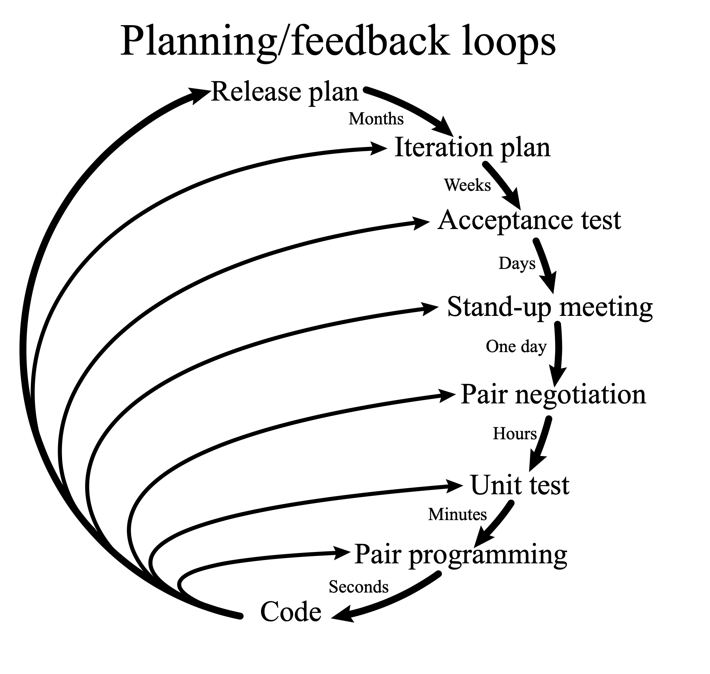
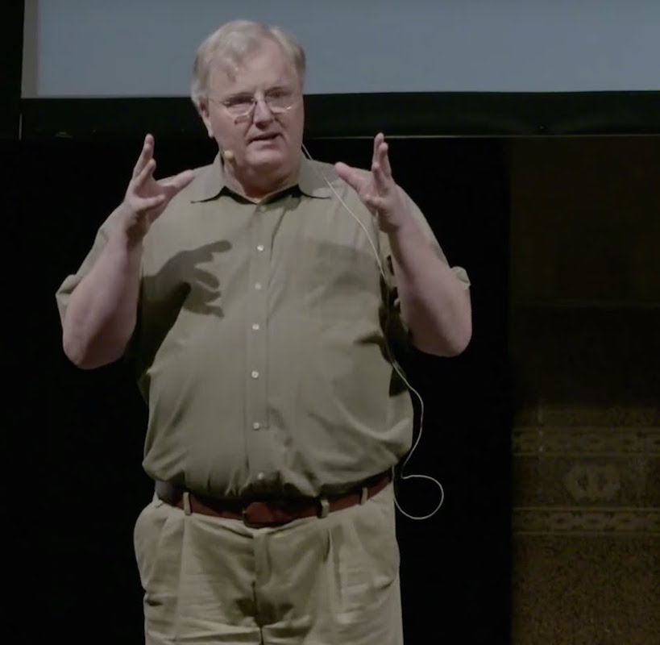

Agility
=======

.. epigraph::

    Healing the divide between business and programming

    -- Kent Beck, 1999

Praktyki developerskie a praktyki projektowe
--------------------------------------------
* Praktyki projektowe: Scrum, Kanban, XP, Lean
* Praktyki developerskie (TDD, S.O.L.I.D., CI/CD, Code Review/Pull Request, DevOps)
* Dlaczego coraz więcej zespołów odchodzi od Scrum i idzie w Kanban?
* Połączenie Scrum i Kanban
* XP - Extreme Programming

.. figure:: img/agile-division-methods.png
.. figure:: img/spotify-engineering-culture-01.png

Wartości biznesowe
------------------
* Lower "time to market"
* Increase "value to market"
* Increase "quality to market"
* Increase flexibility
* Increase visibility
* Lower costs
* Increase product lifetime

Lower time to market
^^^^^^^^^^^^^^^^^^^^
* Test-driven Development
* Evolutionary Design

   * Refactoring
   * CI / CD

* Test-driven Requirements

   * Functional Tests
   * BDD

Increase value to market
^^^^^^^^^^^^^^^^^^^^^^^^
* Test-driven Requirements

   * Functional Tests
   * BDD

Increase quality to market
^^^^^^^^^^^^^^^^^^^^^^^^^^
* Test-driven Development

   * Test-first and Test-last

* Test-driven Requirements

   * BDD

* Evolutionary design

   * Refactoring
   * Simple Design
   * CI / CD

Increase flexibility
^^^^^^^^^^^^^^^^^^^^
* Evolutionary Design

   * Refactoring
   * Simple Design
   * CI / CD

* Test-driven Development

   * Test-first and Test-last

* Test-driven Requirements

Increase visibility
^^^^^^^^^^^^^^^^^^^
* Test-driven Requirements

   * Functional Tests
   * BDD
   * CI / CD

Lower Cost
^^^^^^^^^^
* Evolutionary design

   * Simple Design
   * Refactoring
   * Collective Code Ownership

* Test-driven Development

   * Test-last and Test-first
   * Functional Tests

Increase product lifetime
^^^^^^^^^^^^^^^^^^^^^^^^^
* Test-Driven Development

   * Automated Developer Tests

* Evolutionary Design

   * Refactoring
   * Simple Design

* Test-driven Requirements

   * Functional Tests

Lean Startup
------------
* Build, Measure, Learn loop

.. figure:: img/person-eric-ries.jpg
.. figure:: img/lean-startup-cycle-01.jpg

+---------------------------------+---------------------------+---------------------------------+
| Build                           | Measure                   | Learn                           |
+=================================+===========================+=================================+
| Unit Tests                      | Split Tests (A/B)         | Split Tests                     |
+---------------------------------+---------------------------+---------------------------------+
| Usability Tests                 | Clear Product Owner       | Customer Interviews             |
+---------------------------------+---------------------------+---------------------------------+
| Continuous Integration          | Continuous Deployment     | Customer Development            |
+---------------------------------+---------------------------+---------------------------------+
| Incremental Deployment          | Usability Tests           | Five Whys Root Cause Analysis   |
+---------------------------------+---------------------------+---------------------------------+
| Free & Open Source Components   | Real-time Monitoring      | Customer Advisory Board         |
+---------------------------------+---------------------------+---------------------------------+
| Cloud Computing                 | Custom Liaison            | Falsifiable Hypothesis          |
+---------------------------------+---------------------------+---------------------------------+
| Cluster Immune System           | Funnel Analysis           | Product Owner Accountability    |
+---------------------------------+---------------------------+---------------------------------+
| Just-in-time Scalability        | Cohort Analysis           | Custom Archetypes               |
+---------------------------------+---------------------------+---------------------------------+
| Refactoring                     | Net Promoter Score        | Cross-functional Teams          |
+---------------------------------+---------------------------+---------------------------------+
| Developer Sandbox               | Search Engine Marketing   | Smoke Tests                     |
+---------------------------------+---------------------------+---------------------------------+
|                                 | Real-time Alerting        |                                 |
+---------------------------------+---------------------------+---------------------------------+
|                                 | Predictive Monitoring     |                                 |
+---------------------------------+---------------------------+---------------------------------+

Praktyki deweloperskie a wartości biznesowe
-------------------------------------------
.. figure:: img/agility-v1.png
.. figure:: img/agility-v2.png

Agile vs agility
----------------
* Agility is achieved only by combining Business Practices and Technical Craftsmanship.
* Agile is not only about Scrum.
* Agile is Dead • Pragmatic Dave Thomas • GOTO 2015 [#ytAgileIsDead]_

.. epigraph::

    Agile is dead, long live agility!

    -- Dave Thomas, 2007

References
----------
.. [#ytAgileIsDead] https://www.youtube.com/watch?v=a-BOSpxYJ9M

Assignments
-----------
* Oglądnijcie z trenerem filmik Spotify Engineering Culture 1 i 2
