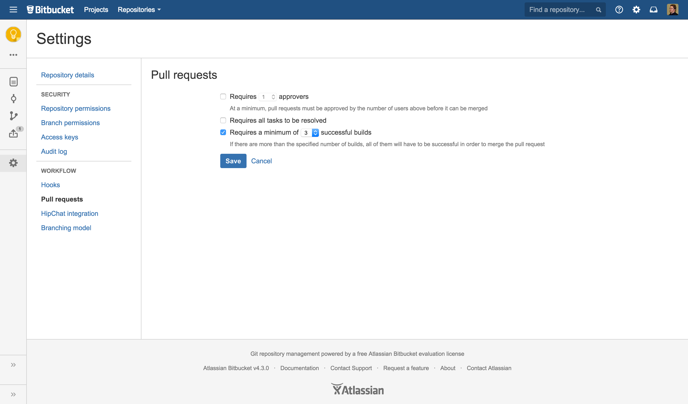
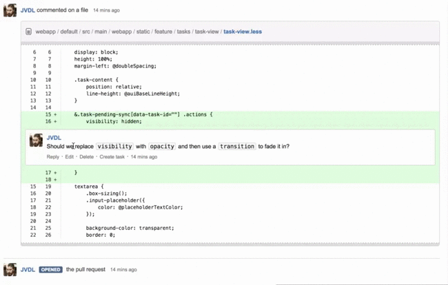
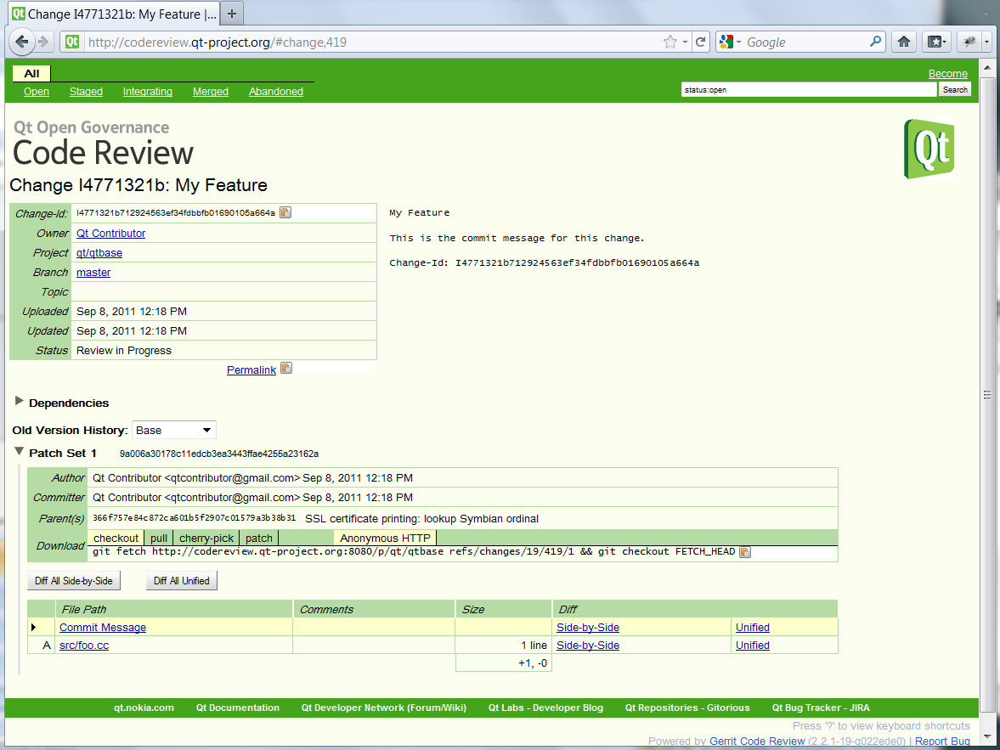
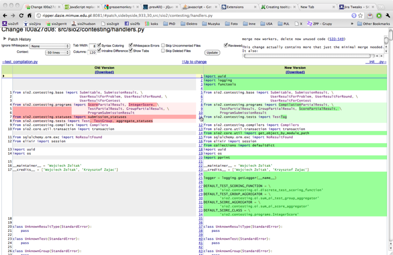

Automation
==========

Rationale
---------
* Automatyzacja Code Review
* Włączenie procesu CI/CD do Code Review
* Statyczna analiza kodu źródłowego
* Pipeline as a Code
* Code Review dla provisioning
* Quality Gates
* Triggerowanie statusów w Jira
* Automatyzacja narzędzi Atlassian (Atlassian Python API)

Problemy
--------
Code Review tool:

* Uwaga ze zbyt duża liczbą automatycznych komentarzy, szczególnie Info, i Style
* Na początku zrobić tylko, by przepuszczał Blocker i Critical
* Jak przesadzisz, to ludzie zaczną ignorować komunikaty

Instant Messanger:

* Wrzucanie informacji na Slack, że każdy build się powiódł, powoduje, że ludzie ignorują komunikaty
* Przerywa to ich dyskusję
* Dedykowane kanały tylko na informacje o buildach nie działają, bo nikt tego nie śledzi
* Skupiamy się na niedziałających buildach, nie powtarzamy w nieskończoność, że coś nie działa
* Może wykorzystać private message, a nie kanał zespołu

.. figure:: img/devbook-gerrit-2.jpeg

Further Reading
---------------
* https://dev.astrotech.io/jira/end-user/automation.html
* https://dev.astrotech.io/jira/end-user/board-scrum.html
