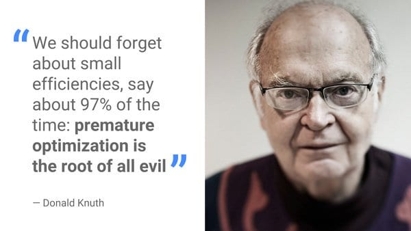
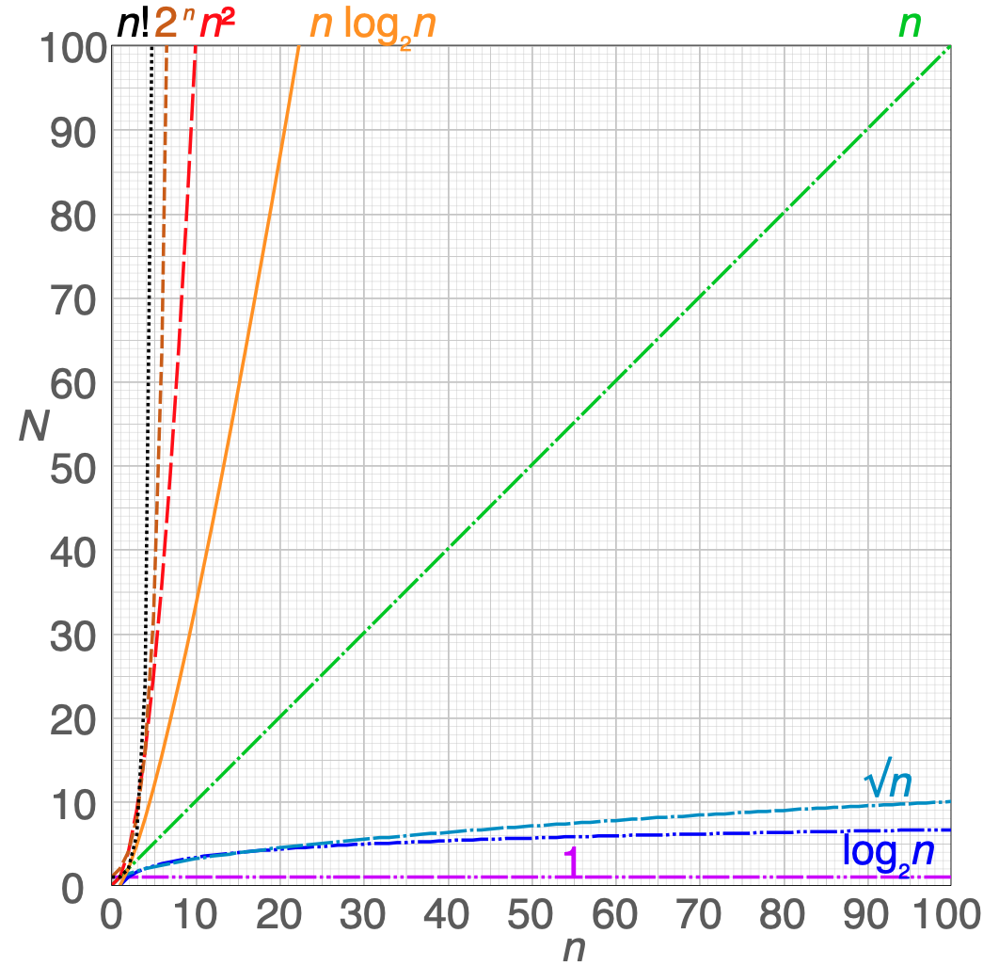

Complexity
==========

.. epigraph::

    We should forget about small efficiencies, say about 97% of the time:
    premature optimization is the root of all evil
    -- Donald Knuth

Rationale
---------
* Podstawy optymalizacji i wydajności systemów
* Computational Complexity (pol. złożoność obliczeniowa)
* Memory Complexity (pol. złożoność pamięciowa)
* Cognitive Complexity (pol. złożoność kognitywna)
* Cyclomatic Complexity (pol. złożoność cyklometryczna)
* Big O notation [#wikibigonotation]_
* https://wiki.python.org/moin/TimeComplexity

Computational Complexity
------------------------

Memory Complexity
-----------------

Cognitive Complexity
--------------------
* Measure of how difficult the application is to understand
* Measure of how hard the control flow of a function is to understand
* Functions with high Cognitive Complexity will be difficult to maintain.
* https://www.sonarsource.com/docs/CognitiveComplexity.pdf

Cyclomatic Complexity
---------------------
* Measures the minimum number of test cases required for full test coverage.

Big O notation
--------------
Most common:

    * O(sqrt_n)
    * O(log_n)
    * O(log2_n)
    * O(1)
    * O(n)
    * O(nlog2_n)
    * O(n^2)
    * O(2^n)
    * O(n!)

.. csv-table:: Table of common time complexities [#wikibigonotation]_
    :widths: 20, 20, 60
    :header: "Running time (T(n))", "Name", "Example algorithms"

    "``O(1)``",                  "constant time",                           "Finding the median value in a sorted array of numbersCalculating (−1)n"
    "``O(α(n))``",               "inverse Ackermann time",                  "Amortized time per operation using a disjoint set"
    "``O(log* n)``",             "iterated logarithmic time",               "Distributed coloring of cycles"
    "``O(log log n)``",          "log-logarithmic",                         "Amortized time per operation using a bounded priority queue"
    "``O(log n)``",              "logarithmic time",                        "Binary search"
    "``poly(log n)``",           "polylogarithmic time",                    ""
    "``O(nc) where 0 < c < 1``", "fractional power",                        "Searching in a kd-tree"
    "``O(n)``",                  "linear time",                             "Finding the smallest or largest item in an unsorted array, Kadane's algorithm, linear search"
    "``O(n log* n)``",           "n log-star n time",                       "Seidel's polygon triangulation algorithm"
    "``O(n log n)``",            "linearithmic time",                       "Fastest possible comparison sort; Fast Fourier transform"
    "``n poly(log n)``",         "quasilinear time",                        ""
    "``O(n2)``",                 "quadratic time",                          "Bubble sort; Insertion sort; Direct convolution"
    "``O(n3)``",                 "cubic time",                              "Naive multiplication of two n×n matrices. Calculating partial correlation"
    "``2O(log n) = poly(n)``",   "polynomial time",                         "Karmarkar's algorithm for linear programming; AKS primality test"
    "``2poly(log n)``",          "quasi-polynomial time",                   "Best-known O(log2 n)-approximation algorithm for the directed Steiner tree problem"
    "``O(2nε) for all ε > 0``",  "sub-exponential time",                    "Best-known algorithm for integer factorization; formerly-best algorithm for graph isomorphism"
    "``2o(n)``",                 "sub-exponential time",                    "Best-known algorithm for integer factorization; formerly-best algorithm for graph isomorphism"
    "``2O(n)``",                 "exponential time (with linear exponent)", "Solving the traveling salesman problem using dynamic programming"
    "``2poly(n)``",              "exponential time",                        "Solving matrix chain multiplication via brute-force search"
    "``O(n!)``",                 "factorial time",                          "Solving the traveling salesman problem via brute-force search"
    "``22poly(n)``",             "double exponential time",                 "Deciding the truth of a given statement in Presburger arithmetic"

References
----------
.. [#wikibigonotation] https://en.wikipedia.org/wiki/Big_O_notation

Further Reading
---------------
* https://dev.astrotech.io/sonarqube/quality-models.html
* https://dev.astrotech.io/sonarqube/quality-metrics.html
* https://dev.astrotech.io/sonarqube/quality-sqale.html
* https://www.youtube.com/watch?v=RT88FrHttRI
* https://www.youtube.com/watch?v=LCr3XyHdaZk
* https://www.youtube.com/watch?v=rWdgla54bcc
* https://www.youtube.com/watch?v=Xx2-Snbb_nA
