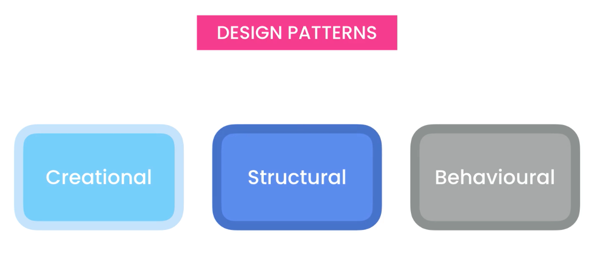
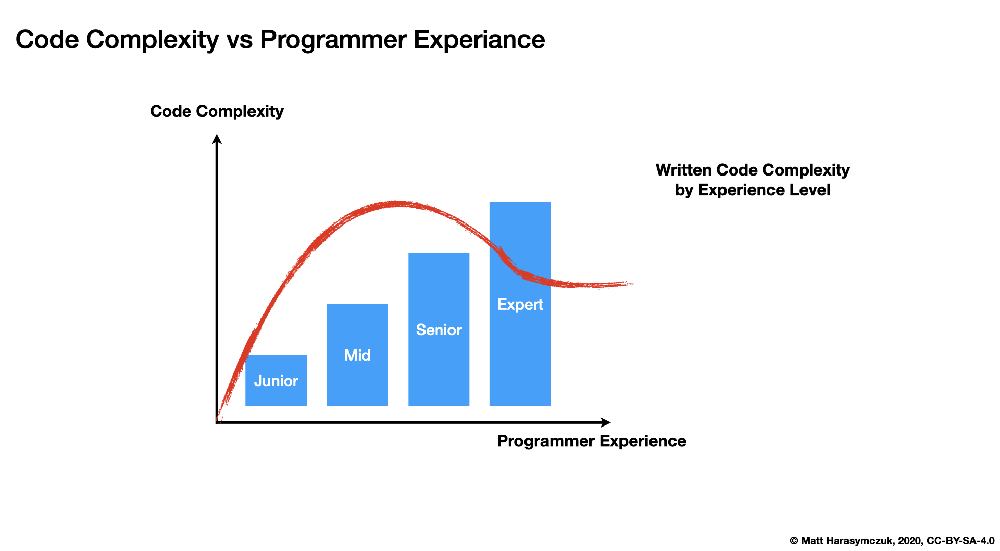

Design Patterns
===============

Rationale
---------
* Structural - Relationships between objects
* Behavioral - Communication and interaction between objects
* Creational - Creating new objects

Behavioral Design Patterns
--------------------------
Object patterns:

    * Chain of Responsibility (polish: Łańcuch zobowiązań)
    * Command (polish: Polecenie)
    * Interactor (polish: Interactor)
    * Mediator (polish: Mediator)
    * Memento (polish: Pamiątka)
    * Observer (polish: Obserwator)
    * State (polish: Stan)
    * Strategy (polish: Strategia)
    * Visitor (polish: Odwiedzający)

Class Patterns:

    * Interpreter (polish: Interpreter)
    * Template Method (polish: Metoda szablonowa)

Structural Design Patterns
--------------------------
Object:

    * Bridge (polish: Most)
    * Composite (polish: Kompozyt)
    * Decorator (polish: Dekorator)
    * Façade (polish: Fasada)
    * Flyweight (polish: Pyłek)
    * Proxy (polish: Pełnomocnik)

Class and Object Patterns:

    * Adapter (polish: Adapter)

Creational Design Patterns
--------------------------
Object Patterns:

    * Abstract Factory (polish: Fabryka Abstrakcyjna)
    * Builder (polish: Budowniczy)
    * Prototype (polish: Prototyp)
    * Singleton (polish: Singleton)

Class Patterns:

    * Factory Method (polish: Metoda wytwórcza)

Paradigm
--------
* EFAP (Easier to ask for forgiveness than permission)
* Metaclasses
* Borg
* Mixin

Abusing Patterns
----------------
.. figure:: img/about-introduction-javaproblemfactory.jpg

Further Reading
---------------
* https://www.toptal.com/python/python-design-patterns
* https://www.youtube.com/watch?v=NU_1StN5Tkk
* https://codewithmosh.com/courses/733596/bundled_courses
* https://codewithmosh.com/courses/enrolled/759570
* https://codewithmosh.com/courses/enrolled/760032
