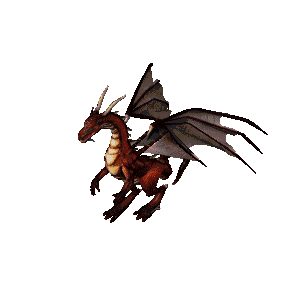

Dragon (version alpha)
======================

About
-----
* Assignment: Dragon (version alpha)
* Complexity: medium
* Lines of code: 100 lines
* Time: 89 min, then 144 min live coding with instructor
* Warning: Don't delete code, assignment will be continued

    Firkraag dragon from game Baldur's Gate II: Shadows of Amn

English
-------
1. Create class representing Dragon
2. Dragon has (attributes):
    a. name
    b. position on the screen
    c. texture file name, default `img/dragon/alive.png`
    d. health points, default random `int` in range from 50 to 100
3. Dragon can (methods):
    a. have position set to any place on the screen
    b. make damage in range from 5 to 20
    c. take damage
    d. move in any direction by specified value
4. Assume left-top screen corner as an initial coordinates position:
    a. going right add to `x`
    b. going left subtract from `x`
    c. going up subtract from `y`
    d. going down add to `y`
5. When health points drop to, and below zero:
    a. Dragon is dead
    b. Set object status to dead
    c. Print `XXX is dead`, where XXX is the name of the dragon
    d. Change texture file name to  `img/dragon/dead.png`
    e. Print position where dragon died
    f. Print how much gold Dragon dropped (random in range from 1 to 100)
    g. Dragon cannot take any more damage
    h. Dragon cannot make any more damage
    i. Dragon cannot move or have position set
6. Run the game:
    a. Create dragon at x=50, y=120 position and name it "Wawelski"
    b. Set new position to x=10, y=20
    c. Move dragon left by 10 and down by 20
    d. Move dragon left by 10 and right by 15
    e. Move dragon right by 15 and up by 5
    f. Move dragon down by 5
    g. Dragon makes damage
    h. Make 10 points damage to the dragon
    i. Make 5 points damage to the dragon
    j. Make 3 points damage to the dragon
    k. Make 2 points damage to the dragon
    l. Make 15 points damage to the dragon
    m. Make 25 points damage to the dragon
    n. Make 75 points damage to the dragon
7. Non-functional requirements:
    a. This assignment is a simulation of development process
    b. Trainer acts as Product Owner with little technical knowledge
    c. You are the software engineer who need to decide and live with
       consequences of your choices
    d. Task is a narrative story telling to demonstrate OOP
       and good engineering practices
    e. Calculated last position of the game should be x=20, y=40
    f. You can introduce new fields, methods, functions, variables,
       constants, classes, objects, whatever you want
    g. Don't use modules form outside the Python Standard Library
    h. Task is business requirement specification, not a technical
       documentation, i.e., "what Dragon has to do, not how to do it"
    i. You don't have to keep order of specification while writing code
    j. This is `alpha` version, so no new functionality like
       negative position checking etc.
    l. You can create tests, i.e.: unittest, doctest
    k. Do not read solution or any future iterations of this exercise;
       if you read future tasks, you will spoil fun and learning

Polish
------
1. Stwórz klasę reprezentującą Smoka
2. Smok ma (atrybuty):
    a. nazwę
    b. pozycję na ekranie
    c. nazwę pliku tekstury, domyślnie `img/dragon/alive.png`
    d. punkty życia, domyślnie losowy `int` z zakresu od 50 do 100
3. Smok może (metody):
    a. być ustawiony w dowolne miejsce ekranu
    b. zadawać komuś losowe obrażenia z przedziału od 5 do 20
    c. otrzymywać obrażenia
    d. być przesuwany o zadaną liczbę punktów w którymś z kierunków
4. Przyjmij górny lewy róg ekranu za punkt początkowy:
    a. idąc w prawo dodajesz `x`
    b. idąc w lewo odejmujesz `x`
    c. idąc w górę odejmujesz `y`
    d. idąc w dół dodajesz `y`
5. Kiedy punkty życia Smoka spadną do lub poniżej zera:
    a. Smok jest martwy
    b. Ustaw status obiektu na dead
    c. Wypisz napis `XXX is dead` gdzie XXX to nazwa smoka
    d. Zmień nazwę pliku tekstury na `img/dragon/dead.png`
    e. Wypisz, pozycję gdzie smok zginął
    f. Wypisz, ile złota smok wyrzucił (losowa 1-100)
    g. Nie można zadawać mu obrażeń
    h. Smok nie może zadawać obrażeń
    i. Smok nie może się poruszać
6. Przeprowadź grę:
    a. Stwórz smoka w pozycji x=50, y=120 i nazwij go "Wawelski"
    b. Ustaw nową pozycję na x=10, y=20
    c. Przesuń smoka w lewo o 10 i w dół o 20
    d. Przesuń smoka w lewo o 10 i w prawo o 15
    e. Przesuń smoka w prawo o 15 i w górę o 5
    f. Przesuń smoka w dół o 5
    g. Smok zadaje obrażenia
    h. Zadaj 10 obrażeń smokowi
    i. Zadaj 5 obrażeń smokowi
    j. Zadaj 3 obrażeń smokowi
    k. Zadaj 2 obrażeń smokowi
    l. Zadaj 15 obrażeń smokowi
    m. Zadaj 25 obrażeń smokowi
    n. Zadaj 75 obrażeń smokowi
7. Wymagania niefunkcjonalne:
    a. Zadanie jest symulacją procesu developmentu
    b. Trener zachowuje się jak Product Owner z niewielką techniczną wiedzą
    c. Ty jesteś inżynierem oprogramowania, który musi podejmować decyzje
       i ponosić ich konsekwencje
    d. Zadanie jest tylko narracją do demonstracji OOP i dobrych
       praktyk programowania
    e. Wyliczona pozycja Smoka na końcu gry powinna być x=20, y=40
    f. Możesz wprowadzać dodatkowe pola, metody, funkcje, zmienne, stałe,
       klasy, obiekty, co tylko chcesz
    g. Nie korzystaj z modułów spoza standardowej biblioteki Pythona
    h. Zadanie jest specyfikacją wymagań biznesowych, a nie dokumentacją
       techniczną, tj. "co Smok ma robić, a nie jak to ma robić"
    i. Nie musisz trzymać się kolejności punktów i podpunktów w zadaniu
    j. Jest to wersja `alpha` więc bez dodatkowych funkcjonalności
       (np. sprawdzanie koordynatów, wychodzenia poza planszę itp.)
    k. Możesz stworzyć testy, np. unittest lub doctest
    l. Nie przeglądaj rozwiązań ani treści kolejnych części zadania;
       jeżeli zaglądniesz w przód, to zepsujesz sobie zabawę i naukę

Solution
--------
* EN: Note, that this will spoil your fun and learning
* PL: Zwróć uwagę, że to zepsuje Twoją zabawę i naukę
* :download:`Python Basic <assignments/dragon_alpha_basic.py>`
* :download:`Python Intermediate <assignments/dragon_alpha_intermediate.py>`
* :download:`Python Advanced <assignments/dragon_alpha_advanced.py>`
