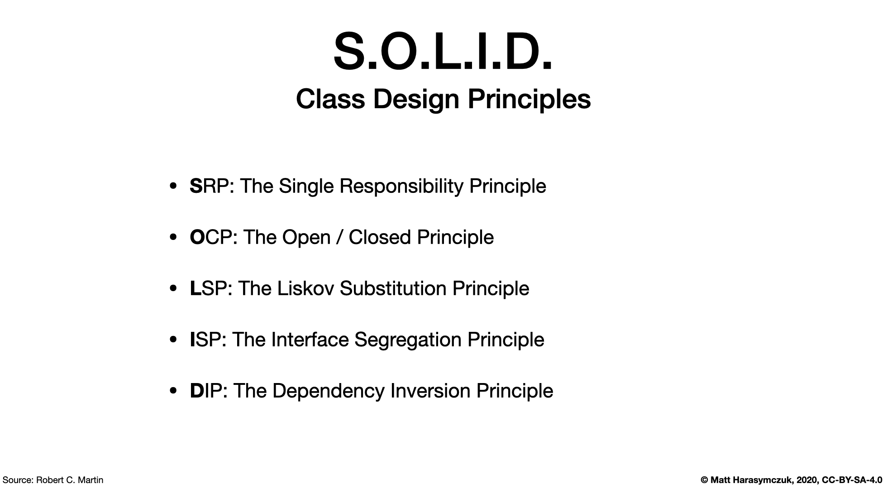
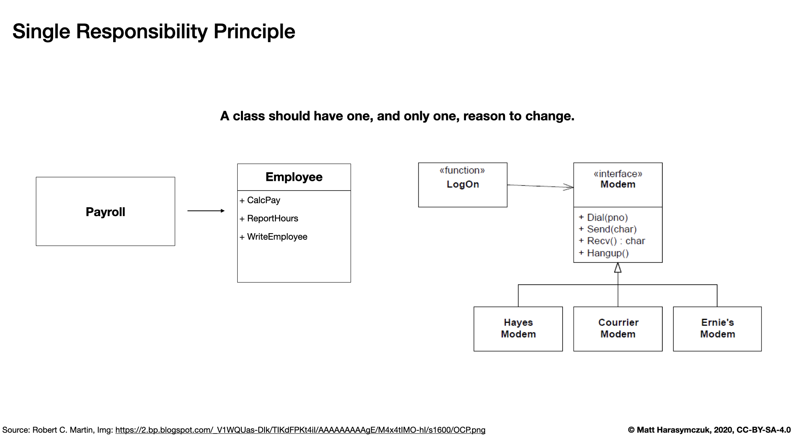
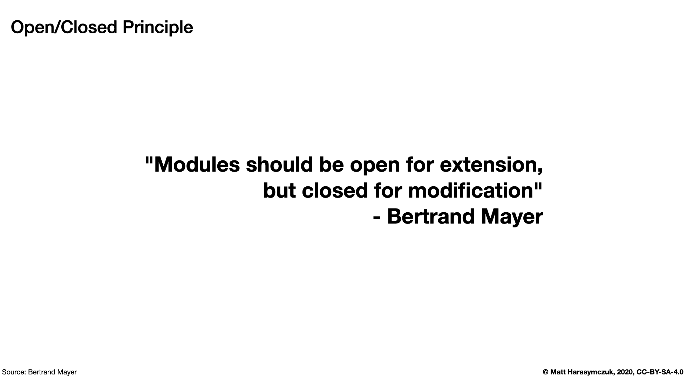
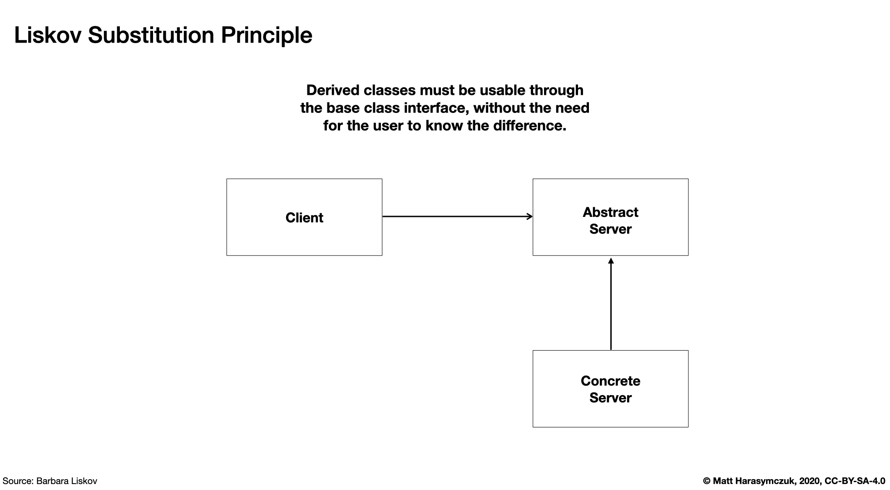
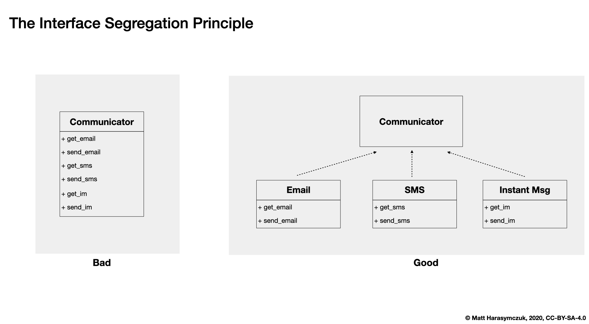
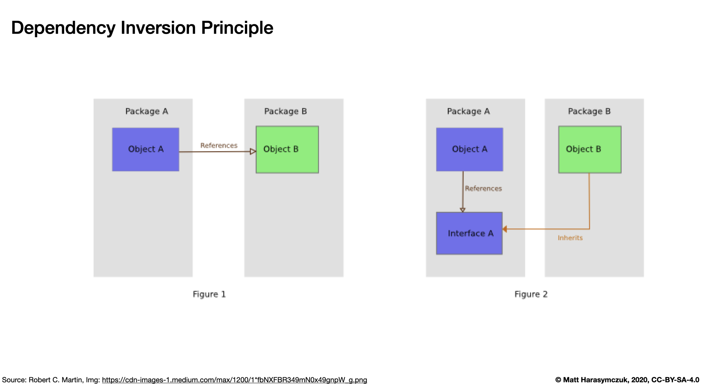
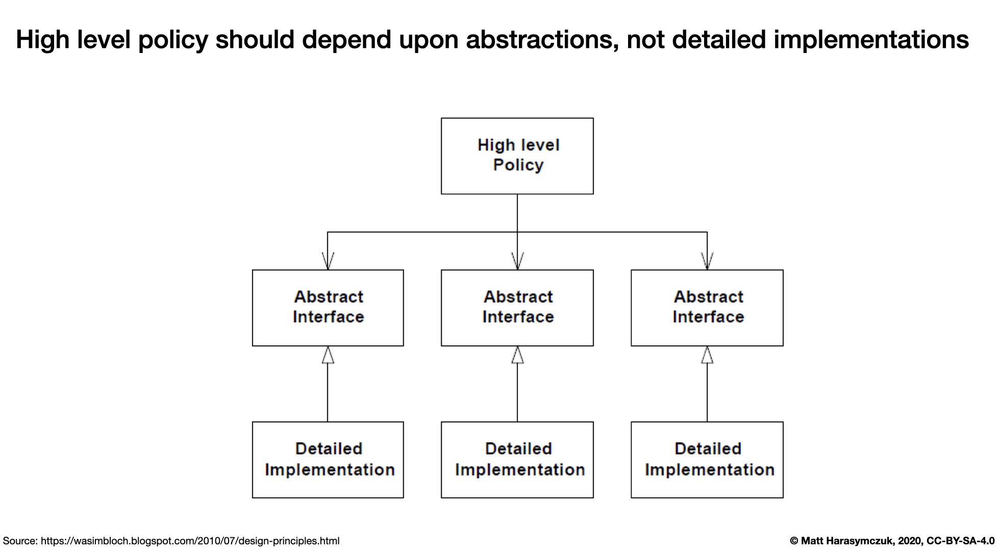

S.O.L.I.D. Principles
=====================

Recap
-----
OOP Principles:

    * Encapsulation
    * Abstraction
    * Inheritance
    * Polymorphism

Problems:

    * Rigidity - mixing higher level with low level implementation
    * Fragility - if you change something, some other thing will break
    * Coupling - interdependencies a.k.a "spaghetti code"
    * No Re-usability - cannot reuse code, and need to implement from scratch

Patterns:

    * K.I.S.S. - Keep It Simple Stupid
    * Y.A.G.N.I. - You Ain't Gonna Need It
    * D.R.Y. - Do not Repeat Yourself

Rationale
---------
* SRP: The Single Responsibility Principle
* OCP: The Open / Closed Principle
* LSP: The Liskov Substitution Principle
* ISP: The Interface Segregation Principle
* DIP: The Dependency Inversion Principle

    S.O.L.I.D. Principles

Single Responsibility Principle
-------------------------------
.. epigraph::

    A class should have one, and only one, reason to change.

    -- Robert C. Martin

Every module or class should have responsibility over a single part of the
functionality provided by the software, and that responsibility should be
entirely encapsulated by the class. All its services should be narrowly
aligned with that responsibility.

    S.O.L.I.D. - Single Responsibility Principle

Bad:

.. code-block:: python

    class Hero:
        is_alive()
        is_dead()
        position_set()
        position_get()
        position_change()
        damage_make()
        damage_take()
        texture_set()
        texture_get()

Good:

.. code-block:: python

    class HasPosition:
        position_set()
        position_get()
        position_change()

    class HasHealth:
        damage_take()
        is_alive()
        is_dead()

    class HasTexture:
        texture_set()
        texture_get()

    class CanAttack:
        damage_make()

    class Hero(HasPosition, HasHealth, HasTexture, CanAttack):
        ...

.. code-block:: python

    class Position:
        position_set()
        position_get()
        position_change()

    class Health:
        damage_take()
        is_alive()
        is_dead()

    class Texture:
        texture_set()
        texture_get()

    class Attack:
        damage_make()

    class Hero:
        position: Position
        health: Health
        texture: Texture
        attack: Attack

Bad:

>>> from dataclasses import dataclass
>>>
>>>
>>> @dataclass
... class Hero:
...     HEALTH_MIN: int = 10
...     HEALTH_MAX: int = 20
...     _health: int = 0
...     _position_x: int = 0
...     _position_y: int = 0
...
...     def __post_init__(self) -> None:
...         self._health = randint(self.HEALTH_MIN, self.HEALTH_MAX)
...
...     def is_alive(self) -> bool:
...         return self._health > 0
...
...     def is_dead(self) -> bool:
...         return self._health <= 0
...
...     def position_set(self, x: int, y: int) -> None:
...         self._position_x = x
...         self._position_y = y
...
...     def position_change(self, right=0, left=0, down=0, up=0):
...         x = self._position_x + right - left
...         y = self._position_y + down - up
...         self.position_set(x, y)
...
...     def position_get(self) -> tuple[int, int]:
...         return self._position_x, self._position_y

Good:

>>> from dataclasses import dataclass
>>>
>>>
>>> @dataclass
... class HasHealth:
...     HEALTH_MIN: int = 10
...     HEALTH_MAX: int = 20
...     _health: int = 0
...
...     def __post_init__(self) -> None:
...         self._health = randint(self.HEALTH_MIN, self.HEALTH_MAX)
...
...     def is_alive(self) -> bool:
...         return self._health > 0
...
...     def is_dead(self) -> bool:
...         return self._health <= 0
>>>
>>>
>>> @dataclass
... class HasPosition:
...     _position_x: int = 0
...     _position_y: int = 0
...
...     def position_set(self, x: int, y: int) -> None:
...         self._position_x = x
...         self._position_y = y
...
...     def position_change(self, right=0, left=0, down=0, up=0):
...         x = self._position_x + right - left
...         y = self._position_y + down - up
...         self.position_set(x, y)
...
...     def position_get(self) -> tuple[int, int]:
...         return self._position_x, self._position_y
>>>
>>>
>>> class Hero(HasHealth, HasPosition):
...     pass

Open/Closed Principle
---------------------
.. epigraph::

    Software entities (classes, modules, functions, etc.) should be open for extension, but closed for modification

    -- Bertrand Mayer

    S.O.L.I.D. - Open/Closed Principle

* This idea has many different interpretations
* Sometimes it refers to use of abstract base classes to create fixed interfaces with multiple implementations
* The view we take is that objects have internal invariants and that subclasses shouldn't be able to break those invariants
* In other words, the classes capabilities can be extended but the underlying class shouldn't get broken
* Source: [#Hettinger2012]_

Adding new parser (PDF,Txt) class should not break the ``Document`` class.

Bad:

>>> class PDF:
...     pass
>>>
>>> class Txt:
...     pass
>>>
>>> class Docx:
...     pass
>>>
>>> class Document:
...     def __new__(cls, *args, **kwargs):
...         filename, extension = args[0].split('.')
...         if extension == 'pdf':
...             return PDF()
...         elif extension == 'txt':
...             return Txt()
...         elif extension == 'docx':
...             return Docx()
>>>
>>>
>>> file1 = Document('myfile.pdf')
>>> file2 = Document('myfile.txt')
>>>
>>> print(file1)  # doctest: +ELLIPSIS
<PDF object at 0x...>
>>>
>>> print(file2)  # doctest: +ELLIPSIS
<Txt object at 0x...>

Good:

>>> class FileFormat:
...     def __init__(self, *args, **kwargs):
...         ...
>>>
>>> class PDF(FileFormat):
...     pass
>>>
>>> class Txt(FileFormat):
...     pass
>>>
>>> class Docx(FileFormat):
...     pass
>>>
>>>
>>> class Document:
...     def __new__(cls, *args, **kwargs):
...         filename, extension = args[0].split('.')
...         for format in FileFormat.__subclasses__():
...             if extension == format.__name__.lower():
...                 return format(*args, **kwargs)
...         else:
...             raise NotImplementedError(extension)
>>>
>>>
>>> file1 = Document('myfile.pdf')
>>> file2 = Document('myfile.txt')
>>> file3 = Document('myfile.docx')
>>>
>>> print(file1)  # doctest: +ELLIPSIS
<PDF object at 0x...>
>>>
>>> print(file2)  # doctest: +ELLIPSIS
<Txt object at 0x...>
>>>
>>> print(file3)  # doctest: +ELLIPSIS
<Docx object at 0x...>

Good:

>>> class Setosa:
...     pass
>>>
>>> class Versicolor:
...     pass
>>>
>>> class Virginica:
...     pass
>>>
>>>
>>> def factory(species):
...     try:
...         classname = species.capitalize()
...         return globals()[classname]
...     except KeyError:
...         raise NotImplementedError
>>>
>>>
>>> iris = factory('setosa')
>>> print(iris)
<class 'Setosa'>

>>> from random import randint
>>>
>>>
>>> class Critter:
...     HEALTH_MIN: int = 0
...     HEALTH_MAX: int = 10
...
...     def __init__(self) -> None:
...         self._health = randint(self.HEALTH_MIN, self.HEALTH_MAX)
>>>
>>>
>>> class Skeleton(Critter):
...     HEALTH_MIN: int = 10
...     HEALTH_MAX: int = 20
>>>
>>>
>>> class Troll(Hero):
...     HEALTH_MIN: int = 100
...     HEALTH_MAX: int = 200
>>>
>>>
>>> class Dragon(Critter):
...     HEALTH_MIN: int = 1000
...     HEALTH_MAX: int = 2000

>>> from random import randint
>>>
>>>
>>> class Critter:
...     HEALTH_MIN: int = 0
...     HEALTH_MAX: int = 10
...
...     def __init__(self):
...         self._health = self._get_initial_health()
...
...     def _get_initial_health(self):
...         return randint(self.HEALTH_MIN, self.HEALTH_MAX)
>>>
>>>
>>> class Regular(Critter):
...     pass
>>>
>>>
>>> class Elite(Critter):
...     def _get_initial_health(self):
...         hp = super()._get_initial_health()
...         return hp * 2
>>>
>>>
>>> class Boss(Critter):
...     def _get_initial_health(self):
...         hp = super()._get_initial_health()
...         return hp * 10

Liskov Substitution Principle
-----------------------------
.. epigraph::

    Derived classes must be usable through the base class interface,
    without the need for the user to know the difference.

    -- Barbara Liskov

.. epigraph::

    If S is a subtype of T, then objects of type T may be replaced with
    objects of the S

    -- Barbara Liskov

* Objects in a program should be replaceable with instances of their
  subtypes without altering the correctness of that program
* It's all about polymorphism
* Example:

    * Lots of code in Python works with dictionaries
    * An ``OrderedDict`` is a dict subclass that keeps most of the API
      intact (fully Liskov substitutable)
    * It can be used just about everywhere in Python instead of dicts

* Any part of the API which is not fully substitutable is a Liskov violation
* This is common and normal
* In particular, subclasses can have different constructor signatures (for
  example the array API [``from array import array``] is very similar to the
  list API but the constructor is different)
* Goal is to isolate or minimize the impact
* Problem:

    * Taxonomy hierarchies do not neatly transform into useful class
      hierarchies (Circle and Ellipse problem)
    * Substitutability can be a hard problem
    * More importantly, it challenges our conceptual view of a subclass as
      simple a form of specialization
    * Clarity comes from thinking about the design in terms of code reuse
      (the class that has the most reusable code should be the parent)

* Source: [#Hettinger2012]_

    S.O.L.I.D. - Liskov Substitution Principle

>>> class mystr(str):
...     pass
>>>
>>>
>>> a = str('Mark Watney')
>>> a.upper()
'MARK WATNEY'
>>>
>>> b = mystr('Mark Watney')
>>> b.upper()
'MARK WATNEY'

>>> from collections import OrderedDict
>>>
>>>
>>> assert hasattr(dict, 'clear')
>>> assert hasattr(dict, 'copy')
>>> assert hasattr(dict, 'fromkeys')
>>> assert hasattr(dict, 'get')
>>> assert hasattr(dict, 'items')
>>> assert hasattr(dict, 'keys')
>>> assert hasattr(dict, 'pop')
>>> assert hasattr(dict, 'popitem')
>>> assert hasattr(dict, 'setdefault')
>>> assert hasattr(dict, 'update')
>>> assert hasattr(dict, 'values')
>>>
>>> assert hasattr(OrderedDict, 'clear')
>>> assert hasattr(OrderedDict, 'copy')
>>> assert hasattr(OrderedDict, 'fromkeys')
>>> assert hasattr(OrderedDict, 'get')
>>> assert hasattr(OrderedDict, 'items')
>>> assert hasattr(OrderedDict, 'keys')
>>> assert hasattr(OrderedDict, 'pop')
>>> assert hasattr(OrderedDict, 'popitem')
>>> assert hasattr(OrderedDict, 'setdefault')
>>> assert hasattr(OrderedDict, 'update')
>>> assert hasattr(OrderedDict, 'values')

Interface Segregation Principle
-------------------------------
* many specific interfaces are better than one general-purpose interface

The interface-segregation principle (ISP) states that no client should be
forced to depend on methods it does not use. ISP splits interfaces that are
very large into smaller and more specific ones so that clients will only have
to know about the methods that are of interest to them. Such shrunken
interfaces are also called role interfaces. ISP is intended to keep a system
decoupled and thus easier to refactor, change, and redeploy. ISP is one of
the five SOLID principles of object-oriented design, similar to the High
Cohesion Principle of GRASP.

    S.O.L.I.D. Principles - Interface Segregation Principle

.. todo:: Make image about code examples below

Bad:

>>> class Serializable:
...     def json_loads(self):
...         raise NotImplementedError
...
...     def json_dumps(self):
...         raise NotImplementedError
...
...     def pickle_loads(self):
...         raise NotImplementedError
...
...     def pickle_dumps(self):
...         raise NotImplementedError
...
...     def csv_loads(self):
...         raise NotImplementedError
...
...     def csv_dumps(self):
...         raise NotImplementedError
>>>
>>>
>>> class User(Serializable):
...     def __init__(self, firstname, lastname):
...         self.firstname = firstname
...         self.lastname = lastname

Good:

>>> class JSONMixin:
...     def json_loads(self):
...         raise NotImplementedError
...
...     def json_dumps(self):
...         raise NotImplementedError
>>>
>>>
>>> class PickleMixin:
...     def pickle_loads(self):
...         raise NotImplementedError
...
...     def pickle_dumps(self):
...         raise NotImplementedError
>>>
>>>
>>> class CSVMixin:
...     def csv_loads(self):
...         raise NotImplementedError
...
...     def csv_dumps(self):
...         raise NotImplementedError
>>>
>>>
>>> class User(JSONMixin, PickleMixin, CSVMixin):
...     def __init__(self, firstname, lastname):
...         self.firstname = firstname
...         self.lastname = lastname

Dependency Inversion Principle
------------------------------
.. epigraph::

    Clients should not be forced to depend on methods that they do not use.
    Program to an interface, not an implementation.

    -- Robert C. Martin

* https://medium.com/swlh/isp-the-interface-segregation-principle-a3416f3ac8f5
* one should depend upon abstractions, not concretions
* decoupling software modules

    S.O.L.I.D. - Dependency Inversion Principle

    Class Dependencies should depend upon abstractions, not concretions

When following this principle, the conventional dependency relationships
established from high-level, policy-setting modules to low-level, dependency
modules are reversed, thus rendering high-level modules independent of the
low-level module implementation details. The principle states:

    1. High-level modules should not depend on low-level modules. Both should
       depend on abstractions.

    2. Abstractions should not depend on details. Details should depend on
       abstractions.

By dictating that both high-level and low-level objects must depend on the
same abstraction this design principle inverts the way some people may think
about object-oriented programming.

Bad:

>>> watney = 'Astronaut'
>>>
>>> if watney == 'Astronaut':
...     print('Hello')
... elif watney == 'Cosmonaut':
...     print('Привет!')
... elif watney == 'Taikonaut':
...     print('你好')
... else:
...     print('Default Value')
Hello

Good:

>>> class Astronaut:
...     def say_hello(self):
...         print('Hello')
>>>
>>> class Cosmonaut:
...     def say_hello(self):
...         print('Привет!')
>>>
>>> class Taikonaut:
...     def say_hello(self):
...         print('你好')
>>>
>>>
>>> watney = Astronaut()
>>> watney.say_hello()
Hello

>>> class Cache:
...     def get(self, key: str) -> str: raise NotImplementedError
...     def set(self, key: str, value: str) -> None: raise NotImplementedError
...     def is_valid(self, key: str) -> bool: raise NotImplementedError
>>>
>>> class CacheDatabase(Cache):
...     def is_valid(self, key: str) -> bool:
...         ...
...
...     def get(self, key: str) -> str:
...         ...
...
...     def set(self, key: str, value: str) -> None:
...         ...
>>>
>>>
>>> db: Cache = CacheDatabase()
>>> db.set('name', 'Jan Twardowski')
>>> db.is_valid('name')
>>> db.get('name')

References
----------
.. [#Hettinger2012] Raymond Hettinger. The Art of Subclassing. 2012. https://www.youtube.com/watch?v=miGolgp9xq8

Assignments
-----------
.. todo:: Create assignments
