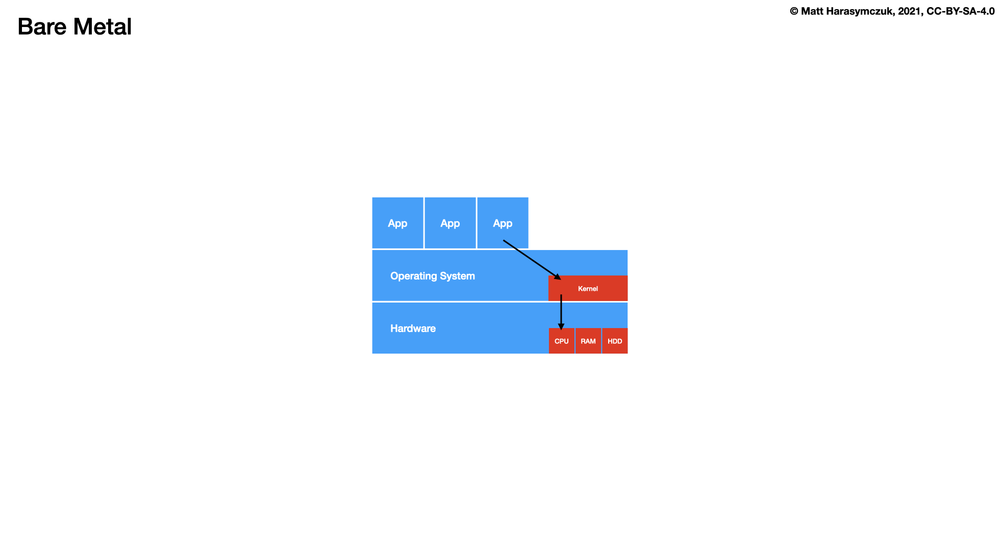
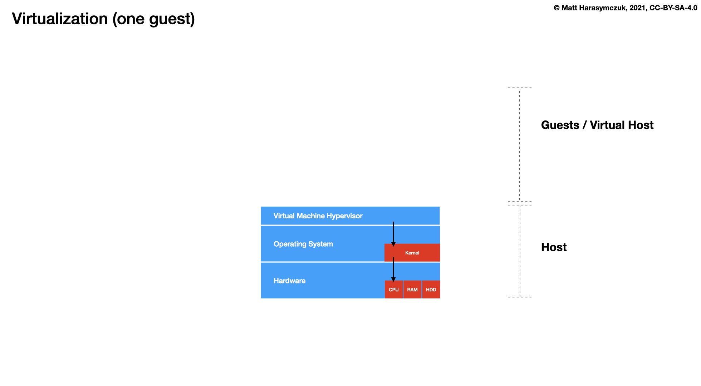
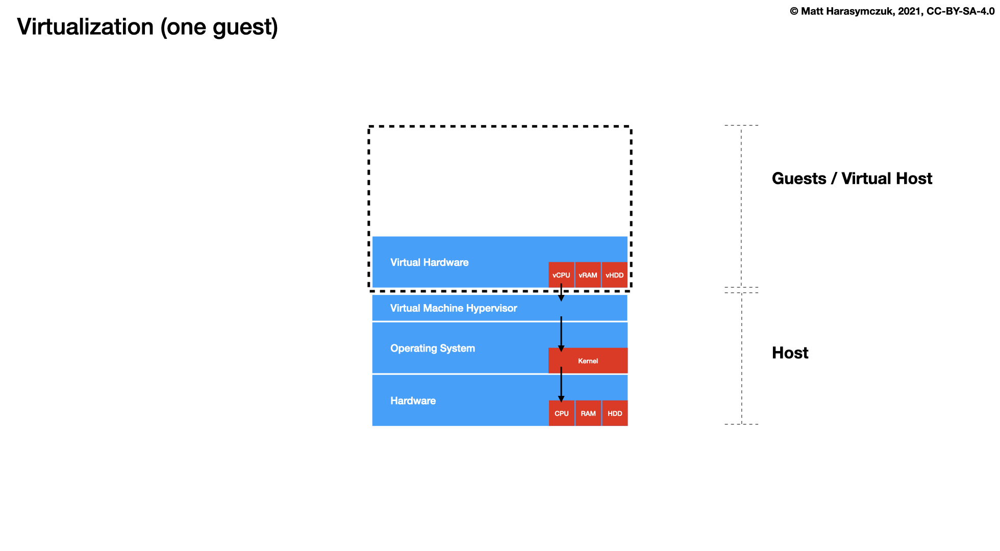
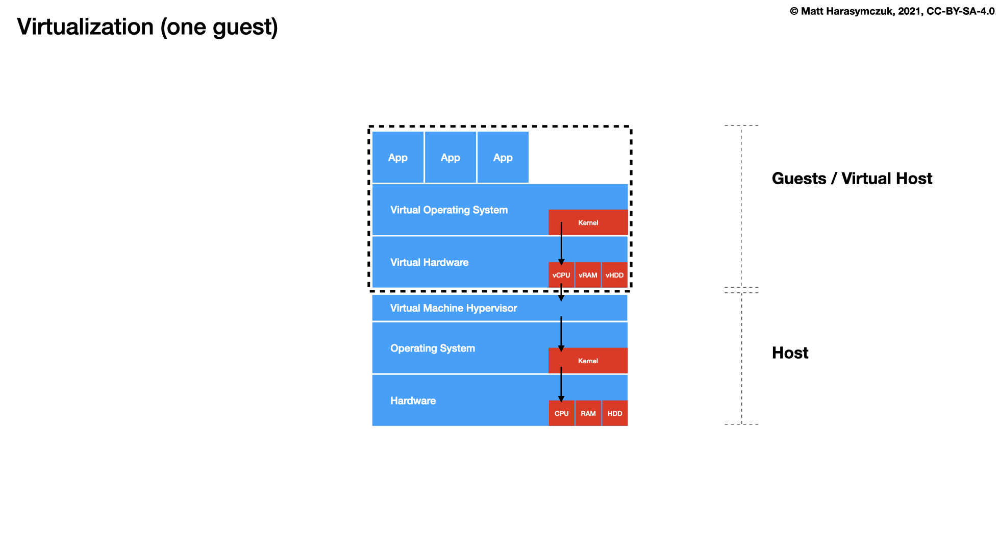
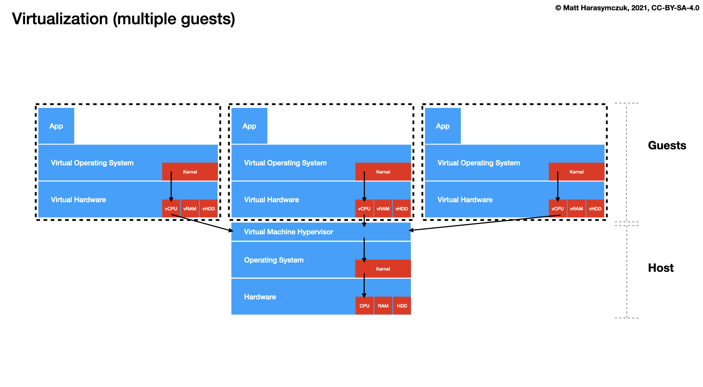
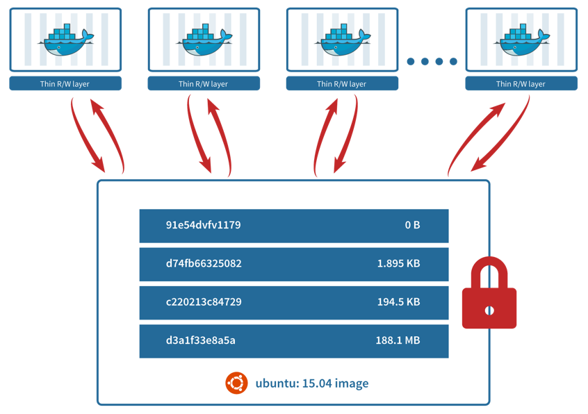

************
About Docker
************

What is docker?
===============
* :cite:`DockerDocumentation`

.. figure:: ../_img/docker-vs-lxc.png
.. figure:: ../_img/docker-arch.png

.. figure:: ../_img/docker-stack-03-docker.png
.. figure:: ../_img/docker-stack-05-kubernetes.png
.. figure:: ../_img/docker-stack-06-architecture.png

Architecture
============
.. glossary::

    Guest
        Container running on Docker Engine

    Host
        Server running Docker Engine, see also :term:`Docker 0`

    Docker 0
        Server running Docker Engine

Docker image vs container
=========================
.. glossary::

    Image
        Ready to run Operating System with pre-installed software

    Container
        Running instance of an image

Layers
======
.. glossary::

    Layer
        Diff between outputs of Dockerfile ``RUN`` command while building an image

.. figure:: ../_img/docker-layer-images.png
    :scale: 50%
    :align: center

    Layers

    Layers

.. figure:: ../_img/docker-container-layers.jpg
    :scale: 50%
    :align: center

    Container Layers

.. figure:: ../_img/docker-container-layers.png
    :scale: 50%
    :align: center

    Container Layers

Open Container Initiative
=========================
* https://opencontainers.org

The Open Container Initiative is an open governance structure for the
express purpose of creating open industry standards around container
formats and runtimes.

Established in June 2015 by Docker and other leaders in the container
industry, the OCI currently contains two specifications: the Runtime
Specification (runtime-spec) and the Image Specification (image-spec).
The Runtime Specification outlines how to run a "filesystem bundle" that
is unpacked on disk. At a high-level an OCI implementation would download
an OCI Image then unpack that image into an OCI Runtime filesystem bundle.
At this point the OCI Runtime Bundle would be run by an OCI Runtime.
