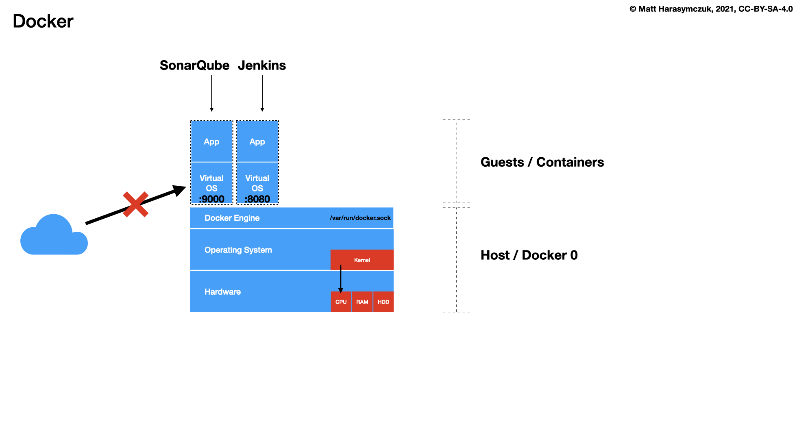
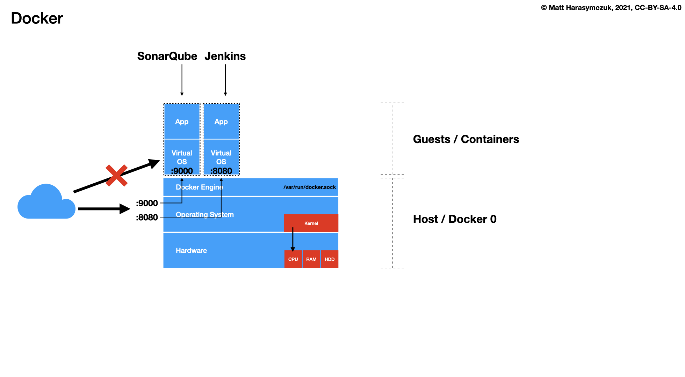

Docker Expose
=============

Port Forwarding
---------------
* ``-p``, ``--publish`` - Publish a container's port(s) to the host
* ``-P``, ``--publish-all`` - Publish all exposed ports to random ports

.. code-block:: console

    $ docker run -p 5432:5432 postgres
    $ docker run -p 192.168.56.101:5432:5432 postgres

.. figure:: ../_img/docker-stack-04-docker-network-3.png
