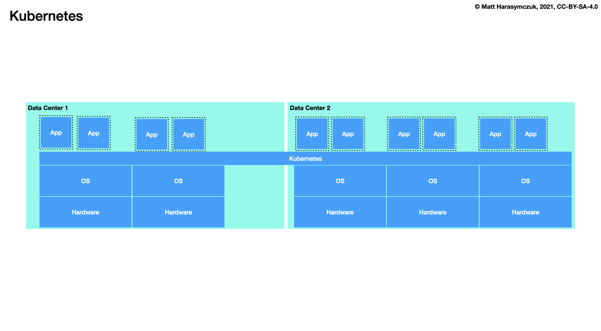
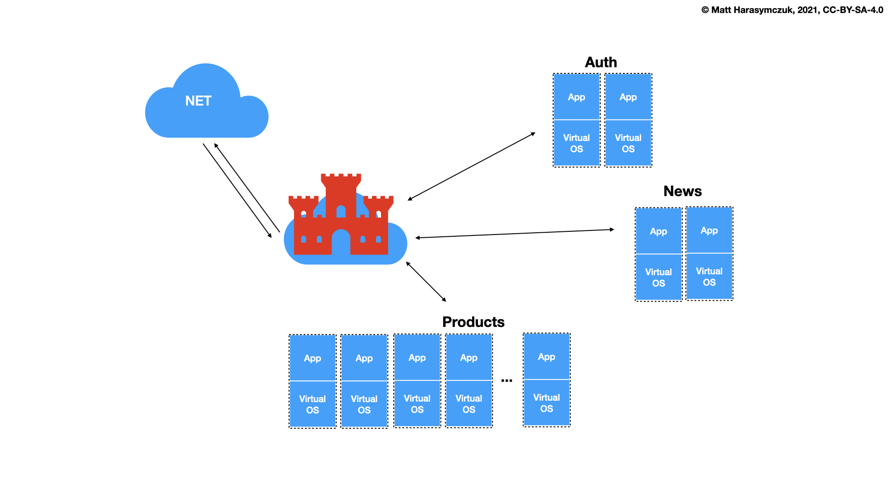

Docker Network
==============
* Create a new docker network and connect both containers to that network
* Containers on the same network can use the others container name to communicate with each other
* Bridge - multiple containers to communicate on the same Docker host
* Host - network stack should not be isolated from the Docker host
* Overlay - containers running on different Docker hosts to communicate
* Macvlan - your containers will look like physical hosts on your network

Adapters
--------
.. figure:: ../_img/docker-networking.png
    :scale: 35%
    :align: center

    Docker network

Bridge:

    * https://docs.docker.com/network/bridge/
    * Best when you need multiple containers to communicate
      on the same Docker host

Host:

    * Best when the network stack should not be isolated from
      the Docker host, but you want other aspects of the container
      to be isolated

Overlay:

    * Best when you need containers running on different Docker hosts
      to communicate, or when multiple applications work together using
      swarm services

Macvlan:

    * Best when you are migrating from a VM setup or need your containers
      to look like physical hosts on your network, each with a unique MAC
      address

Create network
--------------
Automatic address:

.. code-block:: console

    $ docker network create mynetwork

Specific address:

.. code-block:: console

    $ docker network create -d bridge --subnet 192.168.0.0/24 --gateway 192.168.0.1 mynetwork

List networks
-------------
.. code-block:: console

    $ docker network ls

Delete network
--------------
.. code-block:: console

    $ docker network rm mynetwork

Connect running container to network
------------------------------------
.. code-block:: console

    $ docker run -d --name host1 -it alpine sh
    $ docker run -d --name host2 -it alpine sh

    $ docker network create mynetwork
    $ docker network connect mynetwork host1
    $ docker network connect mynetwork host2

Connect new container to network
--------------------------------
.. code-block:: console

    $ docker network create mynetwork
    $ docker run -d --net mynetwork --name host1 -it alpine sh
    $ docker run -d --net mynetwork --name host2 -it alpine sh

.. code-block:: console

    $ docker exec host1 ping -c4 host2

.. code-block:: console

    $ docker exec host1 ping -c4 host2

Inspect network
---------------
.. code-block:: console

    $ docker network inspect
