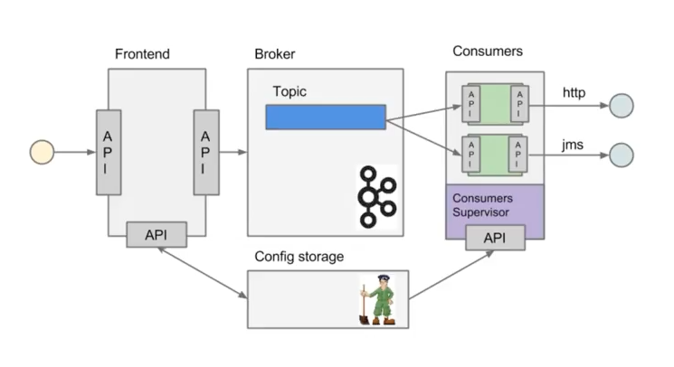
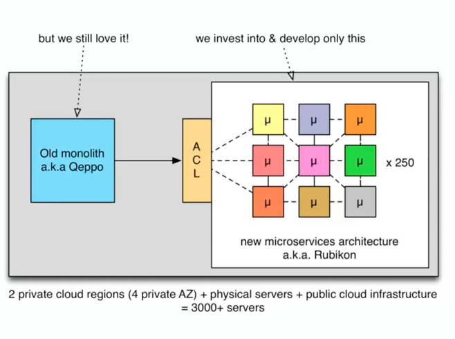
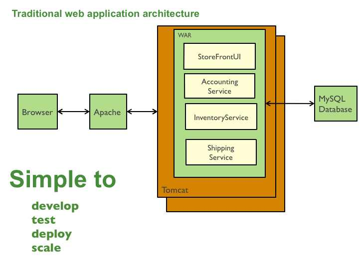
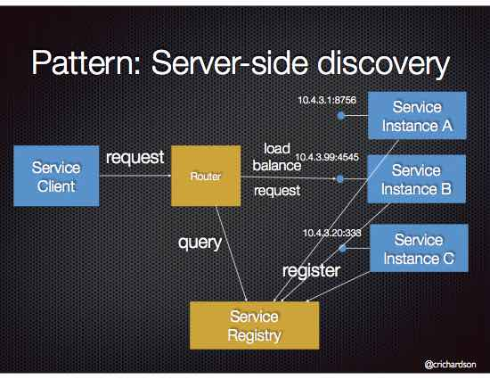

Microservices
=============

Jeżeli jedna usługa pada i to pociąga za sobą cały system, to nie jest to architekura `Microservices`.

Spojrzenie na Mikroserwisy z perspektywy biznesu
------------------------------------------------

- szybkie wypuszczanie MVP nowych produktów
- ROI wdrożenia
- spójność systemów

Cechy rozproszonych systemów
----------------------------

- Niezależne domeny awarii
- Możliwość pisania w wielu językach
- Równoległość komponentów (concurrency)
- Brak globalnego zegara i możliwości jednoznacznego określenia

8 błędnych założeń
------------------
- sieć jest niezawodna:

    - sieć w serwerowni jest niezawodna
    - MTBF routera jest 50k h
    - netsplit w publicznych cloudach są normalne
    - zwiększa sięlatency

- opóźnienia w sieci są zerowe
- przepustowość sieci jest nieskończona
- sieć jest bezpieczna:

    - większość aplikacji jest chroniona z zewnątrz
    - brak szyfrowania wewnątrz sieci

- Topologia sieci się nie zmienia:

    - przeliczenie BGP i zmiana spanning tree
    - ścieżki sieciowe się zmieniają
    - pojawiają się nowe instancje

- Istnieje tylko jeden administrator:

    - różni ludzie z różną wiedzą
    - inaczej konfigurują maszyny
    - jeden serwer może być lepiej skonfigurowany

- Koszt transportu jest zerowy

    - narzut czasowy na serializację, deserializację, stos TCP
    - czas transportu po medium jest niezerowy

- Sieć jest jednorodna

    - sieć składa się z różnych urządzeń
    - mogą być różnie stabilne
    - mogą mieć różne charakterystyki

    The Eight Fallacies of Distributed Computing
    -- Peter Deutsch, 1991

Poświęcenie
-----------
- zapewnienie spójności kosztem dostępności
- zapewnienie wysokiej dostępności kosztem spójności
- wzajemnie się wykluczające
- nie ma ACID!

BASE
----
- Basically:

    - Available (w większości możemy wykonać pewne operacje)
    - Soft State (tylko operacje, których stan możemy odbudować, np. przez przegenerowanie cache)
    - Eventually consistent (system jest pomiędzy stanem spójnym i niespójnym)

Cechy systemów
--------------
- Brak transakcyjności
- Zastosować mechanizm rekompensacji (np. raz w nocy usuwać zduplikowane dane)
- Brak gwarancji, że komunikat wysłany do hosta zostanie wysłany tylko raz (np. jeżeli dwa razy zostanie wysłany komunikat przez bankomat o naliczeniu opłaty, to operacja zostanie wykonana przez bank tylko raz)

Choreografia > Orkiestracja
---------------------------
- Choreografia:

    - informujemy system o zdarzeniu
    - system subskrybuje się do eventów
    - system reaguje na zmiany stanów

- Orkiestracja:

    - usługa jest odpowiedzialna za informację o zmianie stanu

Hermes
^^^^^^
- https://github.com/allegro/hermes
- usługa subskrybuje się do danego topicu
- gdy zajdzie zdarzenie
- system wypycha je do subskrybentów
- nakładka na `Apache Kafka`

    Architektura systemu Hermes

- można zapchać sieć, gdy ma się zcentralizowaną infrastrukturę
- wykorzystanie HTTP/2.0 (multipleksowanie połączeń http, kompresja nagłówków, TLS)

Przepisywanie architektury
--------------------------
.. figure:: ../../_static/img/microservices-sidecar.png
    :scale: 50%
    :align: center

    Architektura systemu zgodna z Sidecar

- Anti Corruption Layer (ACL)
- Tworzenie nowych funckonalności na nowej platformie
- zapewnienie spójności systemów
- kontrola czy dane w nowym systemie są spójne z nowym
- przepisywanie całości
- wdrożenie ludzi:

    - zatrudnianie w nowej technologii
    - konwersja obecnych pracowników

    Anti Corruption Layer

Tworzenie nowej usługi
^^^^^^^^^^^^^^^^^^^^^^
- end to end:

    - założenie repo w Bitbucket
    - projekt w JIRA
    - CI/CD
    - Deployment
    - Repozytorium artefaktów
    - Publikowanie metryk
    - Testy security
    - Monitoring i logowanie

- `one-click-project`
- automatyzacja powtarzających się czynności za pomocą pluginów (`gradle` i `axion`)

Platforma uruchamiania
----------------------
- Usługi uruchamiane w różnych datacenter jednocześnie
- Wykorzystanie public i private cloud jednocześnie

Mesos
^^^^^
- Tworznie logicznego klastra, który przykrywa infrastrukturę
- Możliwość dzielenia klastra na biznesowe komponenty i przydzielenia im zasobów
- Możliwość definiowania wykorzystywanych zasobów przez usługę
- Dynamiczne alokowanie zasobów

.. figure:: ../../_static/img/microservices-platform-path.png
    :scale: 50%
    :align: center

    Ścieżka rozwoju platform uruchomieniowych w architekturze mikrousługowej

Monitoring
----------
- automatyczne zapinanie metryk do usług
- raportowanie poziomu SLA
- alerting
- definiowanie progów alertownia
- wykrywanie anomalii (na podstawie dotychczasowej historii, machine learning)

Poziom organizacyjny
--------------------
- powiązania pomiędzy usługami
- przepływy danych

Domain Driven Design
^^^^^^^^^^^^^^^^^^^^
- Poziom Strategiczny i Taktyczny
- Wzorce Strategiczne: Domain Distillation, Bounded Context
- nauka Product Ownerów
- DDD na poziomie strategicznym
- definicja corowych usług
- ułożenie biznesu i IT
- podział na domeny:

    - Lead PO dla domeny
    - Solutions Archtect pomiędzy domenami

- DDD na poziomie taktycznym do decyzji zespółu

Polyglog Programming i Polyglog Persistance
^^^^^^^^^^^^^^^^^^^^^^^^^^^^^^^^^^^^^^^^^^^
- overhead związany z wielością usług
- nowe technologie
- różne działające równoległe wersje np. baz danych

Ludzie
^^^^^^
- poziom wiedzy jest nierówny
- różna wiedza na temat spójności systemów
- różne doświadczenie
- zmiana zespołów
- próg wejścia
- wdrożenie ludzi:

    - zatrudnianie w nowej technologii
    - konwersja obecnych pracowników
    - zmiana przyzwyczajeń
    - zmiana języka programowania i technologii

Handoff
^^^^^^^
- ze względu na bardzo rozproszone środowisko ludzie uruchamiają swoje usługi sami
- duża i rozproszona wiedza na temat działania systemu
- utrzymywanie przez zespół
- przekazywania usług
- zmiany HRowe
- dyżury w każdym zespole

Wiązanie usług (coupling)
-------------------------
- zaprzecza systemowi wysyłania eventów
- ze względu na rozwój domen w różnym tempie pojawia się pokusa, aby obejść usługę i samemu zaimplementować funkcjonalność

Audyt i Compliance
------------------
- problemy z monitotowaniem
- problemy z rozproszoną wiedzą
- sprawdzanie czy wszystko się liczy poprawnie
- wyciąganie raportów i danych audytowych:

    - monolit - jedno zapytanie do bazy dancyh i joiny
    - microservices - dane są rozproszone (różne systemy, bazy danych, technologie)

- tworzenie audit logów
- przygotowanie systemu od początku pod audyty

Microdata
---------
- ekspord danych do Hadoopa
- normalizacja danych z różnych technologii i baz danych
- brak informacji na świecie jak to robić
- inny sposób dostępu do danych dla analityki (dostęp do miliardów rekordów po HTTP i API nie jest optymalny)

SLA usług
---------
- Definiowanie SLA
- Koszt inwestycji w zwiększenie dostępności np. z 4 na 5 dziewiątek)
- ROI z wprowadzenia poszczególnych usług

    - zmienjszone latency
    - większa stabilność
    - większa redundantność

- Każdy system może mieć inną charakterystykę i inne cechy

Microservice testing
--------------------
* https://martinfowler.com/articles/microservice-testing/

Architecture
------------
- Duży próg wejścia:

    - Wymaga bardzo dobrego ekosystemu narzędziowego
    - Wymaga automatyzacji
    - Wymaga stworzenia i wdrożenia wielu różnych technologii
    - Tworzenie technologii, które skalują się horyzontalnie
    - Zmiana myślenia
    - Wdrożenie ludzi

- Dla większości firm nie przynosi to korzyści (sic!)
- SOA zrobiona porządnie (wywalone tematy związane z Enterprise)

Monolithic architecture
^^^^^^^^^^^^^^^^^^^^^^^
Build an application with a monolithic architecture. For example:

-  a single Java WAR file.
-  a single directory hierarchy of Rails or NodeJS code

    Monolithic architecture

Microservices architecture
^^^^^^^^^^^^^^^^^^^^^^^^^^
-  Architect the application by applying the Scale Cube (specifically
   y-axis scaling) and functionally decompose the application into a set
   of collaborating services. Each service implements a set of narrowly,
   related functions. For example, an application might consist of
   services such as the order management service, the customer
   management service etc.
-  Services communicate using either synchronous protocols such as
   HTTP/REST or asynchronous protocols such as AMQP.
-  Services are developed and deployed independently of one another.
-  Each service has its own database in order to be decoupled from other
   services. When necessary, consistency is between databases is
   maintained using either database replication mechanisms or
   application-level events.

.. figure:: ../../_static/img/microservices-architecture.jpg
    :scale: 50%
    :align: center

    Microservices Architecture

API
---

Cechy API
^^^^^^^^^
- Werjsonowane
- Stabilne
- HTTP
- REST
- JSON

API gateway
^^^^^^^^^^^
-  Implement an API gateway that is the single entry point for all
   clients. The API gateway handles requests in one of two ways. Some
   requests are simply proxied/routed to the appropriate service. It
   handles other requests by fanning out to multiple services.
-  Rather than provide a one-size-fits-all style API, the API gateway
   can expose a different API for each client. For example, the Netflix
   API gateway runs client-specific adapter code that provides each
   client with an API that’s best suited to it’s requirements.
-  The API gateway might also implement security, e.g. verify that the
   client is authorized to perform the request
-  Netflix API gateway

.. figure:: ../../_static/img/microservices-api-gateway.jpg
    :scale: 50%
    :align: center

    Microservices API gateway

Service discovery
-----------------

Client-side discovery
^^^^^^^^^^^^^^^^^^^^^
-  When making a request to a service, the client obtains the location
   of a service instance by querying a Service Registry, which knows the
   locations of all service instances.
-  Eureka is a Service Registry
-  Ribbon Client is an HTTP client that queries Eureka to route HTTP
   requests to an available service instance

.. figure:: ../../_static/img/microservices-client-side-discovery.jpg
    :scale: 50%
    :align: center

    Microservices client side discovery

Server-side discovery
^^^^^^^^^^^^^^^^^^^^^
-  When making a request to a service, the client makes a request via a
   router (a.k.a load balancer) that runs at a well known location. The
   router queries a service registry, which might be built into the
   router, and forwards the request to an available service instance.
-  AWS Elastic Load Balancer (ELB), Kubernetes, Marathon

    Server side-discovery

Service registry
----------------
-  Implement a service registry, which is a database of services, their
   instances and their locations. Service instances are registered with
   the service registry on startup and deregistered on shutdown. Client
   of the service and/or routers query the service registry to find the
   available instances of a service.
-  Eureka, Apache Zookeeper, Consul, Etcd

Self registration
-----------------
-  A service instance is responsible for registering itself with the
   service registry. On startup the service instance registers itself
   (host and IP address) with the service registry and makes itself
   available for discovery. The client must typically periodically renew
   it’s registration so that the registry knows it is still alive. On
   shutdown, the service instance unregisters itself from the service
   registry.
-  Apache Zookeeper, Netflix Eureka

3rd party registration
----------------------
-  A 3rd party registrar is responsible for registering and
   unregistering a service instance with the service registry. When the
   service instance starts up, the registrar registers the service
   instance with the service registry. When the service instance shuts
   downs, the registrar unregisters the service instance from the
   service registry.
-  Netflix Prana - a “side car” application that runs along side a
   non-JVM application and registers the application with Eureka.
-  AWS Autoscaling Groups automatically (un)registers EC2 instances with
   Elastic Load Balancer
-  Joyent’s Container buddy runs in a Docker container as the parent
   process for the service and registers it with the registry
-  Registrator - registers and unregisters Docker containers with
   various service registries
-  Clustering frameworks such as Kubernetes and Marathon (un)register
   service instances with the built-in/implicit registry

Instancje
---------

Multiple service instances per host
^^^^^^^^^^^^^^^^^^^^^^^^^^^^^^^^^^^

-  Run multiple instances of different services on a host (Physical or
   Virtual machine).
-  There are various ways of deploying a service instance on a shared
   host including:
-  Deploy each service instance as a JVM process. For example, a Tomcat
   or Jetty instances per service instance.
-  Deploy multiple service instances in the same JVM. For example, as
   web applications or OSGI bundles.

Single service instance per host
^^^^^^^^^^^^^^^^^^^^^^^^^^^^^^^^

-  Deploy each single service instance on it’s own host

Service instance per VM
^^^^^^^^^^^^^^^^^^^^^^^

-  Package the service as a virtual machine image and deploy each
   service instance as a separate VM

Service instance per Container
^^^^^^^^^^^^^^^^^^^^^^^^^^^^^^

-  Package the service as a (Docker) container image and deploy each
   service instance as a container
- Kubernetes, Marathon/Mesos, Amazon EC2 Container Service

Serverless deployment
---------------------

-  Use a deployment infrastructure that hides any concept of servers
   (i.e. reserved or preallocated resources)- physical or virtual hosts,
   or containers. The infrastructure takes your service’s code and runs
   it. You are charged for each request based on the resources consumed.
-  To deploy your service using this approach, you package the code
   (e.g. as a ZIP file), upload it to the deployment infrastructure and
   describe the desired performance characteristics.
-  The deployment infrastructure is a utility operated by a public cloud
   provider. It typically uses either containers or virtual machines to
   isolate the services. However, these details are hidden from you.
   Neither you nor anyone else in your organization is responsible for
   managing any low-level infrastructure such as operating systems,
   virtual machines, etc.
-  AWS Lambda, Google Cloud Functions, Azure Functions

Baza danych
-----------

Database per Service
^^^^^^^^^^^^^^^^^^^^

-  Keep each microservice’s persistent data private to that service and
   accessible only via its API.

.. figure:: ../../_static/img/microservices-database-per-service.png
    :scale: 50%
    :align: center

    Database per Service

Shared database
^^^^^^^^^^^^^^^

-  Use a (single) database that is shared by multiple services. Each
   service freely accesses data owned by other services using local ACID
   transactions.

.. figure:: ../../_static/img/microservices-database-shared.png
    :scale: 50%
    :align: center

    Shared database

Database triggers
^^^^^^^^^^^^^^^^^

-  Reliably publish events whenever state changes by using database
   triggers. Each trigger inserts an event into an EVENTS table, which
   is polled by a separate process that publishes the events.

Microservice chassis
--------------------

-  Build your microservices using a microservice chassis framework,
   which handles cross-cutting concerns
-  Spring Boot, Spring Cloud, Dropwizard

Zdarzenia
---------

Event-driven architecture
^^^^^^^^^^^^^^^^^^^^^^^^^

-  Use an event-driven, eventually consistent approach. Each service
   publishes an event whenever it update it’s data. Other service
   subscribe to events. When an event is received, a service updates
   it’s data.

Event sourcing
^^^^^^^^^^^^^^

-  Reliably publish events whenever state changes by using Event
   Sourcing. Event Sourcing persists each business entity as a sequence
   of events, which are replayed to reconstruct the current state.

.. figure:: ../../_static/img/microservices-event-sourcing.png
    :scale: 50%
    :align: center

    Event sourcing

Application events
^^^^^^^^^^^^^^^^^^

-  Reliably publish events whenever state changes by having the
   application insert events into an EVENTS table as part of the local
   transaction. A separate process polls the EVENTS table and publishes
   the events to a message broker.

CQRS - Command Query Responsibility Segregation
-----------------------------------------------

-  Split the system into two parts. The command side handles create,
   update and delete requests. The query side handles queries using one
   or more materialized views of the application’s data.

Transaction log tailing
-----------------------

-  Reliably publish events whenever state changes by tailing the
   transaction log.

