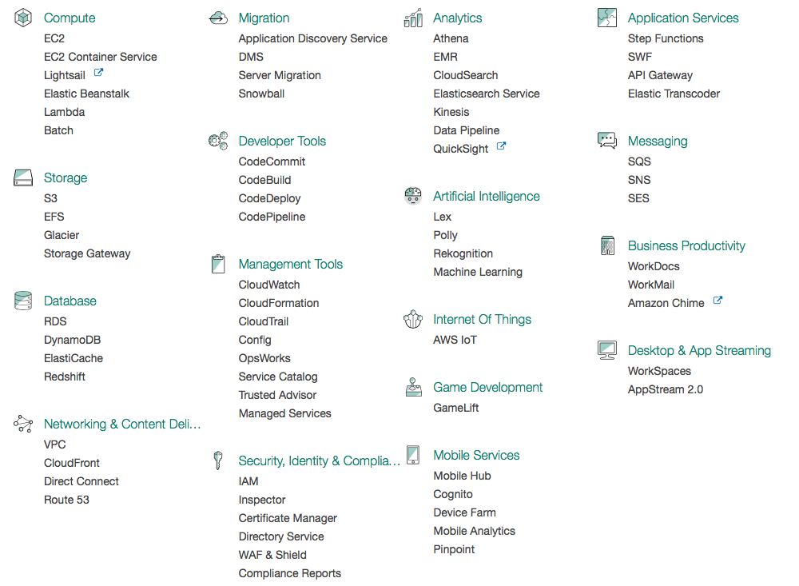

Amazon AWS
==========

    Amazon AWS services overview

Produkty
--------

- https://aws.amazon.com/products/

Compute
^^^^^^^
=============================  =========================================
Nazwa                          Opis
=============================  =========================================
Amazon EC2                     Virtual Servers in the Cloud
Amazon EC2 Container Registry  Store and Retrieve Docker Images
Amazon EC2 Container Service   Run and Manage Docker Containers
Amazon Lightsail               Launch and Manage Virtual Private Servers
Amazon VPC                     Isolated Cloud Resources
AWS Batch                      Run Batch Jobs at Any Scale
AWS Elastic Beanstalk          Run and Manage Web Apps
AWS Lambda                     Run Your Code in Response to Events
Auto Scaling                   Automatic Elasticity
=============================  =========================================

Storage
^^^^^^^
=============================  =========================================
Nazwa                          Opis
=============================  =========================================
Amazon S3                      Scalable Storage in the Cloud
Amazon EBS                     Block Storage for EC2
Amazon Elastic File System     Managed File Storage for EC2
Amazon Glacier                 Low-Cost Archive Storage in the Cloud
AWS Storage Gateway            Hybrid Storage Integration
AWS Snowball                   Petabyte-scale Data Transport
AWS Snowball Edge              Petabyte-scale Data Transport with On-board Compute
AWS Snowmobile                 Exabyte-scale Data Transport
=============================  =========================================

Database
^^^^^^^^
==============================  =========================================
Nazwa                           Opis
==============================  =========================================
Amazon Aurora                   High Performance Managed Relational Database
Amazon RDS                      Managed Relational Database Service for MySQL, PostgreSQL, Oracle, SQL Server, and MariaDB
Amazon DynamoDB                 Managed NoSQL Database
Amazon ElastiCache              In-Memory Caching System
Amazon Redshift                 Fast, Simple, Cost-Effective Data Warehousing
AWS Database Migration Service  Migrate Databases with Minimal Downtime
==============================  =========================================

Networking
^^^^^^^^^^
==============================  =========================================
Nazwa                           Opis
==============================  =========================================
Amazon VPC                      Isolated Cloud Resources
Amazon CloudFront               Global Content Delivery Network
Amazon Route 53                 Scalable Domain Name System
AWS Direct Connect              Dedicated Network Connection to AWS
Elastic Load Balancing          High Scale Load Balancing
==============================  =========================================

Regions
-------
==============  ==========================
Code	        Name
==============  ==========================
us-east-1       US East (N. Virginia)
us-east-2       US East (Ohio)
us-west-1       US West (N. California)
us-west-2       US West (Oregon)
ca-central-1    Canada (Central)
eu-west-1       EU (Ireland)
eu-central-1    EU (Frankfurt)
eu-west-2       EU (London)
ap-northeast-1  Asia Pacific (Tokyo)
ap-northeast-2  Asia Pacific (Seoul)
ap-southeast-1  Asia Pacific (Singapore)
ap-southeast-2  Asia Pacific (Sydney)
ap-south-1      Asia Pacific (Mumbai)
sa-east-1       South America (São Paulo)
==============  ==========================

AWS Command Line Interface (CLI)
--------------------------------
- Access Key

.. code-block:: sh

    brew install awscli

    aws configure
    aws ecr get-login
    docker login -u AWS -p [...] -e none https://624006931819.dkr.ecr.eu-central-1.amazonaws.com
    docker build -t docker .
    docker tag docker:latest 624006931819.dkr.ecr.eu-central-1.amazonaws.com/docker:latest
    docker push 624006931819.dkr.ecr.eu-central-1.amazonaws.com/docker:latest

.. code-block:: dockerfile

    FROM ubuntu
    RUN echo 'ehlo world'

Tworzenie aplikacji w oparciu o platformę Amazon AWS
----------------------------------------------------

-  Provisioning środowiska
-  Tworzenie aplikacji
-  Storage
-  Cache
-  Bazy danych
-  Zarządzanie hostami
-  Tworzenie reguł

Usługi w Amazon AWS
-------------------

- `10 minute tutorials <https://aws.amazon.com/getting-started/tutorials/>`_

EC2
^^^

ELB - Elastic Load Ballancer
^^^^^^^^^^^^^^^^^^^^^^^^^^^^
- Czym jest ELB
- Jak działa
- Rodzaje Load Ballancerów

    - An Application Load Balancer makes routing decisions at the application layer (HTTP/HTTPS), supports path-based routing, and can route requests to one or more ports on each container instance in your cluster [LB]_.

    .. figure:: ../../_static/img/architecture-application-load-ballancer.png
        :scale: 50%
        :align: center

        Application Load Balancer [LB]_

    - A Classic Load Balancer makes routing decisions at either the transport layer (TCP/SSL) or the application layer (HTTP/HTTPS) [LB]_.

        .. figure:: ../../_static/img/architecture-classic-load-ballancer.png
            :scale: 50%
            :align: center

            Classic Load Balancer [LB]_

- Application Load Ballancer

    - Application Load Balancers allow containers to use dynamic host port mapping (so that multiple tasks from the same service are allowed per container instance) [LB]_.

    - Application Load Balancers support path-based routing and priority rules (so that multiple services can use the same listener port on a single Application Load Balancer) [LB]_.

.. [LB] http://docs.aws.amazon.com/AmazonECS/latest/developerguide/service-load-balancing.html

Amazon EC2 Container Service (ECS)
^^^^^^^^^^^^^^^^^^^^^^^^^^^^^^^^^^
- Pozwalają na uruchomienie kontenerów `Docker` na platformie `Amazon EC2`

Lambda
^^^^^^
- Uruchamianie funkcji w Cloud, bez konieczności stawiania środowiska
- Obsługiwane języki programowania

Zadania
-------

Lambda functions
^^^^^^^^^^^^^^^^
Stwórz w `Amazon AWS` lambda function który wyświetli `Ehlo World`.

Korzystanie z `Amazon AWS`
^^^^^^^^^^^^^^^^^^^^^^^^^^
- Załóż konto na `Amazon AWS`
- Stwórz wolumen danych
- W panelu sterowania uruchom maszynę z poziomu `Free Tier` z `Ubuntu LTS` `AMI` z zamontowanym wolumenem
- W konfiguracji sieciowej maszyny ustaw możliwość połączenia z maszyną na portach:

    - 80
    - 443
    - 8080
    - 9000
    - 8081

- Jaki jest adres IP maszyny?

    - zewnętrzny
    - wewnętrzny
    - czym to się różni?
    - z którego korzystać?
