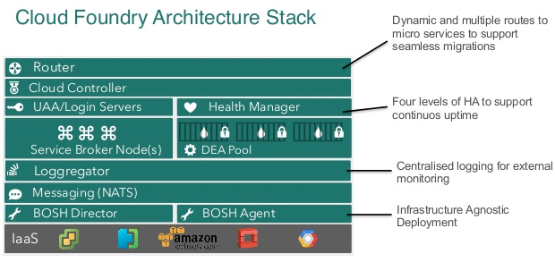

Cloud Foundry
=============

Cloud Foundry is an open platform as a service (PaaS) that provides a choice of clouds, developer frameworks, and application services. Cloud Foundry makes it faster and easier to build, test, deploy, and scale applications.

- https://www.infoq.com/presentations/pcf-cd
- https://www.infoq.com/presentations/devops-cloud-foundry
- https://www.infoq.com/presentations/trends-cloud-foundry

    Cloud Foundry Architecture

.. figure:: ../../_static/img/cloud-foundry-architecture-02.png
    :scale: 50%
    :align: center

    Cloud Foundry Architecture

Technology
----------
=================  =================================================
Name               Description
=================  =================================================
cf                 Cloud Foundry is an open platform as a service (PaaS)
cflinuxfs2-rootfs  System plików
diego              Diego is the new container runtime system for Cloud Foundry, replacing the DEAs and Health Manager.
garden-runc        Guardian is a simple single-host OCI container manager. It implements the Garden API which is used in Cloud Foundry.
bosh-aws-cpi
bosh
=================  =================================================

Bosh
----
BOSH is an open source tool chain for release engineering, deployment and lifecycle management of large scale distributed services. It’s the default deployment and management platform for Cloud Foundry operators.

BOSH installs and updates software packages on large numbers of VMs over many IaaS providers with the absolute minimum of configuration changes.

- https://bosh.io/docs/bosh-components.html

The Director is the core orchestrating component in BOSH. The Director controls VM creation and deployment, as well as other software and service lifecycle events.

Stemcell
^^^^^^^^
A stemcell is a versioned Operating System image wrapped with IaaS specific packaging.

- https://bosh.io/docs/stemcell.html

A typical stemcell contains a bare minimum OS skeleton with a few common utilities pre-installed, a BOSH Agent, and a few configuration files to securely configure the OS by default. For example: with vSphere, the official stemcell for Ubuntu Trusty is an approximately 500MB VMDK file. With AWS, official stemcells are published as AMIs that can be used in your AWS account.

By introducing the concept of a stemcell, the following problems have been solved:

- Capturing a base Operating System image
- Versioning changes to the Operating System image
- Reusing base Operating System images across VMs of different types
- Reusing base Operating System images across different IaaS

Release
^^^^^^^
A release is a versioned collection of configuration properties, configuration templates, start up scripts, source code, binary artifacts, and anything else required to build and deploy software in a reproducible way.

- https://bosh.io/docs/release.html

A release is the layer placed on top of a stemcell.

By introducing the concept of a release, the following concerns are addressed:

- Capturing all needed configuration options and scripts for deployment of the software
- Recording and keeping track of all dependencies for the software
- Versioning and keeping track of software releases
- Creating releases that can be IaaS agnostic
- Creating releases that are self-contained and do not require internet access for deployment

Deployment
^^^^^^^^^^
A deployment is a collection of VMs, built from a stemcell, that has been populated with specific releases and disks that keep persistent data. These resources are created based on a manifest file in the IaaS and managed by the BOSH Director, a centralized management server.

.. code-block:: yaml

    ---
    name: redis-us

    releases:
    - name: redis
      version: 15.9 # <--- bump version

    resource_pools:
    - name: all-machines
      stemcell:
        name: bosh-aws-xen-ubuntu-trusty-go_agent
        version: 2972
      network: default
      cloud_properties:
        instance_type: m1.small
        availability_zone: us-east-1a
    ...

Bosh Lite
---------
- https://github.com/cloudfoundry/bosh-lite

Create
^^^^^^
.. code-block:: sh

    git clone https://github.com/cloudfoundry/bosh-lite
    cd bosh-lite
    vagrant up

Upgrade
^^^^^^^
.. code-block:: sh

    git pull
    vagrant box update
    vagrant destroy
    vagrant up

CF Release
----------
CF-Release is the BOSH release repository for the Cloud Foundry platform. To deploy Cloud Foundry, start with cf-release, build a custom manifest for your deployment, and let BOSH take over from there.

Diego
-----
Diego is the new container runtime system for Cloud Foundry, replacing the DEA (Droplet Execution Agent) and Health Manager.

- https://github.com/cloudfoundry/diego-release

Cloud Foundry has used two architectures for managing application containers:

- Droplet Execution Agents (DEA)
- Diego.

With the DEA architecture, the Cloud Controller schedules and manages applications on the DEA nodes. In the newer Diego architecture, Diego components replace the DEAs and the Health Manager (HM9000), and assume application scheduling and management responsibility from the Cloud Controller.

- https://github.com/cloudfoundry/diego-release/tree/develop/examples/bosh-lite

From the standpoint of your application, here's what you need to know: In Diego, you now have the choice to push a one-use function (a Task) or a more traditional application that stays resident (a Long-Running Process, or LRP) -- a good example of an LRP might be a web server that you need always listening for traffic, while a Task may be something like a database migration as part of a release, or a task that examines recent data for something specific. Before, in DEA, you really only pushed processes that were expected to stay resident. Diego's brain and health monitor makes sure these tasks are balanced as well as possible - spreading out CPU-intensive tasks across virtual machines, or balancing memory, et cetera. While before some of this was done as part of the cloud controller, now the Diego environment handles it itself.

Getting a bit further into the trees, pushing an application to Cloud Foundry using Diego would:

- Contacts the Diego Brain which immediately sets up Auctioneer to announce to the diego cells that there is a new task or LRP that needs to be added, and how many cells it should use.

- Lets the Converger know what the application expects to have running at any time, so that if there is a change, it can immediately set up a replacement.

- The Diego Cells run the task at hand, constantly updating the bulletin board system with necessary information (such as CPU usage) that allow the auctioneer and the converger to ensure the app is running according to plan. Diego uses etcd to handle the BBS.

- What isn't handled by the BBS is handled by Consul - this is mostly locks to make sure only the right process is handling the right task (as an example in Diego, there can be only one Auctioneer at any time, but if that Auctioneer goes away, something else must pick up the lock) or load balancing.

- Various other Diego-specific processes (Nsync, TPS, stager, and so forth) all exist as brokers to provide information from the cells to the right ingestors to ensure things are pushed in a safe manner, and information gets back to the right channels when things are not so safe.

- http://www.starkandwayne.com/blog/demystifying-cloud-foundrys-diego/

Droplet Execution Agents (DEA) -> Diego
^^^^^^^^^^^^^^^^^^^^^^^^^^^^^^^^^^^^^^^
- Warden -> Garden
- Health Manager (HM9000) -> nsync, BBS, and Cell Rep
- DEA Placement Algorithm -> Diego Auction
- Message Bus (NATS)

+-------------------------+---------------------------------------------------------------------+-----------------------------------------------------------------------------------------------------------------------------------------------------+-----------------------------------------------------------------------------------------------------------------------------+
| DEA architecture        | Diego architecture                                                  | Function                                                                                                                                            | Δ notes                                                                                                                     |
+=========================+=====================================================================+=====================================================================================================================================================+=============================================================================================================================+
| Ruby                    | Go                                                                  | Source code language                                                                                                                                |                                                                                                                             |
+-------------------------+---------------------------------------------------------------------+-----------------------------------------------------------------------------------------------------------------------------------------------------+-----------------------------------------------------------------------------------------------------------------------------+
| DEA                     | Diego Brain                                                         | High-level coordinator that allocates processes to containers in application VMs and keeps them running                                             | DEA is part of the Cloud Controller. Diego is outside the Cloud Controller.                                                 |
+-------------------------+---------------------------------------------------------------------+-----------------------------------------------------------------------------------------------------------------------------------------------------+-----------------------------------------------------------------------------------------------------------------------------+
| DEA Node                | Diego Cell                                                          | Mid-level manager on each VM that runs apps as directed and communicates “heartbeat”, application status and container location, and other messages | Runs on each VM that hosts apps, as opposed to special-purpose component VMs.                                               |
+-------------------------+---------------------------------------------------------------------+-----------------------------------------------------------------------------------------------------------------------------------------------------+-----------------------------------------------------------------------------------------------------------------------------+
| Warden                  | Garden                                                              | Low-level manager and API protocol on each VM for creating, configuring, destroying, monitoring, and addressing application containers              | Warden is Linux-only. Garden uses platform-specific Garden-backends to run on multiple OS.                                  |
+-------------------------+---------------------------------------------------------------------+-----------------------------------------------------------------------------------------------------------------------------------------------------+-----------------------------------------------------------------------------------------------------------------------------+
| DEA Placement Algorithm | Diego Auction                                                       | Algorithm used to allocate processes to VMs                                                                                                         | Diego Auction distinguishes between Task and Long-Running Process (LRP) job types                                           |
+-------------------------+---------------------------------------------------------------------+-----------------------------------------------------------------------------------------------------------------------------------------------------+-----------------------------------------------------------------------------------------------------------------------------+
| Health Manager (HM9000) | nSync, BBS, and Cell Reps                                           | System that monitors application instances and keeps instance counts in sync with the number that should be running                                 | nSync syncs between Cloud Controller and Diego, BBS syncs within Diego, and Cell Reps sync between cells and the Diego BBS. |
+-------------------------+---------------------------------------------------------------------+-----------------------------------------------------------------------------------------------------------------------------------------------------+-----------------------------------------------------------------------------------------------------------------------------+
| NATS Message Bus        | Bulletin Board System (BBS) and Consulthrough HTTP, HTTPS, and NATS | Internal communication between components                                                                                                           | BBS stores most runtime data; Consul stores control data.                                                                   |
+-------------------------+---------------------------------------------------------------------+-----------------------------------------------------------------------------------------------------------------------------------------------------+-----------------------------------------------------------------------------------------------------------------------------+
|                         |                                                                     |                                                                                                                                                     |                                                                                                                             |
+-------------------------+---------------------------------------------------------------------+-----------------------------------------------------------------------------------------------------------------------------------------------------+-----------------------------------------------------------------------------------------------------------------------------+
|                         |                                                                     |                                                                                                                                                     |                                                                                                                             |
+-------------------------+---------------------------------------------------------------------+-----------------------------------------------------------------------------------------------------------------------------------------------------+-----------------------------------------------------------------------------------------------------------------------------+

Consul
------
Consul is a tool for service discovery and configuration. Consul is distributed, highly available, and extremely scalable.

- https://github.com/hashicorp/consul

Consul provides several key features:

- Service Discovery - Consul makes it simple for services to register themselves and to discover other services via a DNS or HTTP interface. External services such as SaaS providers can be registered as well.

- Health Checking - Health Checking enables Consul to quickly alert operators about any issues in a cluster. The integration with service discovery prevents routing traffic to unhealthy hosts and enables service level circuit breakers.

- Key/Value Storage - A flexible key/value store enables storing dynamic configuration, feature flagging, coordination, leader election and more. The simple HTTP API makes it easy to use anywhere.

- Multi-Datacenter - Consul is built to be datacenter aware, and can support any number of regions without complex configuration.

Guardian
--------
A simple single-host OCI (`Open Container Initiative <https://www.opencontainers.org>`_) container manager.

- https://github.com/cloudfoundry/garden-runc-release

Components
^^^^^^^^^^
- Gardeners Question Time (GQT): A venerable British radio programme. And also a test suite.
- Gardener: Orchestrates the other components. Implements the Cloud Foundry Garden API.
- Garden Shed: RootFS and volume management. Where stuff is kept in the garden.
- RunDMC: A tiny wrappper around RunC to manage a collection of RunC containers.
- Kawasaki: It's an amazing networker.

CLI - Command Line Interface
----------------------------

.. code-block:: text

    Before getting started:
      config    login,l      target,t
      help,h    logout,lo

    Application lifecycle:
      apps,a        logs      set-env,se
      push,p        ssh       create-app-manifest
      start,st      app
      stop,sp       env,e
      restart,rs    scale
      restage,rg    events

    Services integration:
      marketplace,m        create-user-provided-service,cups
      services,s           update-user-provided-service,uups
      create-service,cs    create-service-key,csk
      update-service       delete-service-key,dsk
      delete-service,ds    service-keys,sk
      service              service-key
      bind-service,bs      bind-route-service,brs
      unbind-service,us    unbind-route-service,urs

    Route and domain management:
      routes,r        delete-route    create-domain
      domains         map-route
      create-route    unmap-route

    Space management:
      spaces         create-space    set-space-role
      space-users    delete-space    unset-space-role

    Org management:
      orgs,o       set-org-role
      org-users    unset-org-role

    CLI plugin management:
      plugins           add-plugin-repo      repo-plugins
      install-plugin    list-plugin-repos

    Commands offered by installed plugins:

    Global options:
      --help, -h                         Show help
      -v                                 Print API request diagnostics to stdout

Help
^^^^
.. code-block:: sh

    cf help

Deployment
^^^^^^^^^^
.. code-block:: sh

    cf push myapp -p <filename>.jar
    cf app myapp

Scaling
^^^^^^^
.. code-block:: sh

    cf scale myapp -i 2

Marketplace
^^^^^^^^^^^
.. code-block:: sh

    cf marketplace |grep mysql

    cf create-service p-mysql 100mb mydb
    cf bind-service myapp mydb
    cf restart myapp

Web Platform
------------
- https://console.run.pivotal.io

Login
^^^^^
.. code-block:: sh

    cf login -a api.run.pivotal.io
    cf push myapp

PCF Dev
-------
A lightweight Pivotal Cloud Foundry® (PCF) installation that runs on a single virtual machine (VM) on your workstation. PCF Dev is intended for application developers who want to develop and debug their applications locally on a PCF deployment.

- https://network.pivotal.io/products/pcfdev

Zadania
-------

`pcfdev`
^^^^^^^^
- Zainstaluj na czystym `Ubunutu` na `Vagrant` ``pcfdev``

.. toggle-code-block:: sh
    :label: Pokaż rozwiązanie dla CF Dev

    wget -q -O - https://packages.cloudfoundry.org/debian/cli.cloudfoundry.org.key | sudo apt-key add -
    echo "deb http://packages.cloudfoundry.org/debian stable main" | sudo tee /etc/apt/sources.list.d/cloudfoundry-cli.list
    sudo apt-get update
    sudo apt-get install openjdk-8-jdk
    sudo apt-get install cf-cli

Bosh Lite
^^^^^^^^^
- Uruchom `Bosh Lite` na `Vagrant`

.. toggle-code-block:: sh
    :label: Pokaż rozwiązanie deploymentu lokalnego - uruchomienie

    git clone https://github.com/cloudfoundry/bosh-lite
    cd bosh-lite
    vagrant up

    # uważaj na ilość RAMu i CPU dla maszyny

Deploy to local workstation
^^^^^^^^^^^^^^^^^^^^^^^^^^^
- Uruchom aplikację https://github.com/cloudfoundry-samples/spring-music CF lokalnie
- Podłącz aplikację do bazy danych `MySQL`

.. tip:: `cf dev <https://network.pivotal.io/products/pcfdev>`_

.. toggle-code-block:: sh
    :label: Pokaż rozwiązanie deploymentu lokalnego - uruchomienie

    git clone https://github.com/cloudfoundry-samples/spring-music
    cd ./spring-music
    cf login -a api.local.pcfdev.io --skip-ssl-validation
    ./gradlew assemble
    cf push --hostname spring-music
    cf logs spring-music --recent
    cf logs spring-music

.. toggle-code-block:: sh
    :label: Pokaż rozwiązanie deploymentu lokalnego - baza danych

    cf marketplace -s p-mysql
    cf create-service p-mysql 512mb my-spring-db
    cf bind-service spring-music my-spring-db
    cf restart spring-music
    cf services

Deploy to `Pivotal Web Services` (`PWS`)
^^^^^^^^^^^^^^^^^^^^^^^^^^^^^^^^^^^^^^^^
- Uruchom aplikację https://github.com/cloudfoundry-samples/cf-sample-app-spring.git w `PWS`
- Podłącz aplikację do bazy danych `ElephantSQL`
- Przeskalują aplikację:

    - ilość instancji = 2
    - ilość ramu = 1 GB
    - ilość miejsca na dysku = 512 MB

.. toggle-code-block:: sh
    :label: Pokaż rozwiązanie deploymentu cloud - kod

    git clone https://github.com/cloudfoundry-samples/cf-sample-app-spring.git
    cd cf-sample-app-spring
    cf login -a https://api.run.pivotal.io
    cf push
    cf logs cf-spring --recent
    cf logs cf-spring

.. toggle-code-block:: sh
    :label: Pokaż rozwiązanie deploymentu cloud - baza danych

    cf marketplace -s elephantsql
    cf create-service elephantsql turtle cf-spring-db
    cf bind-service cf-spring cf-spring-db
    cf restart cf-spring
    cf services

.. toggle-code-block:: sh
    :label: Pokaż rozwiązanie deploymentu cloud - skalowanie

    cf scale cf-spring -i 2
    cf app cf-spring
    cf scale cf-spring -m 1G
    cf scale cf-spring -k 512M

Diego
^^^^^
- Uruchom `Diego` na `Bosh Lite` z poprzedniego zadania

.. toggle-code-block:: sh
    :label: Pokaż rozwiązanie

    https://github.com/cloudfoundry/diego-release/tree/develop/examples/bosh-lite
