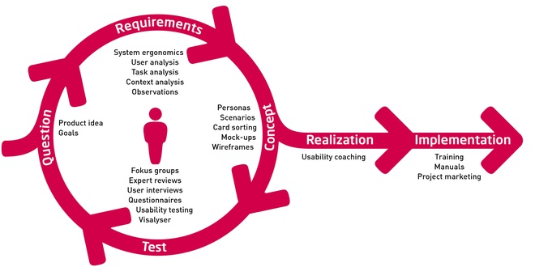

*****************************************************************
Projektowanie zorientowane na użytkownika - `User-centred design`
*****************************************************************

W Firmie znajduje się specjalna komórka zajmująca się opracowywaniem oprogramowania pod kątem jakości doświadczenia użytkowników.

Zespół User Experience prowadzi badania potrzeb użytkowników, prace analityczne i optymalizujące procesy biznesowe, opracowuje e-usługi, prowadzi  prace nad ergonomią rozwiązań (usability, architektura informacji), tworzy projekty graficzne interfejsu użytkownika (`GUI`), implementacje stworzonych rozwiązań (`front-end development`), a także zapewnia testowanie powstałych rozwiązań z udziałem użytkowników (usability testing). Zespół dba również o dostosowywanie produktów do potrzeb osób niepełnosprawnych, co jest szczególnie istotne w kontekście publicznego dostępu do wybranych systemów informatycznych.

.. figure:: ../../_static/img/user-centered-design-phases.png

    Znaczenie User Experience

Rozwiązania tworzone są zgodnie z metodologią User-centered design,  w której potrzeby, wymagania i ograniczenia końcowego użytkownika są szczegółowo badane na każdym etapie procesu projektowego. Ze względu na swoją specyfikę, zespół stale współpracuje z zespołami programistycznymi i włącza się w ich prace. Zajmuje się także wewnętrznym odbiorem stworzonych przez programistów systemów i sprawdza je pod kątem użyteczności. Całość działań jest możliwa dzięki iteracyjnemu systemowi tworzenia oprogramowania stosowanemu w Firmie.

    Projektowanie zorientowane na użytkownika w iteracyjnym systemie wytwarzania oprogramowania
 
Proces planowania wydajności systemu 
====================================

Firma w ramach przygotowania Projektu, określiła, że jednym z kluczowych elementów poprawnego działania aplikacji jest jego wydajność. Decyzja taka wynikła z faktu docelowego wykorzystywania systemu Projektu do codziennej równoległej pracy znacznej liczby użytkowników.

Proces planowania wydajności systemu zawierał:

* zaplanowanie, przygotowanie i wdrożenie odpowiedniej architektury sprzętowej i systemowej środowiska, na którym pracuje system Projektu;
* zaplanowanie, przygotowanie i wdrożenie odpowiedniej architektury projektu samej aplikacji;
* zaplanowanie, przygotowanie, wdrożenie i przeprowadzanie wielopoziomowych testów wydajnościowych systemu.

Pierwsze dwa punkty mają swoje odzwierciedlenie w Projekcie Technicznym. Celem niniejszego dokumentu jest doprecyzowanie trzeciego punktu.

Firma wdrożyła praktykę projektową Ciągłej Integracji (ang. `Continuous Integration`, `CI`).

Testy wydajnościowe
===================

W ramach sprawdzenia testów wydajnościowych systemu Projektu przygotowano scenariusze testów wydajnościowych i obciążeniowych. Na ich podstawie wykonywane są testy mierzące wydajność aplikacji.

Scenariusze oraz wyniki testów bazujących na tych scenariuszach umieszczone są w osobnym, załączonym dokumencie "Scenariusze testów wydajnościowych i obciążeniowych”.
