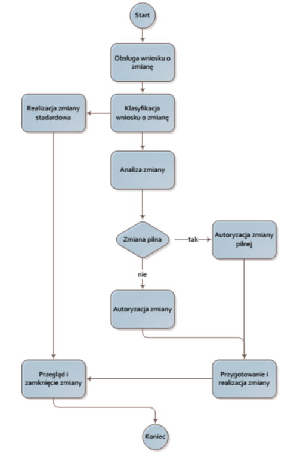

*************************
Proces zarządzania zmianą
*************************

.. figure:: ../../_static/img/processes.png
    :scale: 50%
    :align: center

    Procesy zarządzania zmianą.

Procesy wejścia dla zarządzania zmianą
======================================

Wejściem do procesu zmiany jest zgłoszenie otrzymane poprzez określony kanał kontaktowy. Pierwszym zadaniem związanym ze zgłoszeniem jest określenie jego typu (incydent, wniosek o usługę lub inne).

Przyjmuje się jednolity tryb nadsyłania zgłoszeń incydentów i wniosków o usługę w ramach prac nad aplikacją. W praktyce sposób postępowania z incydentami oraz wnioskami o usługę jest podobny, dlatego inicjalnie oba są zawarte w zakresie procesu Zarządzania Incydentem.

Wnioski o usługę realizowane są w trybie indywidualnym ale powtarzalnym (związanym z analiza ryzyka, czasochłonności, możliwości wprowadzenia zmiany w aktualnym stadium zaawansowania prac), natomiast w przypadku stwierdzenia incydentu, następują działania związane z Zarządzaniem Incydentem. 

Przyczyna wystąpienia incydentu może okazać się oczywista, co skutkuje w szybkim rozwiązaniu i zamknięciu incydentu. W identyfikacji przyczyny przydatna jest Baza Wiedzy dotycząca istniejących rozwiązań. W przypadku, gdy nie jest możliwa szybka identyfikacja przyczyny i rozwiązanie zgłoszenia, następuje uruchomienie procesu Zarządzania Problemem.

Incydent (błąd w funkcjonalności aplikacji)
===========================================

Incydent to każde zdarzenie, które nie jest częścią normalnego działania usługi, zakłóca tę usługę, które powoduje lub może powodować przerwę w dostarczaniu usługi, względnie obniżenie jej jakości.

Wniosek o usługę (zmiana funkcjonalności)
=========================================

Wnioski o usługę mają charakter powtarzalny, obsługiwane są zawsze w ten sam sposób, dla których możliwe jest zagwarantowanie przez Firmę czasu realizacji. 

Zarządzanie incydentem
======================

Celem procesu Zarządzania Incydentem jest przywrócenie normalnego działania aplikacji i usług tak szybko, jak to możliwe oraz minimalizowanie niekorzystnego wpływu Incydentu na działanie aplikacji w przyszłości, tak by zapewnić najwyższy możliwy poziom jakości i dostępności świadczonych przez Projekt usług.

Przez "normalne działanie usług" należy rozumieć działanie usług określone w ustalonej z zamawiającym dokumentacji. Wszystkie zgłoszenia użytkowników, czyli incydenty i wnioski o usługę, powinny zostać zarejestrowane w Bazie Zgłoszeń. Jest to pierwsza czynność procesu Zarządzania Incydentem wykonywana przez I linię wsparcia tzw. Service Desk.

Użytkownik przy rejestracji swojego zgłoszenia otrzymuje unikalny numer referencyjny (nr zgłoszenia), na który może powołać się przy kolejnym kontakcie w sprawie danego zgłoszenia.

Następnym krokiem jest klasyfikacja incydentu.

Klasyfikacja obejmuje następujące czynności:

* identyfikację usługi, której dotyczy incydent i wybór odpowiedniej kategoryzacji,
* identyfikację komponentu usługi związanej z incydentem,
* identyfikację fragmentu kodu, którego dotyczy incydent,
* przypisanie priorytetu na podstawie wpływu danego incydentu na funkcjonowanie usług i aplikacji, użytkownik zgłaszając incydent może zażądać nadania konkretnego priorytetu zgłoszeniu przy czym w przypadku rozbieżności pomiędzy oceną zgłaszającego i Service Desk, priorytet jest uzgadniany przez Firmę z Klientem w późniejszym terminie, a w trakcie obsługi przypisywany jest priorytet określony przez zgłaszającego,
* konfrontacja danego incydentu z Bazą Wiedzy w celu znalezienia gotowego rozwiązania lub rozwiązania zastępczego,
* próba rozwiązania incydentu na podstawie gotowego rozwiązania lub własnego doświadczenia,
* jeśli rozwiązania nie ma lub jest nieskuteczne – wybór i przypisanie kompetentnej grupy wsparcia, mogącej rozwiązać incydent.

Kolejnym krokiem jest zamknięcie incydentu, polegające na zapewnieniu:

* (jeżeli zastosowano rozwiązanie zastępcze nieznajdujące się dotychczas w Bazie Wiedzy) poprawności wpisu w Bazie Wiedzy dotyczącego zastosowanego rozwiązania (czy wpis jest zwięzły i zrozumiały?),
* poprawnej klasyfikacji incydentu ze względu na przyczynę jego wystąpienia,
* sprawdzenia czy zastosowane rozwiązanie jest uzgodnione i zatwierdzone przez Klienta,
* wszystkie istotne informacje dotyczące incydentu są zarejestrowane, a w szczególności rejestrowane są:
* czas poświęcony na rozwiązanie incydentu,
* osoba zamykająca incydent,
* data i czas zamknięcia incydentu.

Zarządzanie problemem
=====================

Celem procesu Zarządzania Problemem realizowanego przez Firmę jest minimalizowanie niekorzystnego wpływu incydentów oraz zabezpieczenie przed ponownym pojawieniem się incydentów związanych z tą samą przyczyną.

W pierwszym kroku procesu pracownik obsługujący problem jest zobowiązany do zarejestrowania nowego Problemu w Bazie Wiedzy. Następnie dokonuje klasyfikacji problemu zgodnie z przyjętymi zasadami. Klasyfikacja dokonywana jest w celu odpowiedniej alokacji zasobów, tak aby problemy o najwyższym priorytecie (poziomie negatywnego wpływu na realizację celów funkcjonowania aplikacji i usług) były rozwiązywane w pierwszej kolejności.

W kolejnym kroku ten sam pracownik lub zespół diagnozuje problem oraz proponuje jego rozwiązanie. Po tym etapie, czyli w momencie gdy znana jest już przyczyna wystąpienia, problem staje się znanym błędem. Kolejne czynności zmierzające do trwałego wyeliminowania przyczyny zwane są Kontrolą błędu.

Rezultatem procesu Zarządzania Problemem musi być wpis do Bazy Wiedzy dokonany przez pracownika obsługującego problem, identyfikujący rozwiązanie lub akceptujący rozwiązanie zastępcze. Dany wpis powinien być na tyle zrozumiały i szczegółowy, aby kolejne zgłoszenia tego samego typu, nie wymagały ponownego uruchomiania procesu Zarządzania Problemem i mogły być rozwiązane przez Specjalistów.

Może wystąpić sytuacja, w której rozwiązanie problemu będzie wymagało od pracowników obsługujących problem  wprowadzenia zmian. Zmiany są realizowane w procedurze Zarządzania Zmianą i w takim przypadku dopiero zastosowanie (przygotowanie, przetestowanie i wprowadzenie) zmiany pozwala zamknąć rozwiązany problem oraz wszelkie incydenty z nim powiązane.

Proces zarządzania zmianą
=========================

Zmiana, to dodanie, modyfikacja lub usunięcie czegokolwiek, co mogłyby mieć wpływ na działanie aplikacji i świadczone przez nią usługi. W ten sposób ogólna definicja zmiany obejmuje swym zakresem każdą zmianę w architekturze, procesach, narzędziach i innych elementach konfiguracji. 

Celem procesu jest zapewnienie, aby na każdym etapie cyklu życia aplikacji i jej usług, wszelkie zmiany kontrolowane były poprzez standardowe metody i procedury, które pozwalają minimalizować zakłócenia w jakości świadczonych usług. Za proces zarządzania zmianą jest odpowiedzialna Firma.

Ogólny sposób obsługi zmian przedstawiony jest na schemacie poniżej.

Wejściem do procesu jest zgłoszenie Incydentu, lub złożony przez ITSM wniosek o zmianę (RFC, z ang. Request of Change). 

Na etapie tworzenia aplikacji, większość zmian wynika ze zgłoszonych Incydentów, natomiast wniosek o zmianę dotyczy tylko procesu wdrożeniowego i może być zgłoszony tylko przez wskazanych pracowników Firmy (w szczególności dotyczy to zmian standardowych, dla których decyzja jest preautoryzowana). 

Obsługa zadania zmiany rozpoczyna się od klasyfikacji i przypisania odpowiedniego priorytetu. Jeśli zmiana zostanie sklasyfikowana jako zmiana standardowa realizowana jest w uproszczony sposób. Zmiana standardowa jest określona wcześniej i decyzja o jej wdrożeniu jest automatycznie autoryzowana. Szczegóły dotyczące zmian standardowych i procedurze ich obsługi zostały określone w dokumentach roboczych dotyczących budowy i eksploatacji aplikacji i jej środowiska. 

Jeśli zmiana nie jest zmianą eksploatacyjną następuje ocena zmiany. Każda taka zmiana przed wprowadzeniem musi zostać zatwierdzona. Z punktu widzenia procesu zarządzania zmianą bardzo istotne jest określenie trybu, w jakim zmiana ma być zatwierdzona. Tryb ten wynika bezpośrednio z charakteru zmiany. Ze względu na to, że sposób autoryzacji może trwać długo (potrzebne jest zwołanie zespołu wewnątrz Firmy, wymagana jest konsultacja z Klientem lub użytkownikami końcowymi) w pewnych sytuacjach może być to nieakceptowalne. 

Dotyczy to szczególnie zmian, które wiążą się np. z krytycznymi poprawkami bezpieczeństwa, które powinny być wdrażane możliwie szybko, a jednocześnie proces musi zapewnić decyzję o wdrożeniu takiej zmiany. Dlatego też zmiany te klasyfikowane są jako pilne i decyzja o ich wdrożeniu leży w kompetencji.

Po autoryzacji planowanej zmiany kolejnym krokiem jest przygotowanie i realizacja zatwierdzonej zmiany. Zakres przeprowadzanej zmiany zawiera dokumentacja związana z obsługa Incydentu, lub dokument RFC. Dokumenty te w szczególności muszą uwzględniać przygotowanie planu implementacji zmiany oraz aktualizacji dokumentacji oraz systemu zarządzania konfiguracją.

    Schemat obsługi wniosku o zmianę.
 
Ostatnim działaniem w cyklu życia zmiany jest przegląd i zamknięcie zapisu zmiany. Przegląd powinien zapewnić, że wszelkie niezbędne informacje dotyczące zmiany zostały zapisane w rekordzie zmiany, w tym informacje dotyczące sukcesu/porażki wdrożenia zmiany. Umożliwia to prowadzenie analiz wykonanych zmian, w celu poszukiwania (i eliminacji) powtarzających się zmian.

Istotne jest to, że proces zarządzania zmianą nie realizuje samego wdrożenia zmiany – to domena procesu Zarządzania Wydaniami. Proces nie odpowiada także za identyfikację komponentów, na  które dana zmiana może mieć wpływ oraz za aktualizacje rekordu zmiany – za te zagadnienia odpowiada proces Zarządzania Konfiguracją. 

Zarządzanie Zmianami jest silnie powiązane z Zarządzaniem Konfiguracją i Zarządzaniem Wydaniami. Z tego względu planuje się implementację tych procesów równocześnie.

Zarządzanie wydaniami, wydajnością i wdrożeniami
================================================

W ramach procesu zarządzania wydaniami obowiązuje oddzielny proces opisany w dokumencie:  Proces wersjonowania aplikacji.

W ramach zarządzania wydajnością, obowiązuje proces opisany w dokumencie: Proces planowania wydajności systemu.

W ramach zarządzania wdrażaniem wersji, obowiązuje proces oparty o schemat przedstawiony w dokumencie: Proces wdrażania wersji (obejmuje on swym zakresem wszelkie środowiska istotne dla prac programistycznych, testów i akceptacji).

Walidacja i testowanie usług
============================

Warunkiem wdrożenia nowej wersji, a więc elementem procedury zarządzania zmianą – oprócz procesu zarządzania wydaniami i zarządzania wdrażaniem wersji jest również pozytywny wynik walidacji i testowania usług.

W Firmie stosujemy dwa podstawowe typy walidacji i testowania:

* Walidacja i testowanie usług które podlegają formalnym odbiorom w ramach realizowanego projektu. Mamy tutaj do czynienia z przejściem przez testy akceptacyjne określone na podstawie wymagań funkcjonalnych. W tym wypadku walidacja i testowanie polega na potwierdzeniu, że wszystkie przewidziane wcześniej testy zakończone zostały pozytywnie.

* Walidacja i testowanie kolejnych wydań. Tutaj mamy do czynienia z weryfikacją w następujących obszarach:

    * Testy regresji, czyli potwierdzenie, że system, po wgraniu poprawki, będzie działał poprawnie w zakresie nieobjętym poprawką.

    * Testy nowej/poprawionej funkcjonalności, czyli potwierdzenie, że planowane wraz z wdrożeniem funkcjonalności zostały odpowiednio zaimplementowane.

Zakres testów, którym podlegają usługi jest określony w dokumencie / jest ustalany na spotkaniach roboczych przed rozpoczęciem testów ... lub jak wyżej w treści – ze wynika z opisanych w poszczególnych dokumentach funkcjonalności.

Zarządzanie wiedzą
==================

Celem Zarządzania Wiedzą jest zebranie wiedzy posiadanej przez pracowników Firmy tworzących aplikację i jej środowisko, ale także zapewnienie, że informacja jest dostępna przy założeniu: odpowiednia informacja trafia w odpowiednie miejsce lub jest dostarczana odpowiednim osobom.

W Firmie prowadzona jest Baza Wiedzy i każdy pracownik realizujący zadania związane z wytworzeniem produktu jest zobowiązany do korzystania i bieżącego uzupełnienia Bazy Wiedzy.

Zakres informacji utrzymywanych w Bazie Wiedzy w zakresie Projektu obejmuje następujące elementy:

* Dokumentacja systemu - całość dokumentacji wytwarzanej przez Firmę wraz z budową systemu.
* Informacje dotyczące eksploatacji Projektu, w tym obejścia, znane błędy i ich rozwiązania.
* Inna dokumentacja powstająca w trakcie wytwarzania i eksploatacji.

Podział odpowiedzialności
=========================

Zarządzający problemami
-----------------------

W zakresie obsługi problemów:

* zorganizowanie, utrzymanie i przeglądy procesu Zarządzania Problemem,
* przeglądy efektywności i sprawności działań mających na celu zapobieganie powstawaniu Problemów,
* dostarczanie informacji zarządczej do Zarządzającego Service Desk,
* zarządzanie zespołem ds. rozwiązywania Problemów, zapewnieniem zasobów niezbędnych do prawidłowego działania procesu,
* rozwój i utrzymanie systemu wspierającego proces Zarządzania Problemem,
* kontaktowanie się z dostawcami zewnętrznymi i zapewnienie, że wywiązują się oni z zapisanych ustaleń dotyczących rozwiązania problemu i/lub dostarczenia niezbędnych informacji dotyczących Problemu. 

Zarządzający konfiguracją 
=========================

Zakres odpowiedzialności: 

* Uzgadnianie zakresu procesu, funkcji i przedmiotów, które mają być kontrolowane, informacji, które muszą być zarejestrowane w ramach Zarządzania Konfiguracją
* Opracowywanie standardów zarządzania konfiguracją,
* Zarządzanie pryncypiami, procesami oraz ich implementacją w ramach Zarządzania Konfiguracją
* Weryfikacja i akceptacja zmian w zakresie struktury Bazy Konfiguracji
* Zapewnianie dostępu do wiedzy w ramach ról biorących udział w procesie.
* Dbanie o odpowiedni poziom wiedzy i zaangażowanie osób w ramach ról biorących udział w procesie
* Zarządzenia prawami dostępu do Bazy Konfiguracji
* Zapewnienie efektywności procesu Zarządzania Konfiguracją

Za zarządzanie konfiguracją odpowiada wyznaczony pracownik po stronie Firmy.

Zarządzający zmianami
---------------------

Zakres odpowiedzialności: 

W zakresie zarządzania zmianą:

* dostosowanie procesu zarządzania zmianą (kanały komunikacji, przebieg działań, sposób opisu RFC w zależności od rodzaju zmiany) do organizacji,
* odbiór, przegląd, logowanie i przydzielanie priorytetu do wszystkich RFC we współpracy z inicjatorem,
* koordynacja oceny i szacowania wpływu zmiany na funkcjonowanie aplikacji,
* autoryzacja zmian eksploatacyjnych w warstwie technicznej aplikacji,
* harmonogramowanie zmian eksploatacyjnych,
* komunikowanie zaplanowanych zmian,
* dokonywanie przeglądów wykonanych zmian,
* opracowywanie raportów dotyczących zmian,
* raportowanie przypadków obchodzenia procesu zarządzania zmianą (zmiany wprowadzone z pominięciem procedur zarządzania zmianą).

W zakresie zarządzania wydaniem:

* ustalenie procesu zarządzania wydaniem, w zależności od rodzaju zmiany,
* grupowanie zmian w wydania,
* koordynacji wdrażania wydań.

Za rolę Zarządzającego Zmianami odpowiada wyznaczony pracownik po stronie Firmy.

Zrządzający ServiceDesk
-----------------------

Zarządzający Service Desk to rola realizowana przez wyznaczonego pracownika Firmy, która w całości odpowiada za funkcję Service Desk.

Zakres odpowiedzialności:

* zapewnienie prawidłowej obsługi wszystkich zgłoszeń obsługiwanych przez Service Desk,
* zapewnienie odpowiednich kompetencji, uprawnień i procedur do wykonywania wniosków o zmianę,
* usługę przewidzianych do realizacji przez Konsultantów Service Desk,
* zapewnienie odpowiedniej ilości pracowników w godzinach funkcjonowania Service Desk,
* tworzenie raportów i statystyk dotyczących funkcjonowania Service Desk,
* zapewnienie prawidłowego funkcjonowania kanałów komunikacji z Service Desk oraz narzędzia zarządzania zgłoszeniami

Ponadto w ramach zarządzania incydentami:

* Zorganizowanie i utrzymanie efektywnego i sprawnego procesu Zarządzania Incydentem: 

    * zdefiniowanie aktywności w procesie,
    * zdefiniowanie niezbędnych procedur,
    * zdefiniowanie kategorii incydentów,
    * zdefiniowanie kluczowych wskaźników wydajności procesu,
    * przydzielenie pracownikom ról w procesie,

* zarządzanie linią wsparcia obejmujące między innymi:

    * kontrolę obciążenia poszczególnych pracowników,
    * kontrolę rozwiązań zastosowanych w zamkniętych incydentach,
    * sygnalizowanie/organizowanie niezbędnych szkoleń.

* monitorowanie skuteczności procesu Zarządzania Incydentem oraz proponowanie ulepszeń procesu:

    * na żądanie przygotowanie raportów i statystyk związanych z jakością procesu w oparciu o zdefiniowane kluczowe wskaźniki wydajności,

* rozwój i utrzymanie systemu wspierającego proces Zarządzania Incydentem.

Użytkownik
----------

Zakres uprawnień:

W zakresie zgłoszeń (incydentów, wniosków o usługę i innych):

* inicjowanie zgłoszeń poprzez wybrany kanał kontaktu z Service Desk,
* przestrzeganie zaleceń Konsultantów Service Desk oraz innych pracowników Firmy przekazanych w ramach realizacji zgłoszenia,
* w razie braku akceptacji rozwiązania, ponowne otworzenie zgłoszenia,

W zakresie standardowych wniosków o usługę:

* zgłaszanie potrzeby realizacji wniosku o usługę,

W zakresie zarządzania zmianą:

* składanie propozycji modyfikacji aplikacji oraz związanych z nią usług.

Zarządzający Wydaniami i Wdrożeniami
------------------------------------

Zakres odpowiedzialności:

* Całościowa odpowiedzialność za proces zarządzania wydaniami.
* Koordynacja prac zespołów przygotowujących wydanie.
* Przygotowywania raportów z postępów wdrożenia wydań.
* Weryfikacja stanu sprzętu i oprogramowania przed i po wdrożeniu wydania.
* Delegowanie czynności związanych z wdrażaniem wydań odpowiednim zespołom po stronie Wykonawcy

Za rolę Zarządzającego Wydaniami i Wdrożeniami jest odpowiedzialny wyznaczony pracownik po stronie Firmy.

Narzędzia wykorzystywane przy realizacji procedury zarządzania zmianą – i podległymi jej procesami.
