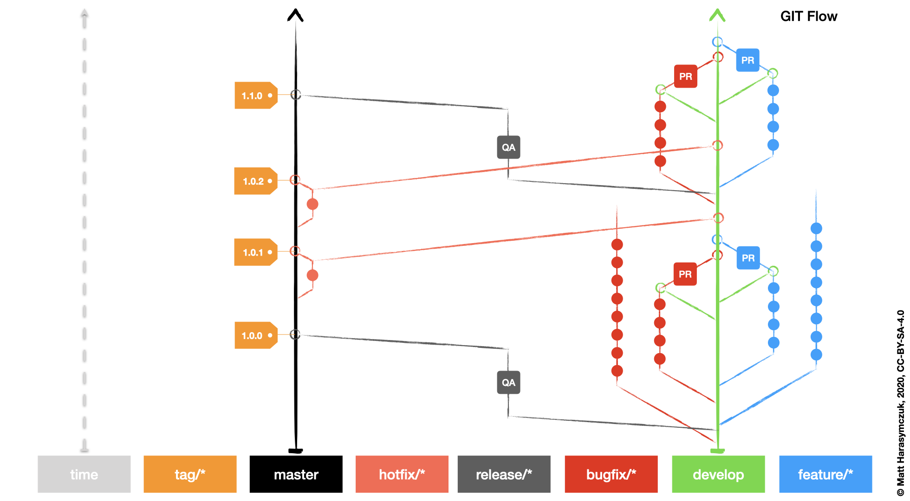
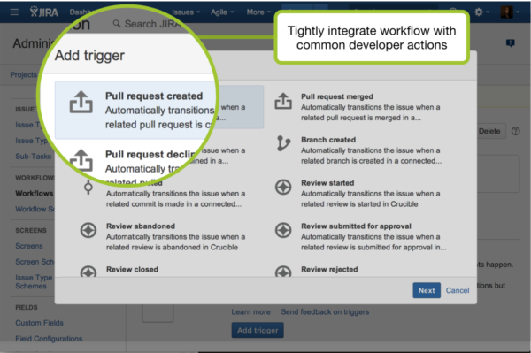

**********
Automation
**********

Atlassian Python API
====================
* https://github.com/atlassian-api/atlassian-python-api
* https://github.com/atlassian-api/atlassian-python-api/tree/master/examples/jira

.. code-block:: sh

    pip install atlassian-python-api

.. code-block:: python

    from atlassian import Jira

    jira = Jira(
        url='http://localhost:8080',
        username='admin',
        password='admin')

    jira.issue_create({
        'project': {'key': 'MYPROJECT'},
        'issuetype': {'name': 'Task'},
        'summary': 'My Issue Summary',
        'description': 'This is the issue description'})

.. code-block:: python

    from atlassian import Jira

    jira = Jira(
        url='http://localhost:8080',
        username='admin',
        password='admin')

    JQL = 'project = MYPROJECT AND status IN ("To Do", "In Progress") ORDER BY priority DESC'

    data = jira.jql(JQL)
    print(data)

Dev Panel
=========
* Create Branch
* Branches
* Commits
* Pull Requests
* Reviews
* CI/CD Builds
* Releases

..   figure:: ../_img//jira-board-devpanel-backlog.png
..   figure:: ../_img//jira-board-devpanel-issue.png
..   figure:: ../_img//jira-board-devpanel-sprint-1.png
..   figure:: ../_img//jira-board-devpanel-sprint-2.png
..   figure:: ../_img//bitbucket-builds.png
..   figure:: ../_img//bitbucket-createbranch.png
..   figure:: ../_img//bitbucket-pullrequest.png

Releases
========
* Trigger CI/CD Builds

..   figure:: ../_img//jira-release-overview.png

Smart Commits
=============
* Log in to Jira Software as a user with administrative permissions.
* Go to Administration > Applications > DVCS accounts.
* Check (or clear) the Smart Commits option for a repository.
* https://support.atlassian.com/bitbucket-cloud/docs/enable-smart-commits/
* https://confluence.atlassian.com/fisheye/using-smart-commits-960155400.html

.. code-block:: text
    :caption: Jira

    MYPROJECT-13 #comment corrected indent issue
    MYPROJECT-13 #time 1w 2d 4h 30m Total work logged
    MYPROJECT-13 #time 360m Total work logged
    MYPROJECT-13 #close Fixed this today
    MYPROJECT-13 #start-progress Fixed this today
    MYPROJECT-13 #start-review Fixed this today
    MYPROJECT-13 #time 2d 5h #comment Task completed ahead of schedule #resolve
    MYPROJECT-13 #comment Imagine that this is a really, and I mean really, long comment #time 2d 5h
    MYPROJECT-13 MYPROJECT-69 MYPROJECT-128 #resolve
    MYPROJECT-13 MYPROJECT-69 MYPROJECT-128 #resolve #time 2d 5h #comment Task completed ahead of schedule

.. code-block:: text
    :caption: Crucible

    Fix a bug +review CR-MYPROJECT
    Fix a bug +review CR-MYPROJECT @mwatney @jtwardowski
    Implement rework on past work +review CR-MYPROJECT-128

.. todo:: Smart commits images

GIT
===
.. code-block:: console

    $ git log --oneline
    ec68eec MYPROJECT-13 now working #time 69m
    60661f4 MYPROJECT-69 fix #time 13m
    1cb7c51 MYPROJECT-128 new feature #time 300m

    $ git log --oneline |awk -F'#time ' '{print $2}'
    69m
    13m
    300m

    $ git log --oneline |awk -F'#time ' '{print $2}' |sed 's/m//'
    69
    13
    300

    $ git log --oneline |awk -F'#time ' '{print $2}' |sed 's/m//' |addnum
    382

    $ cat ~/.profile |grep addnum
    alias addnum='python -c"import sys; print(sum(map(int, sys.stdin)))"'

.. code-block:: console

    $ cat ~/.gitconfig |grep -B1 since
    [alias]
    since = "!f() { ~/.bin/since; }; f"

    $ cat ~/.bin/since
    #!/usr/bin/env python3

    from datetime import datetime, timezone
    from subprocess import run

    SECOND = 1
    MINUTE = 60 * SECOND

    last = run('git log -1 --format="%ad" --date=iso', shell=True, capture_output=True).stdout.strip().decode()
    last = datetime.strptime(last, '%Y-%m-%d %H:%M:%S %z')
    print('Last commit:', last)

    delta = datetime.now(tz=timezone.utc) - last
    min = delta.total_seconds() / MINUTE
    min = round(min)

    print(f'Since: {min}m')

.. code-block:: console

    $ git log --format='"%ai", "%h", "%s"'
    "2020-10-14 01:04:38 +0200", "d5a4d6b", "MYPROJECT-10 git commit message #time 69m"

    $ git log --format='"%aI", "%h", "%an", "%ae", "%s"'
    "2020-10-14T01:04:38+02:00", "d5a4d6b", "Matt Harasymczuk", "matt@astrotech.io", "MYPROJECT-10 git commit message #time 69m"

    $ git log --format='"%aI", "%h", "%an", "%ae", "%s"' > ~/Desktop/git-log.csv

.. code-block:: sh
    :caption: .git/hooks/prepare-commit-msg

    #!/bin/sh
    #
    # @author Matt Harasymczuk <matt@astrotech.io>
    # @since 2012-10-23
    # @updated 2020-11-15
    #
    # This simple hook gets Jira issue ID from the branch you are currently committing to.
    # If you used Jira development panel "Create Branch", your branch name should be:
    # "feature/MYPROJECT-69-some-issue-summary" and in such case it would get "MYPROJECT-69".
    # Then hook prepends issue ID to your current commit message linking commit and Jira issue together.
    # You'll never forget about adding issue id to the commit message anymore! :}
    #
    # To install hook just put following script (with comment) in ".git/hooks/prepare-commit-msg"
    # On *nix machines (macOS, Linux, etc) add executable rights: ``chmod +x .git/hooks/prepare-commit-msg``
    # That's it. You can commit to test if it works. Remember before committing to check out branch
    # with proper name, such as: "feature/MYPROJECT-69-some-issue-summary".

    COMMIT_MSG_FILE=$1
    COMMIT_SOURCE=$2
    COMMIT_HASH=$3

    issuekey=$(git symbolic-ref HEAD |egrep --only-matching '[A-Z]{2,10}-[0-9]{1,6}')
    message=$(cat $1)

    if [ -z "$issuekey" ]; then
        echo "You are currently on a branch without JIRA issue ID in its name."
        echo "Changes were not committed."
        echo "If you want to commit anyway, just remove executable rights for this hook:"
        echo "chmod -x .git/hooks/prepare-commit-msg"
        echo "But remember to re-enable it later on, by executing:"
        echo "chmod +x .git/hooks/prepare-commit-msg"
        exit 1
    else
       echo "$issuekey $message" > $COMMIT_MSG_FILE
    fi

CI/CD
=====
..   figure:: ../_img//devops-ecosystem.png
..   figure:: ../_img//devops-cicd.png

Jira Workflow Triggers
======================
* Bitbucket:

    * Pull request created
    * Pull request merged
    * Pull request declined
    * Pull request reopened
    * Branch created
    * Commit created

Bamboo:

    * Deployment successful
    * Deployment failed

Crucible:

    * Review started
    * Review abandoned
    * Review submitted for approval
    * Review closed
    * Review rejected
    * Review summarized

..   figure:: ../_img//jira-workflow-simplified,triggers.png
..   figure:: ../_img//jira-triggers-1.png

..   figure:: ../_img//jira-triggers-3.png
