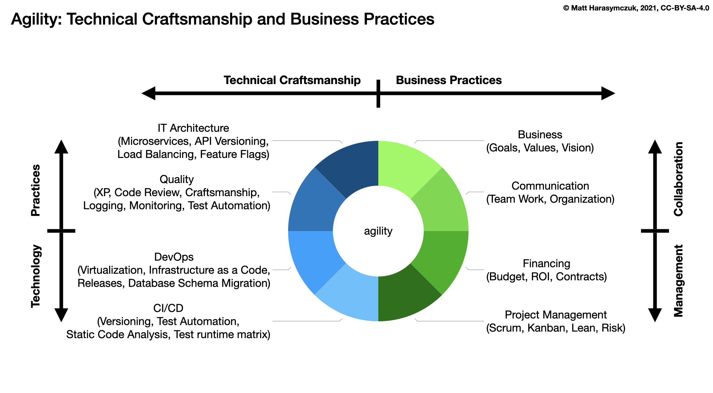

******
Basics
******

Rationale
=========
- Issue Tracker
- Jira

Project
=======
- Project
- Project Type
- Project Name
- Project Key
- Project Lead

Issue
=====
- Issue
- Issue Type
- Field

Board
=====
- Board
- Backlog
- Active Sprint

Demonstration
=============
* Create project: scrum project, set name, set key, set project lead
* Create issue: select project, issuetype, set summary
* Create issue in backlog
* Split issue in backlog

Assignments
===========

Basics Project Create
---------------------
#. Z menu u góry wybierz `Projects` -> `View Projects`
#. Kliknij przycisk `Create Projects` (prawy górny róg)
#. Kliknij przycisk `Scrum software development` -> Next
#. Ustaw:

    - Project name: wpisz swoje imię i pierwszą literę nazwiska, np. `Jan T`, `Mark W`, `Melissa L`, `Matt K`
    - Project key: pozostaw tak jak Jira zasugerowała
    - Project Lead: ustaw siebie

#. Submit

Basics Issue Create
-------------------
#. Z menu u góry kliknij przycisk `Create`
#. Dodaj zadanie:

    - Project: Twój project
    - Issue Type: `Story`
    - Summary: `One`

Basics Issue Create in Backlog
------------------------------
#. Z menu u góry wybierz `Boards` -> Twój Board -> `Backlog`
#. Dodaj zadania do backlog: `Two`, `Three`, `Four`, `Five`, `Six`

Basics Issue Split
------------------
#. Z menu u góry wybierz `Boards` -> Twój Board -> `Backlog`
#. Kliknij prawym klawiszem myszy na zadanie `Six` -> `Split Issue`

    - `Six`
    - `Seven`
    - `Eight`
    - `Nine`

#. Zwróć uwagę, że trzeba kliknąć prawym klawiszem myszy na zadaniu w backlog (na jego treści, a nie kluczu)
