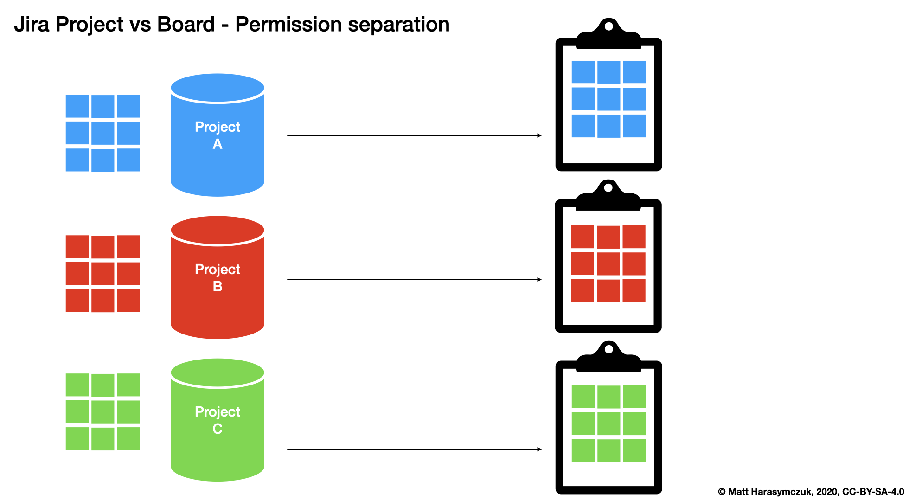
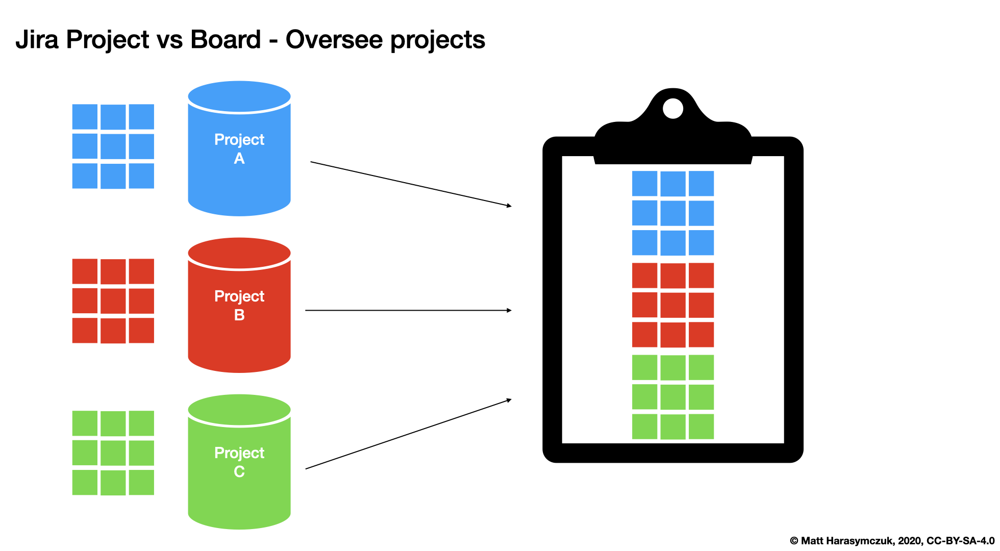
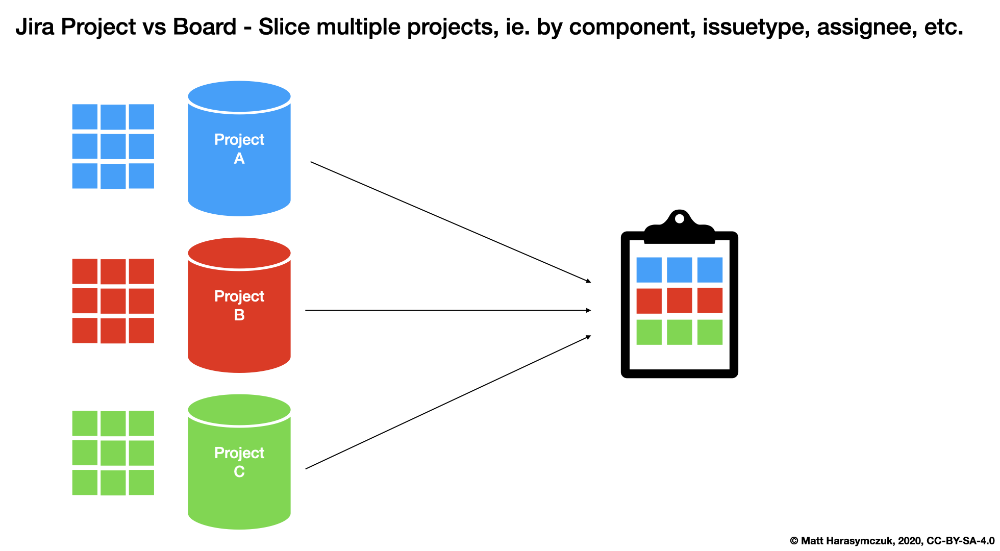
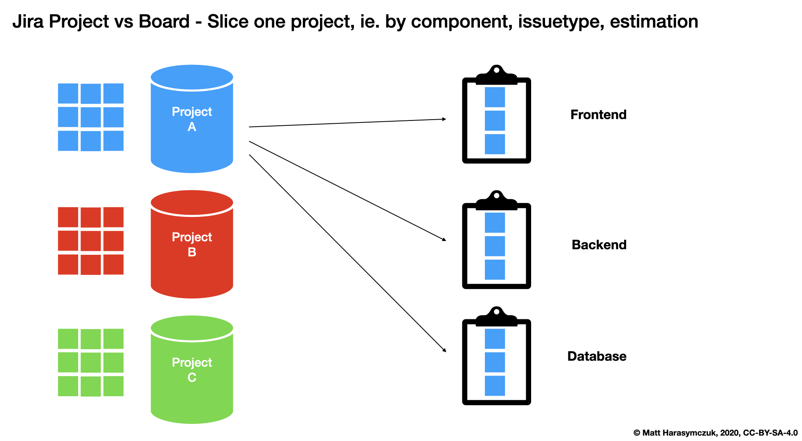
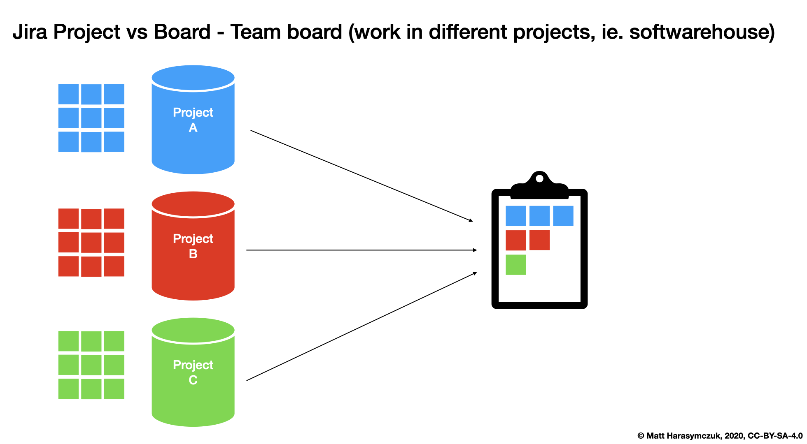
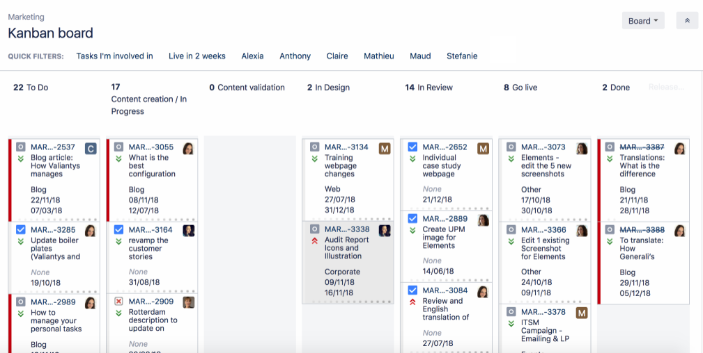
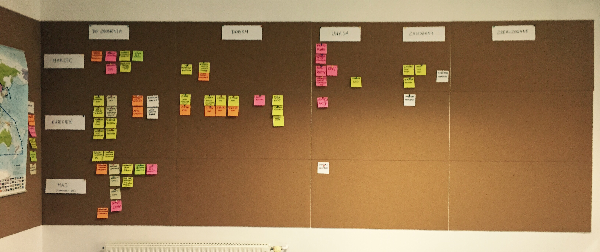
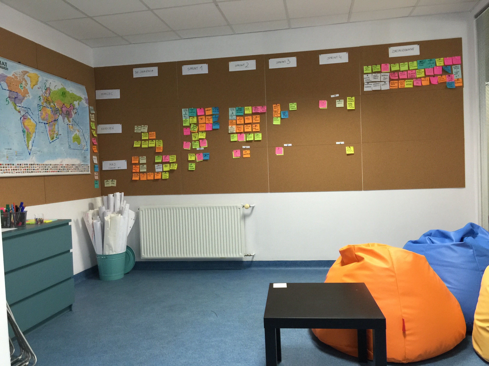

*******************
Board Configuration
*******************

Board vs. Project
=================
- Board z wielu projektów
- Board z części jednego projektu
- Board dla Projektu
- Wiele boardów do jednego projektu (różne estymaty)
- Wiele projektów czy wiele boardów (np. po komponentach)?

.. figure:: img/jira-board-vs-project-6.png

Board
=====
- Uprawnienia
- Konfiguracja
- Kolumny

    - Column Constraint (max, min)
    - Dodawanie i usuwanie kolumn
    - Wiele statusów w jednej kolumnie
    - Statusy ciągnące pracę

- Swimlanes

    - wg. priorytetów
    - wg. wersji

- Quick Filters

    - Quick Filters dla Daily

- Card Colors
- Card Layout

    - Backlog
    - Active Sprint
    - Days in Column

- Estimation

    - Original Estimate + Remaining Estimate and Time Spent
    - Story Points
    - Business Value
    - Issue Count

- Working Days
- Issue Detail View

    Days in Column

Portfolio
=========
- Portfolio na bazie Kanban Board

Cloud
=====
.. figure:: img/jira-board-roadmap.png
.. figure:: img/jira-board-features.png

Demonstration
=============
* Open `Board configuration`
* General configuration
* Columns (add columns, multiple status in one column, column constraints)
* Swimlanes: separate features from maintenance
* Quick filters: Daily
* Card colors: red, yellow, green by priorities
* Card layout: show due date in active sprint and backlog
* Estimation: `Original Time Tracking` and `Remaining Estimate and Time Spent`
* Working days: set region, set timezone, set dates
* Issue Detail View: add fields, remove fields
* Active Sprint: move issues between columns with constraints

Assignments
===========

Board Configuration Setup
-------------------------
#. Z menu u góry wybierz `Boards` -> Twój Board -> `Backlog` (w menu po lewej)
#. Dodaj poniższe zadania do sprintu `2000-01 week 2`:

    - `Four`
    - `Five`
    - `Six`
    - `Seven`
    - `Eight`
    - `Nine`

#. Wyrzuć ze sprintu zadania: `One` i `Two`
#. Wystartuj sprint ustawiając:

    - `Name`: `2000-01 week 2`
    - `Goal`: `Ukończenie szkolenia z Jiry`
    - `Duration`: `1 week`
    - `Start Date`: `7/Jan/00 09:00 AM`

Board Configuration General
---------------------------
#. Z menu u góry wybierz `Boards` -> Twój Board -> `Active Sprints` (w menu po lewej)
#. Z menu `Board` (prawy górny róg) -> `Configure`
#. Zakładka `General`:

    - Dodaj administratora `admin@example.com`
    - Zwróć uwagę na `Edit Filter Shares`, `View Permissions`
    - Osoby które mają uprawnienia do `Filter` będą widziały i mogły otworzyć Board
    - To nie znaczy, że będę widziały zadania (to wymaga uprawnień w projekcie)

Board Configuration Columns
---------------------------
#. Z menu u góry wybierz `Boards` -> Twój Board -> `Active Sprints` (w menu po lewej)
#. Z menu `Board` (prawy górny róg) -> `Configure`
#. Zakładka `Columns`:

    - Dodaj kolumnę `Blocked` w `Category` -> `In Progress`
    - Dodaj status `Rejected` w `Category` -> `Done` do kolumny `Done` i zaznacz `Set resolution`
    - Column Constraints `Issue Count`, excluding sub-tasks
    - W kolumnie `Blocked` -> `Max` ustaw na: `2`
    - W kolumnie `In Progress` -> `Min` ustaw na: `1`
    - Zaznacz `Days in column`

Board Configuration Swimlanes Features Maintenance
--------------------------------------------------
#. Z menu u góry wybierz `Boards` -> Twój Board -> `Active Sprints` (w menu po lewej)
#. Z menu `Board` (prawy górny róg) -> `Configure`
#. Zakładka `Swimlanes`:

    - Wybierz `Base Swimlanes on` -> `Queries`
    - Dodaj Swimlane `Story` z JQL -> ``issuetype = Story``
    - Dodaj Swimlane `Task` z JQL -> ``issuetype = Task``

#. Zobacz `Active Sprints` jak wygląda board

Board Configuration Swimlanes MoSCoW
------------------------------------
#. Z menu u góry wybierz `Boards` -> Twój Board -> `Active Sprints` (w menu po lewej)
#. Z menu `Board` (prawy górny róg) -> `Configure`
#. Zakładka `Swimlanes` (zmodyfikuj dotychczasowe ustawienia)
#. Zmodyfikuj nazwę `Expedite` i zamień na `Must`
#. Dodaj nowe: `Should` z `JQL`: ``priority in (High, Medium, Low)``
#. Zmodyfikuj nazwę `Everything Else` na `Could`
#. Zmień kolejność aby była:

    - `Must` na górze
    - `Should` w środku
    - `Could` na dole

#. Zmień w zadaniach `Four` oraz `Seven` priorytet na `Highest` (zadania powinno pojawić się w Swimlane `Must`)
#. Zmień w zadaniach `Nine` oraz `Eight` priorytet na `Lowest` (zadania powinno pojawić się w Swimlane `Could`)
#. Zwiń zadania które są w Swimlane `Could`, przez kliknięcie strzałeczki obok nazwy `Could`
#. Pamiętaj, że aby zadania wyświetlały się na Twoim boardzie, muszą być do Ciebie przypisane! (Ty musisz być ustawiony jako assignee)

Board Configuration Quick Filters
---------------------------------
#. Z menu u góry wybierz `Boards` -> Twój Board -> `Active Sprints` (w menu po lewej)
#. Z menu `Board` (prawy górny róg) -> `Configure`
#. Zakładka `Quick Filters`:

    - Zmień nazwę `Recently Updated` na `Daily`
    - Zmień JQL dla `Daily` na: ``updatedDate >= -1d OR Flagged IS NOT EMPTY``

Board Configuration Card Colors
-------------------------------
#. Z menu u góry wybierz `Boards` -> Twój Board -> `Active Sprints` (w menu po lewej)
#. Z menu `Board` (prawy górny róg) -> `Configure`
#. Zakładka `Card colours`:

    - Zmień `Colours based on` -> `Priorities`
    - Zmień kolor `Highest` oraz `High` na czerwony (`FF0000`)
    - Zmień kolor `Medium` na żółty (`FFFF00`)
    - Zmień kolor `Low` oraz `Lowest` na zielony (`00FF00`)

Board Configuration Card Layout
-------------------------------
#. Z menu u góry wybierz `Boards` -> Twój Board -> `Active Sprints` (w menu po lewej)
#. Z menu `Board` (prawy górny róg) -> `Configure`
#. Zakładka `Card layout`:

    - W sekcji `Backlog` -> wyświetl pole `Due Date`
    - W sekcji `Active sprints` -> wyświetl pole `Due Date`
    - Usuń wyświetlanie pola `Due Date` z sekcji Backlog (ale zostaw w `Active Sprint`)

Board Configuration Estimation
------------------------------
#. Z menu u góry wybierz `Boards` -> Twój Board -> `Active Sprints` (w menu po lewej)
#. Z menu `Board` (prawy górny róg) -> `Configure`
#. Zakładka `Estimation`:

    - Zmień `Estimation Statistic` na `Original Time Estimate`
    - Zaznacz `Time Tracking` -> `Remaining Estimate and Time Spent`

Board Configuration Working Days
--------------------------------
#. Z menu u góry wybierz `Boards` -> Twój Board -> `Active Sprints` (w menu po lewej)
#. Z menu `Board` (prawy górny róg) -> `Configure`
#. Zakładka `Working days`:

    - `Region`: `Europe`
    - `Time Zone`: `(GMT+01:00) Warsaw`
    - `Non-Working Days` (wybierz trzy dowolne święta):

        * `1/Jan/00` (Nowy Rok)
        * `6/Jan/00` (Święto Trzech Króli)
        * `?/?/00` (pierwszy dzień Wielkiej Nocy)
        * `?/?/00` (drugi dzień Wielkiej Nocy)
        * `1/May/00` (Święto Państwowe)
        * `3/May/00` (Święto Narodowe Trzeciego Maja)
        * `?/?/00` (pierwszy dzień Zielonych Świątek) [pięćdziesiąt dni po wielkanocy]
        * `?/?/00` (dzień Bożego Ciała) [sześćdziesiąt dni po wielkanocy]
        * `15/Aug/00` (Wniebowzięcie Najświętszej Marii Panny / Święto Wojska Polskiego)
        * `1/Nov/00` (Wszystkich Świętych)
        * `11/Nov/00` (Narodowe Święto Niepodległości)
        * `25/Dec/00` (pierwszy dzień Bożego Narodzenia)
        * `26/Dec/00` (drugi dzień Bożego Narodzenia)

Board Configuration Issue Detail View
-------------------------------------
#. Z menu u góry wybierz `Boards` -> Twój Board -> `Active Sprints` (w menu po lewej)
#. Z menu `Board` (prawy górny róg) -> `Configure`
#. Zakładka `Issue Detail View`:

    - Sekcja `General Fields` -> usuń: `Status`, `Priority`, `Labels`, `Affects Version/s`
    - Sekcja `Date Fields` -> dodaj `Due Date`, usuń: `Created` i `Updated`
    - Sekcja `People` -> usuń `Reporter` i `Assignee`
    - Sekcja `Links` -> usuń `Linked Issue`

Board Configuration Column Constraints
--------------------------------------
#. Z menu u góry wybierz `Boards` -> Twój Board -> `Backlog` (w menu po lewej)
#. Przejdź na `Boards` -> Twój Board -> `Active Sprint` (w menu po lewej):

    - Usuń wszystkie zadania z kolumny `In Progress` (powinna podświetlić się na żółto)
    - Dodaj trzy zadania do kolumny `Blocked` (powinna podświetlić się na czerwono)
