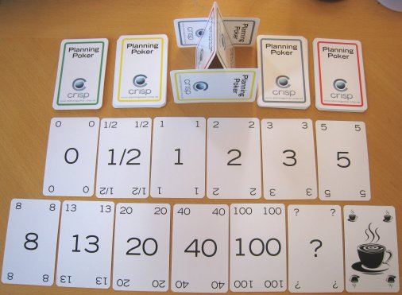
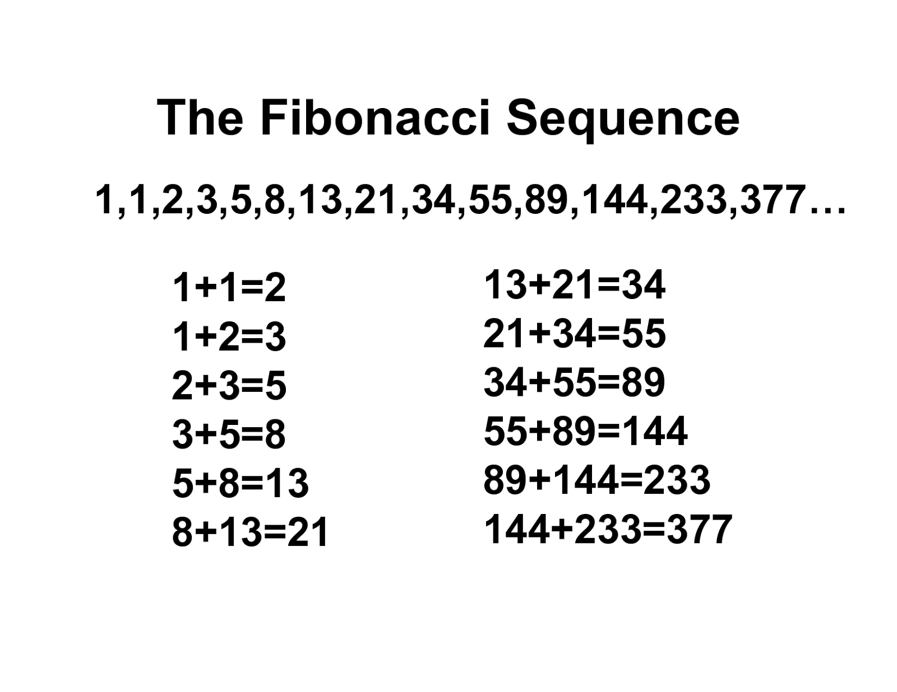

Board Estimation
================

Estimation
----------
* Story Point (SML, Fibonacci, Planning Poker)
* Time Estimate
* Manday
* Business Value
* ``#NoEstimates`` and Monte Carlo simulation:

    * https://www.infoq.com/presentations/monte-carlo
    * https://docs.google.com/spreadsheets/d/1BmSuj1jA2ZfhUBzPtqDBqDjMjSXMqj3QoHZGR-TesOA/edit#gid=542217325

Metrics
-------
* Velocity
* Capacity
* Maturity

.. figure:: ../_img/scrum-capacity-backlog.png

Planning and Refinement
-----------------------
* Estimation
* How big your tasks should be?
* Estimation support systems
* Sprint goal
* Acceptance Criteria
* Definition of Done
* Time Tracking

Demonstration
-------------
* Estimate issue
* Show calculated estimate for sprint
* Change estimate
* Change active sprint scope

Assignments
-----------

Board Estimation Story Points
^^^^^^^^^^^^^^^^^^^^^^^^^^^^^
#. Z menu u góry wybierz `Projects` -> Twój Projekt -> `Backlog` (w menu po lewej)
#. W detail view zadania `One` -> okienko `Estimate` ustaw 3 (lub pole `Story Point` przy edycji zadania)
#. W detail view zadania `Three` -> okienko `Estimate` ustaw 4 (lub pole `Story Point` przy edycji zadania)
#. W detail view zadania `Five` -> okienko `Estimate` ustaw 8 (lub pole `Story Point` przy edycji zadania)
#. Zwróć uwagę, że estymować można tylko zadania typu `Story`

.. note:: `Story Points` (jak sama nazwa wskazuje) domyślnie mogą być przyznawane tylko zadaniom typu `Story`. Można to zmienić w konfiguracji (wymaga uprawnień administratora) `Custom Field` -> `Story Points` -> Ikona trybiku (po prawej) -> `Configure` -> `Applicable contexts for scheme` -> `Edit Configuration`.
