*************
Board Reports
*************

Rationale
=========
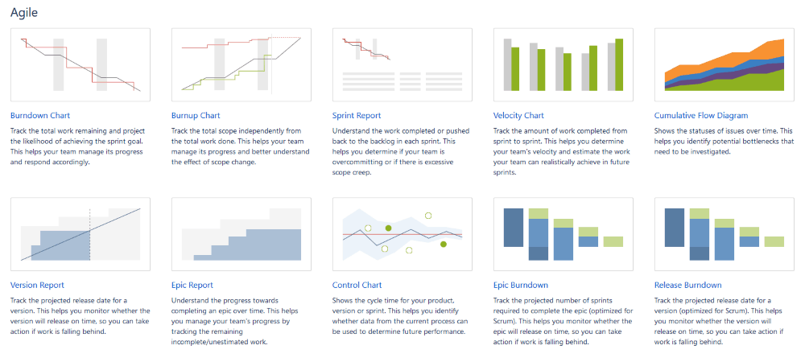
.. figure:: img/jira-report-select-2.png
.. figure:: img/jira-report-select-3.png
.. figure:: img/jira-report-select-4.jpg
.. figure:: img/jira-report-select-kanban.png
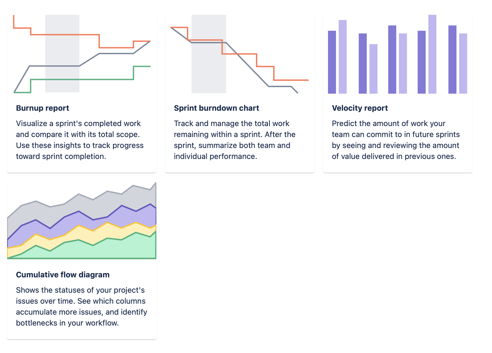

Burn-down Chart
===============
.. figure:: img/jira-report-burndownchart-storypoints-1.png
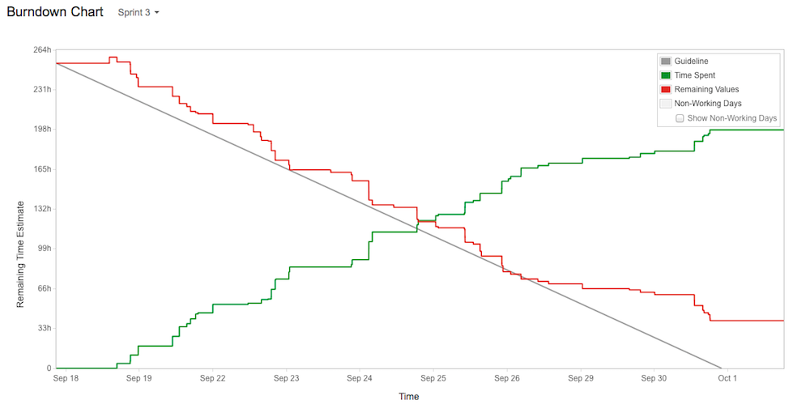
.. figure:: img/jira-report-burndownchart-time-2.png

Burn-up Chart
=============

Control Chart
=============
.. figure:: img/jira-report-controlchart-1.png
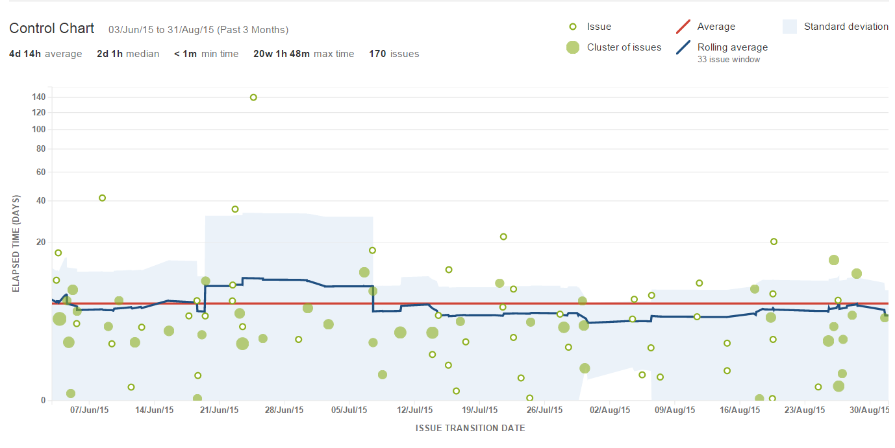
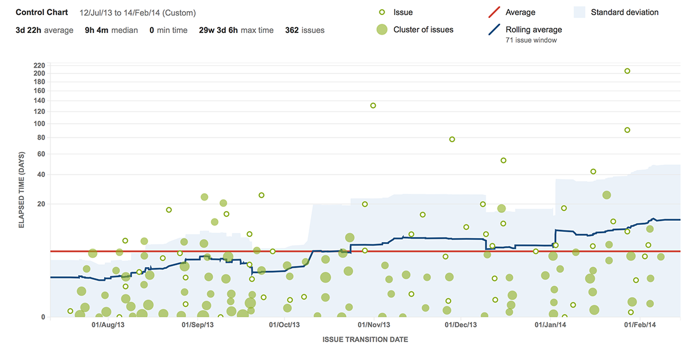

Cumulative Flow Diagram
=======================
.. figure:: img/jira-report-cumulativeflowdiagram-1.png
.. figure:: img/jira-report-cumulativeflowdiagram-2.gif
.. figure:: img/jira-report-cumulativeflowdiagram-3.png
.. figure:: img/jira-report-cumulativeflowdiagram-4.jpg
.. figure:: img/jira-report-cumulativeflowdiagram-5.png
.. figure:: img/jira-report-cumulativeflowdiagram-6.png
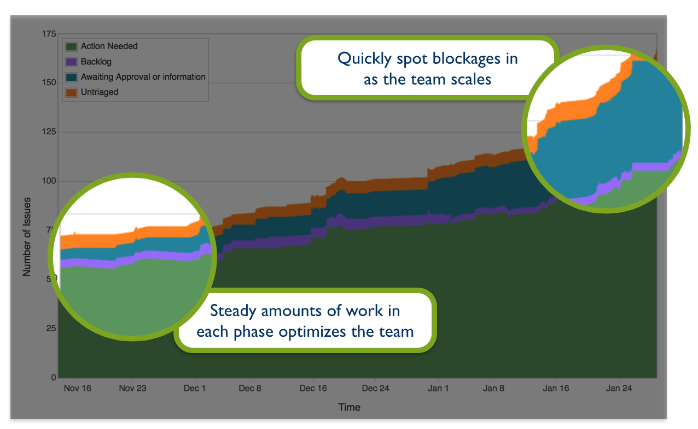
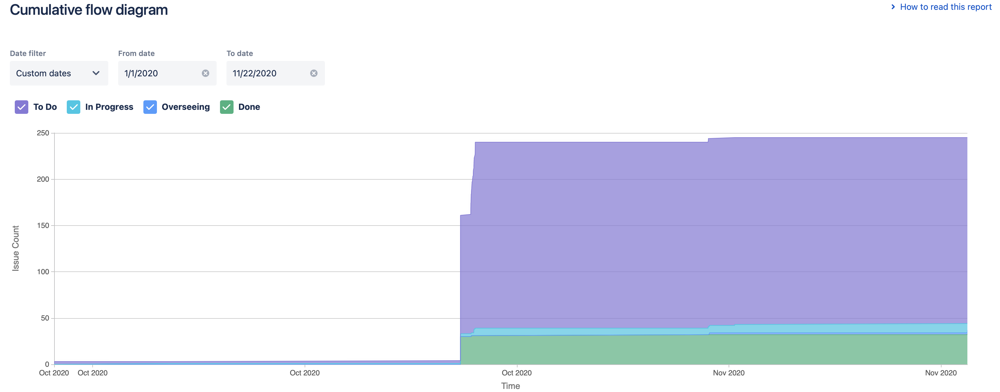
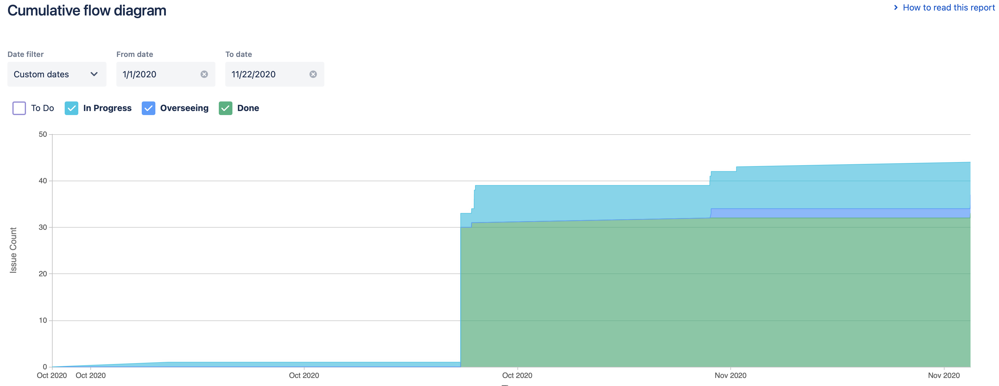
.. figure:: img/jira-report-cumulativeflowdiagram-10.png

Epic Burndown
=============
.. figure:: img/jira-report-epicburndown-1.png
.. figure:: img/jira-report-epicburndown-2.png

Epic Report
===========
.. figure:: img/jira-report-epicreport-1.png
.. figure:: img/jira-report-epicreport-2.png

Release Burndown
================
.. figure:: img/jira-report-releaseburndown-1.jpg
.. figure:: img/jira-report-releaseburndown-2.png
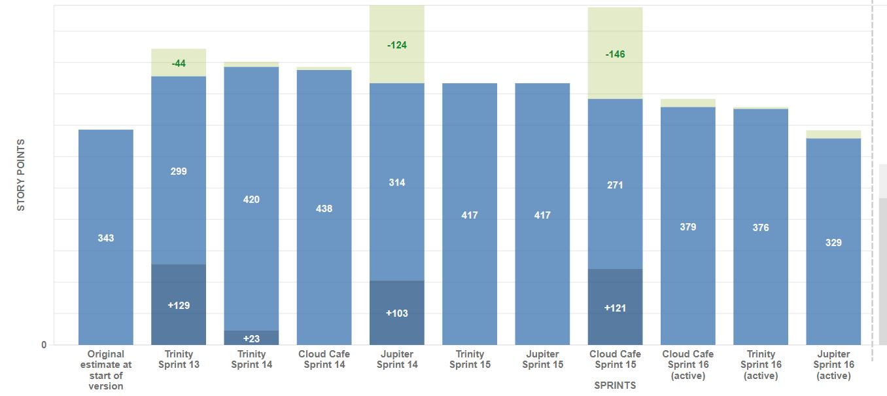
.. figure:: img/jira-report-releaseburndown-3.png
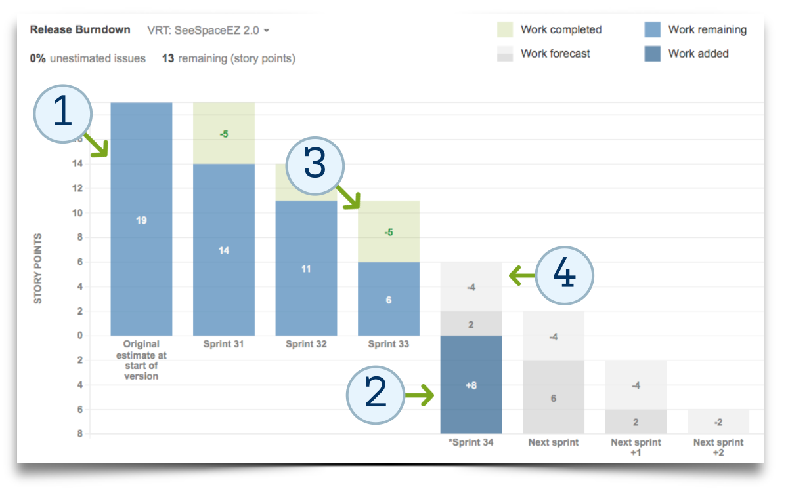
.. figure:: img/jira-report-releaseburndown-5.png
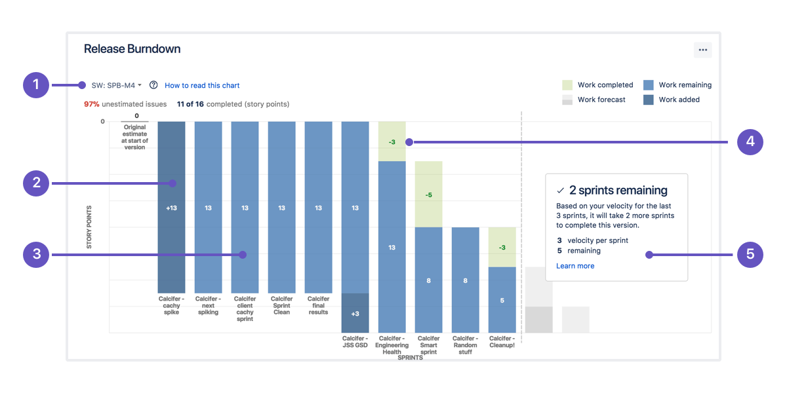
.. figure:: img/jira-report-releaseburndown-7.png
.. figure:: img/jira-report-releaseburndown-8.png
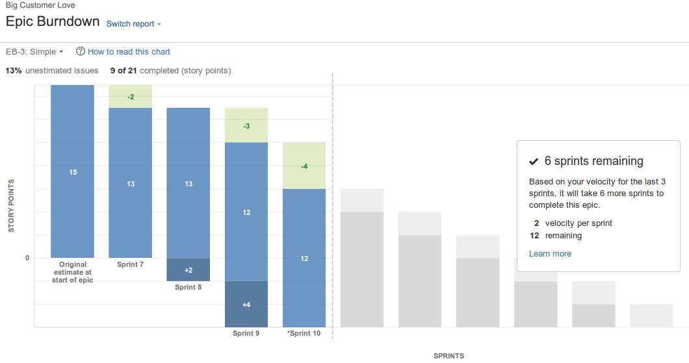

Sprint Report
=============

Velocity Chart
==============
.. figure:: img/jira-report-velocityreport-1.png
.. figure:: img/jira-report-velocityreport-2.png

Version Report
==============
.. figure:: img/jira-report-versionreport-1.jpg
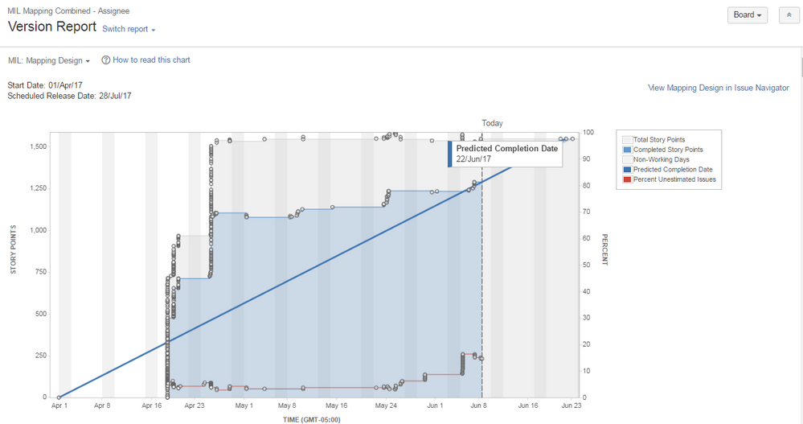
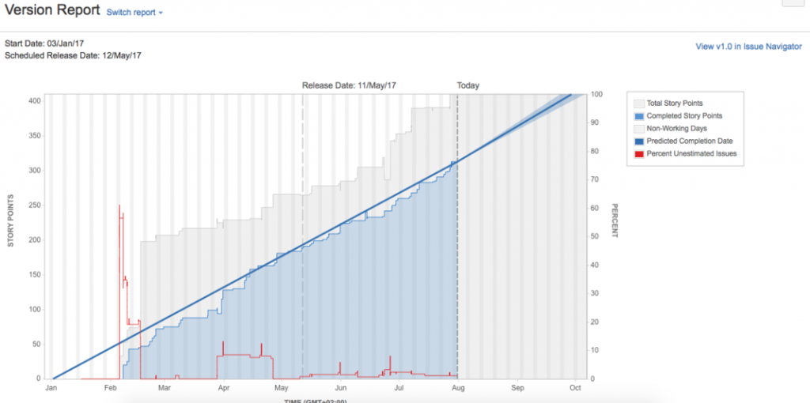

Version Burndown
================

Refine Reports
==============

Time Tracking
=============
.. figure:: img/jira-report-timetracking-1.png
.. figure:: img/jira-report-timetracking-2.png
.. figure:: img/jira-report-timetracking-3.png

Assignments
===========

Board Usage Reports
-------------------
#. Z menu u góry wybierz `Boards` -> Twój Board -> `Reports`
#. Przedyskutuj `Burndown Chart`
#. Przedyskutuj `Burnup Chart`
#. Przedyskutuj `Sprint Report`
#. Przedyskutuj `Velocity Chart`
#. Przedyskutuj `Cumulative Flow Diagram`
#. Przedyskutuj `Version Report`
#. Przedyskutuj `Epic Report`
#. Przedyskutuj `Control Chart`
#. Przedyskutuj `Epic Burndown`
#. Przedyskutuj `Release Burndown`
#. Przedyskutuj `Time Tracking Report`
