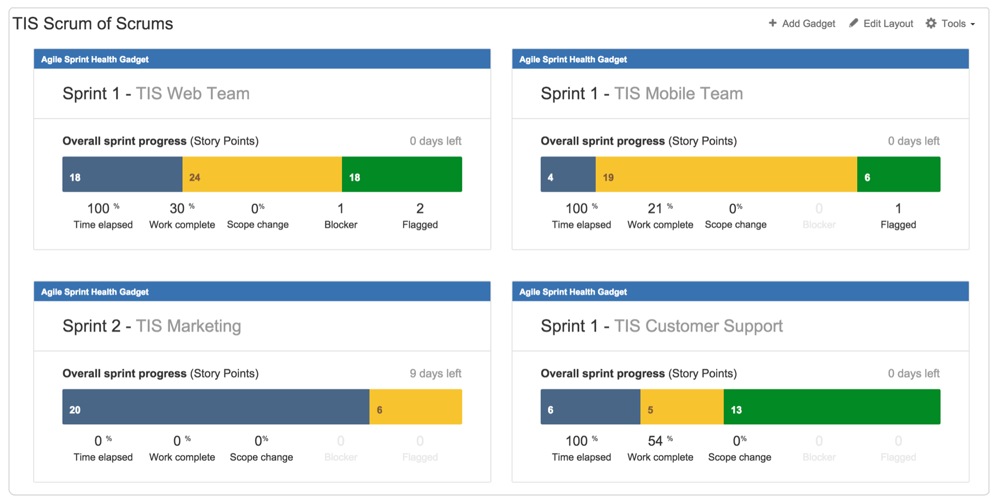

*********
Dashboard
*********

Rationale
=========
- Edit Layout
- Share
- Tworzenie
- Publikacja
- Dodawanie gadżetów

    - Filter Results
    - Issue Statistics
    - Average Age Chart
    - Resolution Time

- Wallboard plugin

    - Tables
    - Graphs
    - Pie charts

- Jira Agile Reports

    - Sprint Health Report
    - Burndown
    - Days Remaining

.. figure:: ../_img/jira-dashboard.png

Demonstration
=============
* Create `Blank Dashboard`
* Edit dashboard
* Add gadgets:

    * `Filter Result`
    * `Filter Statistics`
    * `Sprint Burndown Gadget`
    * `Sprint Health Gadget`
    * `Version Report`
    * `Days Remaining in Sprint Gadget`

* Edit Gadget
* Create another dashboard (show switching)

Assignments
===========

Dashboard Create
----------------
#. Z menu u góry wybierz `Dashboards` -> `Manage Dashboards`
#. Create new dashboard (przycisk u góry po prawej)
#. Name `Imię Dashboard` (gdzie Imię, to Twoje imię)
#. Start from `Blank Dashboard`
#. Kliknij przycisk `Add`

Dashboard Edit
--------------
#. Z menu u góry wybierz `Dashboards` -> Twój `Dashboard`
#. Zmień `Edit Layout` (prawy górny róg) na trzykolumnowy

Dashboard Gadget Create
-----------------------
#. Z menu u góry wybierz `Dashboards` -> Twój `Dashboard`
#. Kliknij na `Add gadget` -> `Load all gadgets`
#. Wybierz z listy `Filter Results` i kliknij przycisk `Add gadget` (po prawej)
#. Wybierz z listy `Issue Statistics` i kliknij przycisk `Add gadget` (po prawej)
#. Wybierz z listy `Sprint Burndown Gadget` i kliknij przycisk `Add gadget` (po prawej)
#. Wybierz z listy `Sprint Health Gadget` i kliknij przycisk `Add gadget` (po prawej)
#. Wybierz z listy `Version Report` i kliknij przycisk `Add gadget` (po prawej)
#. Wybierz z listy `Days Remaining in Sprint Gadget` i kliknij przycisk `Add gadget` (po prawej)
#. Zamknij okienko `X` (górny prawy róg)

Dashboard Gadget Move
---------------------
#. Z menu u góry wybierz `Dashboards` -> Twój `Dashboard`
#. Edytowanie gadgetu jest w jego prawym górnym rogu po kliknięciu trzech kropek `...`
#. Przenieś `Issue Statistics` oraz `Filter Results` do kolumny po lewej
#. Przenieś `Days Remaining in Sprint Gadget` oraz `Health Gadget` do środkowej kolumny
#. Przenieś `Sprint Burndown Gadget` oraz `Version Report` do kolumny po prawej

Dashboard Gadget Edit Issue Statistics
--------------------------------------
#. Z menu u góry wybierz `Dashboards` -> Twój `Dashboard`
#. Edytuj gadżet `Issue Statistics` i ustaw:

    - `Filter`: Twój projekt
    - `Statistic`: `Type Status`
    - `Sort`: `Total`
    - `Sort Direction`: `Descending`
    - Upewnij się, że **nie** jest zaznaczone `Update every 15 minutes`
    - Kliknij przycisk `Save`

Dashboard Gadget Edit Filter Results
------------------------------------
#. Z menu u góry wybierz `Dashboards` -> Twój `Dashboard`
#. Edytuj gadżet `Filter Results` i ustaw:

    - `Filter`: `Imię Todo`
    - `Number of Results`: 20
    - `Columns`: Dodaj kolumnę `Due Date`
    - Upewnij się, że **nie** jest zaznaczone `Update every 15 minutes`
    - Kliknij przycisk `Save`
    - Posortuj po `Due Date` przez kliknięcie nagłówka kolumny

Dashboard Gadget Edit Version Report
------------------------------------
#. Z menu u góry wybierz `Dashboards` -> Twój `Dashboard`
#. Edytuj gadżet  `Version Report` i ustaw:

    - `Board`: `Imię Board`
    - Zaznacz `Show board name`
    - `Version`: `2000-01`
    - Zaznacz `Show version name`
    - Kliknij przycisk `Save`

Dashboard Gadget Edit Days Remaining in Sprint Gadget
-----------------------------------------------------
#. Z menu u góry wybierz `Dashboards` -> Twój `Dashboard`
#. Edytuj gadżet `Days Remaining in Sprint Gadget` i ustaw:

    - `Board`: `Imię Board`
    - Zaznacz `Show board name`
    - `Sprint`: `Next Sprint Due (auto)`
    - Zaznacz `Show sprint name`
    - Kliknij przycisk `Save`

Dashboard Gadget Edit Sprint Burndown Gadget
--------------------------------------------
#. Z menu u góry wybierz `Dashboards` -> Twój `Dashboard`
#. Edytuj gadżet `Sprint Burndown Gadget` i ustaw:

    - `Board`: `Imię Board`
    - Zaznacz `Show board name`
    - `Sprint`: `Next Sprint Due (auto)`
    - Zaznacz `Show sprint name`
    - Kliknij przycisk `Save`

Dashboard Gadget Edit Health Gadget
-----------------------------------
#. Z menu u góry wybierz `Dashboards` -> Twój `Dashboard`
#. Edytuj gadżet `Sprint Health Gadget` i ustaw:

    - `Board`: `Imię Board`
    - Zaznacz `Show board name`
    - `Sprint`: `Next Sprint Due (auto)`
    - Zaznacz `Show sprint name`
    - Kliknij przycisk `Save`

Dashboard Many
--------------
#. Z menu u góry wybierz `Dashboards` -> `Manage Dashboards`
#. Create new dashboard (przycisk u góry po prawej)
#. Name `Imię Team Dashboard` (gdzie Imię, to Twoje imię)
#. Start from `Imię Dashboard`
#. `Add Viewers` -> `Project` -> Twój Projekt -> `Developers` -> `+ Add`
#. `Add Viewers` -> `Project` -> Twój Projekt -> `Administrators` -> `+ Add`
#. Kliknij przycisk `Add`
