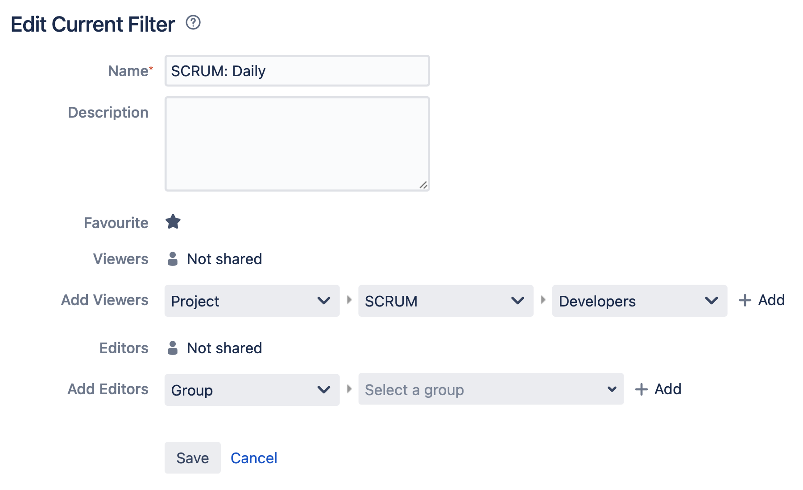
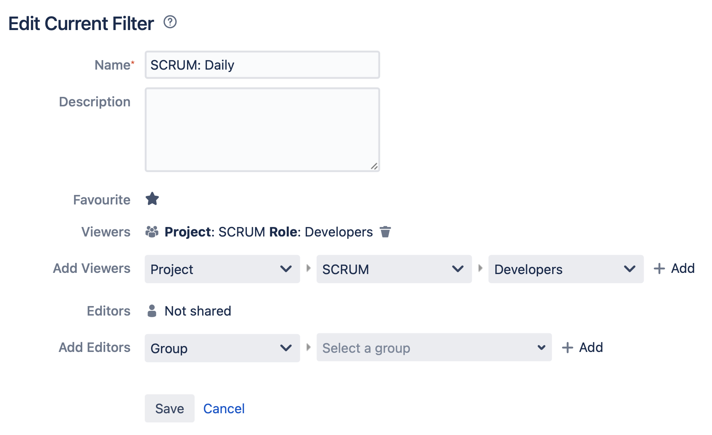

Filter Manage
=============

Rationale
---------
* Tworzenie
* Subskrypcja
* Uprawnienia

    * Przydział do ról
    * Przydział do grup
    * Publiczny

* Współdzielenie

.. figure:: ../_img/jira-filter-share-confirm.png

Demonstration
-------------
* Create filter, set name, set permissions (mention `Add`)
* Create subscription: Every Monday at 5 am
* Delete subscription (mention, not to delete filter)
* Edit filter

Assignments
-----------

Filter Manage Create
^^^^^^^^^^^^^^^^^^^^
#. Przejdź do wyszukiwania zadań:

    * Cloud: Z menu `Filters` wybrać `Advanced Issue Search` w trybie `Switch to JQL`
    * Server: Z menu `Issues` wybrać `Search for Issues` w trybie `Advanced`

#. Wyszukaj:

    .. code-block:: sql

        project = "MYPROJECT"
            AND sprint IN openSprints()
            AND (Flagged IS NOT EMPTY
                 OR updated >= -1d
                 OR statusCategory = "In Progress")

#. Wynik zapisz jako `Save As` (przycisk u góry nad polem wyszukiwania)
#. Nazwij `Imię Daily` (gdzie Imię, to Twoje imię)
#. Kliknij link `details` koło przycisku `Save as`
#. Wybierz `Edit permissions`
#. Ustaw `add Viewers`:

    * `Project`: Wybierz Twój projekt
    * `Roles`: `Any`
    * kliknij `Add` (bez kliknięcia `Add` uprawnienia sie nie dodadzą)

#. Upewnij się, że w polu `Viewers` dodane zostało `Project: Twój Role: Any`
#. Kliknij przycisk `Save`

.. note:: W zapytaniu JQL zamiast ``project = "MYPROJECT"`` podstaw swoją nazwę projektu.

Filter Manage Edit
^^^^^^^^^^^^^^^^^^
#. Przejdź do wyszukiwania zadań:

    * Cloud: Z menu `Filters` wybrać `Advanced Issue Search` w trybie `Switch to JQL`
    * Server: Z menu `Issues` wybrać `Search for Issues` w trybie `Advanced`

#. Z `Favourite Filters` (menu po lewej) wybrać `Imię Todo` (gdzie Imię, to Twoje imię)
#. Zmodyfikuj zapytanie:

    .. code-block:: sql

        assignee = currentUser()
            AND (statusCategory != "Done"
                 AND due <= 7d
                 OR Flagged is not EMPTY)

#. Kliknij `Search` a następnie `Save`
