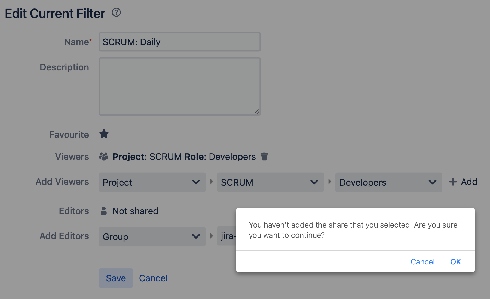

******
Filter
******

Rationale
=========
- Tworzenie
- Subskrypcja
- Uprawnienia

    - Przydział do ról
    - Przydział do grup
    - Publiczny

- Współdzielenie

.. figure:: img/jira-filter-share-before.png
.. figure:: img/jira-filter-share-after.png

Assignments
===========

Filter Save
-----------
#. Z menu `Issues` wybrać `Search for Issues` w trybie `Advanced`
#. Wyszukaj:

    .. code-block:: sql

        project = "MYPROJECT"
            AND sprint IN openSprints()
            AND (Flagged IS NOT EMPTY
                 OR updated >= -1d
                 OR statusCategory = "In Progress")

#. Wynik zapisz jako `Save As` (przycisk u góry nad polem wyszukiwania)
#. Nazwij `Imię Daily` (gdzie Imię, to Twoje imię)
#. Kliknij link `details` koło przycisku `Save as`
#. Wybierz `Edit permissions`
#. Ustaw `add Viewers`:

    - `Project`: Wybierz Twój projekt
    - `Roles`: `Any`
    - kliknij `Add` (bez kliknięcia `Add` uprawnienia sie nie dodadzą)

#. Upewnij się, że w polu `Viewers` dodane zostało `Project: Twój Role: Any`
#. Kliknij przycisk `Save`

Filter Subscription Create
--------------------------
#. Z menu `Issues` wybrać `Search for Issues` w trybie `Advanced`
#. Wyszukaj ``assignee = currentUser() and statusCategory != Done``
#. Przycisk trzy kropki `...` obok `Save` -> wybieramy Save as `Imię Todo` (gdzie Imię, to Twoje imię)
#. Kliknij link `Details` i wybierz `New Subscription`
#. Wybieramy Schedule: Days per Week; Interval: `Once per day at 5:00 am` w dniu `Monday`
#. Upewnij się, że jest odznaczone `Email this filter, even if there are no issues found`
#. Kliknij `Subscribe`
#. Zmodyfikuj wyszukiwanie na:

    .. code-block:: sql

        assignee = currentUser()
            AND statusCategory != "Done"
            AND due <= 7d

#. Kliknij przycisk `Save`

Filter Subscription Delete
--------------------------
#. Z menu u góry `Issues` wybrać `Manage filters` (na dole)
#. Wybierz filtr z aktywną subskrypcją
#. Kliknij na link `1 Subscription`
#. Wybierz Actions `Delete` (po prawej)
#. Uwaga: usuń tylko subskrypcję a nie filtr! - będziemy z niego jeszcze korzystać

Filter Edit
-----------
#. Z menu `Issues` wybrać `Search for Issues` w trybie `Advanced`
#. Z `Favourite Filters` (menu po lewej) wybrać `Imię Todo` (gdzie Imię, to Twoje imię)
#. Zmodyfikuj zapytanie:

    .. code-block:: sql

        assignee = currentUser()
            AND (statusCategory != "Done"
                 AND due <= 7d
                 OR Flagged is not EMPTY)

#. kliknij `Search` a następnie `Save`

Filter Board
------------
#. Z menu u góry wybierz `Boards` -> `View all boards`
#. Kliknij przycisk `Create board` (przycisk u góry po prawej)
#. Wybierz `Create a Kanban board` -> `Board from an existing Saved Filter` -> `Next`
#. Board name: `Imię Todo` (gdzie Imię, to Twoje imię)
#. Saved filter: wybrać filtr: `Imię Todo` (gdzie Imię, to Twoje imię)
#. Kliknij przycisk `Create board`
#. Przycisk Board (górny prawy róg) -> `Configure`
#. Na zakładce `Swimlanes`
#. Zmodyfikuj nazwę `Expedite` i zamień na `Must`
#. Dodaj nowe: `Should` z `JQL`: ``priority in (High, Medium, Low)``
#. Zmodyfikuj nazwę `Everything Else` na `Could`
#. Zmień kolejność aby była:

    - `Must` na górze
    - `Should` w środku
    - `Could` na dole

#. Zmień w zadaniach `Four` oraz `Seven` priorytet na `Highest` (zadania powinno pojawić się w Swimlane `Must`)
#. Zmień w zadaniach `Nine` oraz `Eight` priorytet na `Lowest` (zadania powinno pojawić się w Swimlane `Could`)
#. Zwiń zadania które są w Swimlane `Could`, przez kliknięcie strzałeczki obok nazwy `Could`
#. Pamiętaj, że aby zadania wyświetlały się na Twoim boardzie, muszą być do Ciebie przypisane! (Ty musisz być ustawiony jako assignee)

Filter Board Edit
-----------------
#. Z menu u góry wybierz `Boards` -> `View all boards` -> `Imię Todo` (gdzie Imię, to Twoje imię)
#. Przycisk `Board` (u góry po prawej) -> `Configure` -> Na zakładce `General` -> `Edit Filter Query`
#. Popraw zapytanie:

    .. code-block:: sql

        assignee = currentUser()
            AND issuetype != "Epic"
            AND (statusCategory != "Done"
                 AND due <= 7d
                 OR Flagged is not EMPTY)
            ORDER BY duedate DESC, priority DESC

#. Przycisk `Search` -> `Save`
#. Przejdź na Board `Imię Todo` (gdzie Imię, to Twoje imię)
#. Zobacz czy nie ma zadań typu `Epic`

Filter Board Portfolio
----------------------
#. Z menu u góry wybierz `Boards` -> `View all boards`
#. Kliknij przycisk `Create board` (przycisk u góry po prawej)
#. Wybierz `Create a Kanban board` -> `Board from an existing Saved Filter` -> `Next`
#. Stwórz board Kanban z Epikami:

    - Stwórz `Swimlane` dla kwartałów
    - Określ aby w kolumnie `In Progress` mogły być maksymalnie 3 zadania

#. Stwórz board zadań przypisanych do Ciebie:

    - zadania mogą być w dowolnym projekcie
    - board ma być publiczny

Filter Board Delete
-------------------
#. Z menu u góry wybierz `Boards` -> `View all Boards`
#. Poszukaj swojego Board `Imię Todo` (gdzie Imię, to Twoje imię)
#. kliknij trzy kropeczki `...` po prawej stronie
#. Delete i potwierdzasz przyciskiem `Delete`
