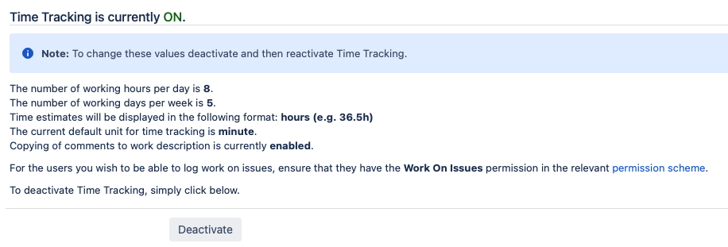

Issue Time Tracking
===================

Admin
-----
* ``gg`` + `Time Tracking`
* Deactivate

Time Reporting
--------------
* `Log Work`
* `Original Time Estimate`
* `Remaining Time`
* `Log Work`
* `Time Tracking Report` by Version

.. figure:: ../_img/jira-report-timetracking-1.png
.. figure:: ../_img/jira-report-timetracking-2.png

Demonstration
-------------
* Change `Time Tracking` display format to hours
* Demonstrate how to `log work` on Jira issue
* Show how `original estimate`, `remaining time` and `log work` are calculated
* See worklog entries on Jira issue tab (next to comments)
* Show `Original Estimate` and `Σ Original Estimate` differs
* Show `Remaining Time` and `Σ Remaining Time` differs
* Show `Log Work` and `Σ Log Work` differs

Assignments
-----------

Issue Log Work
^^^^^^^^^^^^^^
#. Z menu u góry wybierz `Projects` -> Twój Projekt -> `Backlog` (w menu po lewej stronie)
#. Wybierz dowolne zadanie i otwórz szczegóły zadania na nowej zakładce w przeglądarce
#. Wybierz z menu trzech kropek ``...`` (u góry) -> `Log Work`
#. Alternatywnie po wybraniu zadania klikasz skrót klawiszowy kropka ``.`` -> `Log Work`
