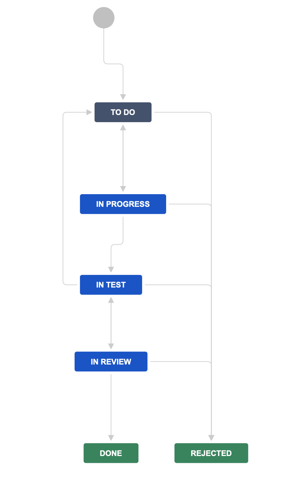
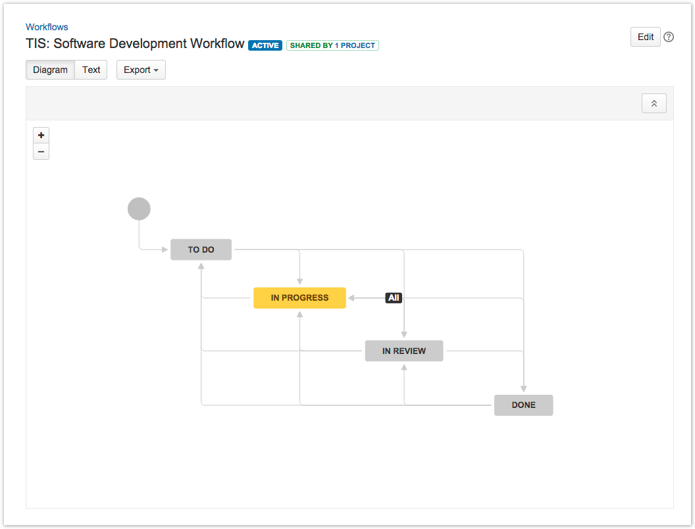
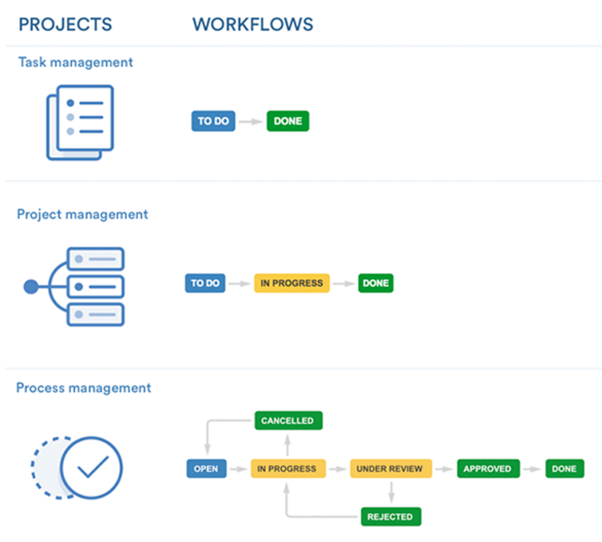
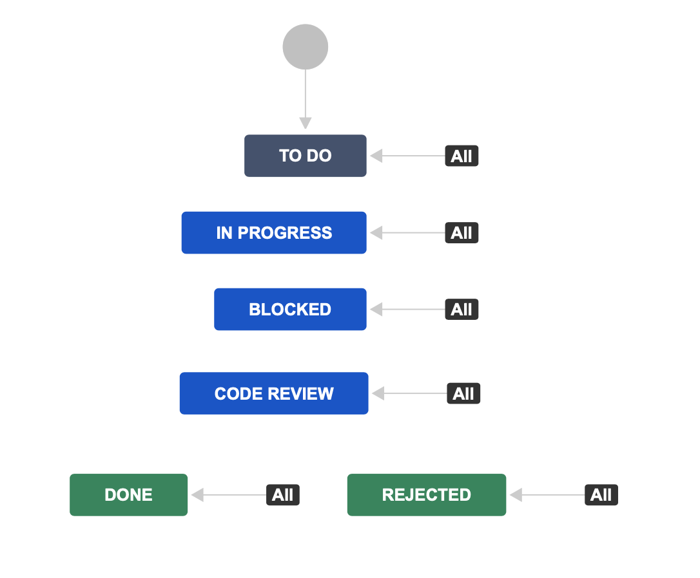

Issue Workflow
==============

Main Fields
-----------
* `Status`
* `Sub-Tasks`
* `Issue Type`

Statuses
--------
* `To Do`
* `In Progress`
* `In Review`
* `In Test`
* `Waiting`, `Blocked`
* `Done`, `Rejected`

Resolutions
-----------
* `Done`
* `Won't Do`
* `Duplicate`
* `Cannot Reproduce`

Workflows
---------
.. figure:: ../_img/jira-workflow-approval.png

    approval

.. figure:: ../_img/jira-workflow-core.jpeg

    core

.. figure:: ../_img/jira-workflow-default.png

    default

.. figure:: ../_img/jira-workflow-dev-1.png

    dev

.. figure:: ../_img/jira-workflow-dev-2.png

    dev

.. figure:: ../_img/jira-workflow-epics.png

    Epics

.. figure:: ../_img/jira-workflow-feedback.png

    feedback

.. figure:: ../_img/jira-workflow-processmgmt.png

    processmgmt

.. figure:: ../_img/jira-workflow-procurement.png

    procurement

    progress

.. figure:: ../_img/jira-workflow-projectmgmt.png

    Project Management

.. figure:: ../_img/jira-workflow-publishing.png

    publishing

    qa

.. figure:: ../_img/jira-workflow-qa,stage,deploy,problem.jpg

    qa

.. figure:: ../_img/jira-workflow-qa,stage,deploy.png

    qa

.. figure:: ../_img/jira-workflow-qa.png

    qa

.. figure:: ../_img/jira-workflow-recruitment.png

    recruitment

.. figure:: ../_img/jira-workflow-risk.jpg

    risk

    select

.. figure:: ../_img/jira-workflow-simplified.png

    simplified

    simplified dev

.. figure:: ../_img/jira-workflow-support.png

    support

.. figure:: ../_img/jira-workflow-taskmgmt.png

    Task Management

Demonstration
-------------
* Change Status

Assignments
-----------

Issue Workflow Status
^^^^^^^^^^^^^^^^^^^^^
#. Z menu u góry wybierz `Projects` -> Twój Projekt -> `Backlog`
#. Wybierz zadanie `One`
#. Zmień status na `In Progress`
