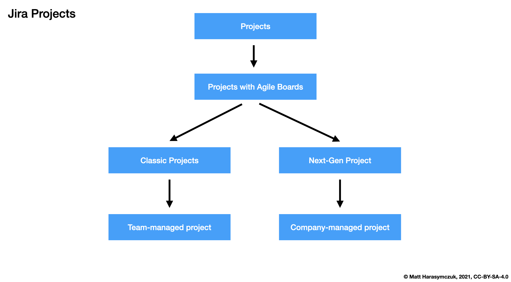
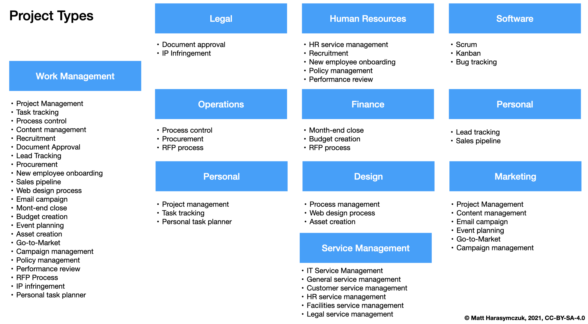
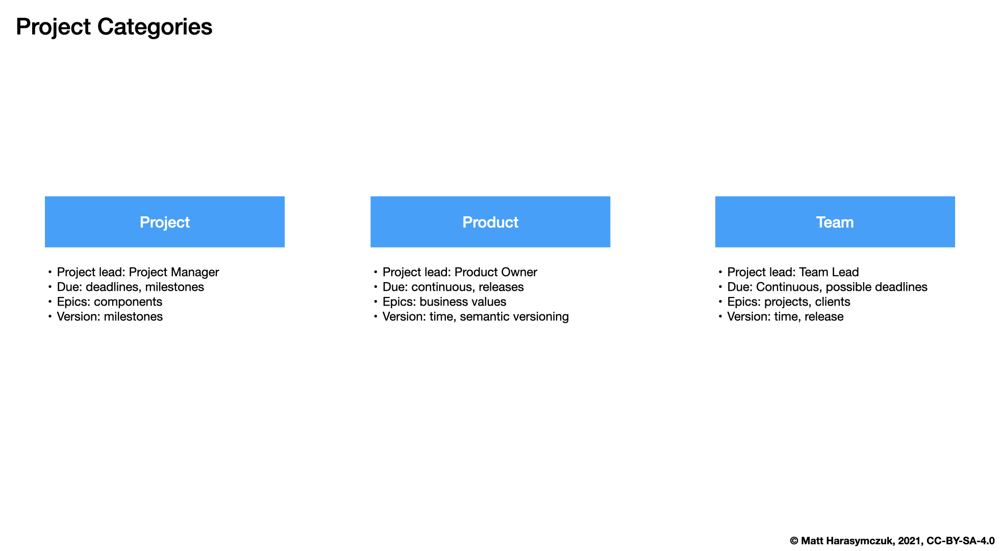

Project Create
==============

Rationale
---------
* What is Jira project
* How Jira project relates to your projects?
* Scrum vs Kanban project boards

Project Attributes
------------------
* Project Type
* Project Name
* Project Key
* Project Lead

Categories
----------
* Project
* Product
* Team

Project Name
------------
* Can be changed
* Filters in JQL are using it (so it might break things)

Issue Key
---------
* Can be Changed, but a lot of stuff is using it (so a lot of things my break)
* short
* easy to remember
* 2-10 uppercase letters

Demonstration
-------------
* View all projects
* Create project: scrum project, set name, set key, set project lead

Assignments
-----------

Project Create New
^^^^^^^^^^^^^^^^^^
#. Z menu u góry wybierz `Projects` -> `View Projects`
#. Kliknij przycisk `Create Projects` (prawy górny róg)
#. Server: Kliknij przycisk `Scrum software development` -> Next
#. Cloud:

    * Z menu po lewej wybierz `Software development`
    * Scrum (na środku ekranu)
    * Przycisk `Use Template` (na dole po prawej)
    * Na ekranie `Choose a project type` wybierz  `Select a company managed project` klikając przyscisk na dole ekranu po prawej (jest to tzw. classic project)

#. Project name: wpisz swoje imię i pierwszą literę nazwiska, np. `Jan T`, `Mark W`, `Melissa L`, `Matt K`
#. Project key: pozostaw tak jak Jira zasugerowała
#. Server: w polu `Project Lead` ustaw siebie
#. Przycisk `Create`
