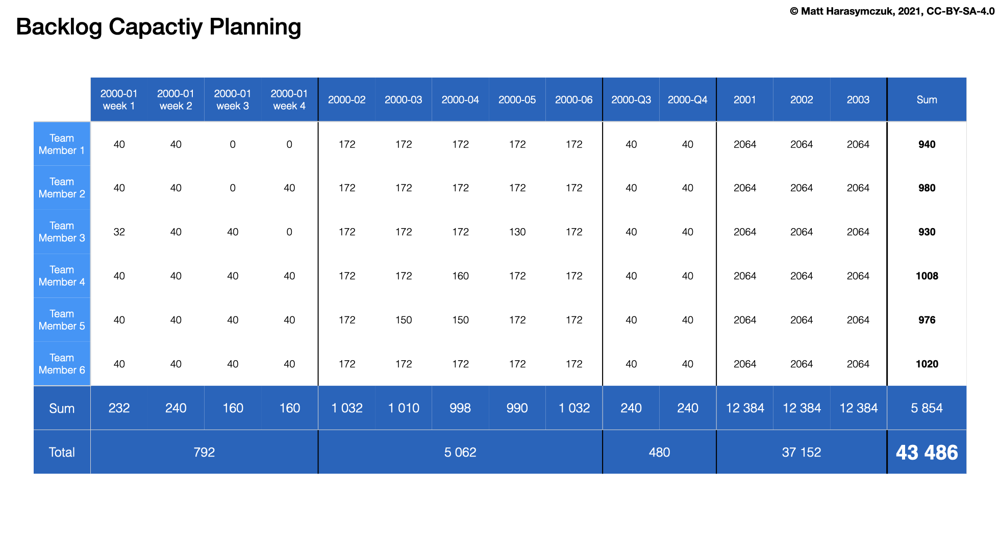

Project Versions
================

Versions
--------
* Semantic Versioning ``major.minor.bugfix``:

    * Major: ``1.0.0``, ``2.0.0``, ``3.0.0``
    * Minor:  ``1.1.0``. ``1.2.0``, ``1.3.0``,
    * Bugfix: ``1.0.1``, ``1.0.2``, ``1.0.3``

* Time Convention:

    * ``YYYY-MM`` - 2000-01, 2000-02, 2000-03
    * ``YYYY-QQ`` - 2000-Q1, 2000-Q2, 2000-Q3, 2000-Q4
    * ``YYYY`` - 2000, 2001, 2002, 2003

* Roadmap
* Releases (with Bamboo)
* Time Tracking Report by Version

.. figure:: ../_img/jira-release-versions.png
.. figure:: ../_img/jira-release-overview.png

Demonstration
-------------
* Add versions
* Change version start and end date
* Reorder versions

Assignments
-----------

Project Versions Add
^^^^^^^^^^^^^^^^^^^^
#. Z menu u góry wybierz `Projects` -> Twój Projekt -> `Project Settings` (przycisk koła zębatego w menu po lewej)
#. Przejdź na zakładkę `Versions`
#. Dodając wersje w tym zadaniu nie musisz ustawiać dat rozpoczęcia i zakończenia
#. Dla uproszczenia w zadaniach, a później w `JQL` i filtrach będę stosował konwencję z rokiem `2000`
#. Możesz dodać wersje z dzisiejszą datą (rokiem), ale w kolejnych zadaniach pamiętaj, żeby podmieniać na swoje nazwy
#. Dodaj wersje: `2000-Q2`, `2000-Q3`, `2000-Q4`
#. Dodaj wersje: `2001`, `2002`, `2003`

Project Versions Edit
^^^^^^^^^^^^^^^^^^^^^
#. Z menu u góry wybierz `Projects` -> Twój Projekt -> `Project Settings` (przycisk koła zębatego w menu po lewej)
#. Przejdź na zakładkę `Versions`
#. Wybierz wersję `2000-Q2` i kliknij na trzy kropeczki w tym samym wierszu po prawej stronie
#. Z menu wybierz `Edit`
#. Zmień daty na:

    * `Start Date`: `2000-04-01`
    * `Release Data`: `2000-06-30`
    * Zaakceptuj klikając `Save`

.. note:: Wpisuj daty w formacie `6/30/2000` (US Format), wtedy kalendarz pozwoli Ci łatwiej wybrać datę z przeszłości.
