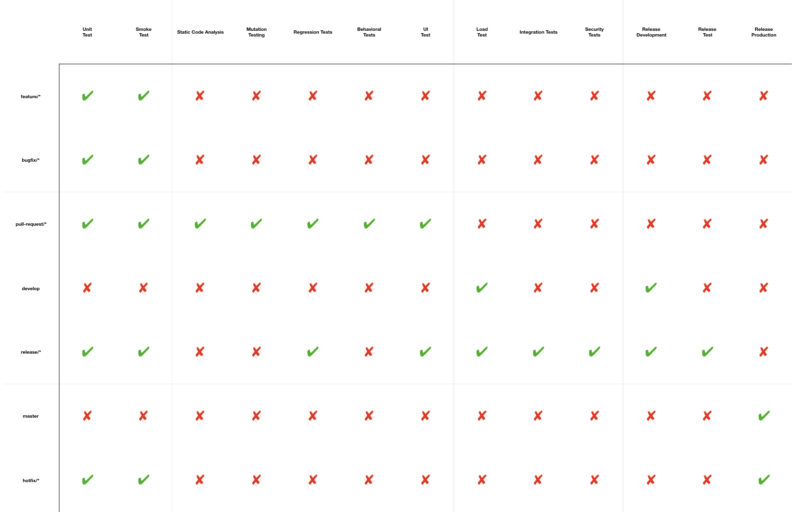

************
Proces CI/CD
************

Proces CI/CD składa się z trzech procesów:

    * ciągłej integracji (ang. Continuous Integration, CI),
    * ciągłego dostarczania (ang. Continuous Delivery, CD),
    * ciągłego wdrażania (ang. Continuous Deployment).

Proces ciągłego wdrażania (ang. *Continuous Deployment*) charakteryzuje się wdrażaniem zmian na środowisko produkcyjne po każdej wprowadzonej poprawce lub nowej funkcjonalności.

Automatyczne testowanie, ciągłe scalanie i wdrażanie oprogramowania pozwalają przygotować je w przejrzystej formie, aby mogły zostać poddane dalszym testom. To pozwala szybko, niezawodnie i wielokrotnie ulepszać produkt i naprawiać pojawiające się na różnych etapach produkcji błędy, uwzględniając opinie użytkowników, zmiany na rynku oraz zmiany w strategii biznesowej. Należy podkreślić, że zachowane jest przy tym minimalne ryzyko poważnej usterki oraz konieczność minimalnej poprawy instrukcji użytkowania.

Platforma uruchamiania procesu CI/CD
====================================
Do procesu zarówno *Continuous Integration* jak i *Continuous Delivery* w projekcie wykorzystywany jest system *Bitbucket Pipelines*. Oprogramowanie to pozwala na automatyzację kroków procesu znacząco obniżając czas i koszt tworzenia kolejnych przyrostów. W kolejnych krokach działania tego narzędzia jest pobranie kodu źródłowego, jego kompilacja, poddanie go testom jednostkowym i funkcjonalnym a na samym końcu analiza statyczna kodu źródłowego i zbudowanie artefaktu gotowego do wdrożenia na środowisko testowe lub/i produkcyjne. Schemat ekosystemu narzędziowego wspierającego automatyzację budowania i testowania aplikacji przedstawiono na :numref:`figure-process-cicd-ecosystem`

.. figure:: img/cicd-ecosystem.png
    :name: figure-process-cicd-ecosystem

    Schemat ekosystemu narzędzi deweloperskich użytych w procesie wytwarzania oprogramowania w celu zapewniania wysokiej jakości.

Proces ciągłej integracji
=========================
Proces ciągłej integracji (ang. *Continuous Integration*, *CI*) polega na automatycznym uruchamianiu testów aplikacji tj. testów jednostkowych, testów integracyjnych, testów regresyjnych i funkcjonalnych dla każdej wprowadzonej zmiany. Dzięki zastosowaniu *Continuous Integration* programiści otrzymują natychmiastową informację czy ich zmiany w kodzie nie destabilizują pracy systemu oraz negatywnie wpływają na całą aplikację.

Proces *CI* w ramach projektu jest realizowany za pomocą systemu do automatycznego budowania *Bitbucket Pipelines*. System ten jest uruchamiany automatycznie, gdy nastąpi zmiana w systemie kontroli wersji.

Zadania w systemie *CI* dzielą się na następujące kategorie:

    * budowanie gałęzi stabilnej (*master*),
    * budowanie gałęzi rozwojowej (*develop*),
    * budowanie *Pull Request*,
    * budowanie zmian w gałęziach z nowymi funkcjonalnościami (*feature*),
    * budowanie zmian w gałęziach z poprawkami błędów (*bugfix*),
    * proces wdrożeniowy.

W zależności od kategorii definiuje się inny zestaw testów uruchamianych dla budowania i sprawdzania aplikacji (:numref:`figure-process-cicd-strategy`). Powyższy podział ma na celu umożliwienie uzyskania natychmiastowych i szybkich informacji po wprowadzeniu zmian (*feature*, *bugfix*). Dla *Pull Request* uruchamiane są testy integracyjne informujące czy wprowadzone zmiany nie destabilizują działania aplikacji. Natomiast dla zmian w gałęzi rozwojowej (zmiany po wprowadzeniu funkcjonalności) oraz gałęzi stabilnej (wdrożenia) uruchamiana jest dogłębna i długotrwała statyczna analiza kodu wraz z odpowiednim procesem.

Poszczególne mniejsze fragmenty wytwarzanego oprogramowania muszą przejść określone etapy walidacji na swojej drodze do publikacji. Kod jest kompilowany i pakowany za każdym razem, gdy dokonywana jest zmiana w systemie kontroli wersji. Następnie jest wielokrotnie testowany. Dopiero po tym może zostać uznany za poprawny.

    Tabela przedstawia listę testów uruchamianych dla zmian w zależności od gałęzi rozwojowej do której należą.

Proces ciągłego dostarczania
============================
Proces ciągłego dostarczania (ang. *Continuous Delivery*, *CD*) jest rozwinięciem procesu *CI* o przygotowanie przetestowanej paczki wdrożeniowej. Każda paczka musi być gotowa do wdrożenia na środowisko produkcyjne w dowolnym momencie. Wykorzystywanie metody *Continuous Delivery* w projekcie pozwala na zmniejszenie ilości zasobów i skrócenie czasu wdrażania nowych funkcjonalności. Pozwala to na znacznie szybszy rozwój.

Proces *CD* w projekcie jest realizowany za pomocą systemu automatyzacji budowania *Bitbucket Pipelines*. System ten po przetestowaniu zmian w repozytorium generuje binarny artefakt w postaci obrazu *Docker*, tj. skompilowaną paczkę gotową do wdrożenia na środowisko produkcyjne i umieszcza ją w systemie *Docker Hub* uprzednio nazywając ją odpowiednio do wersji oprogramowania.

Automatyczne testowanie, ciągłe scalanie i ciągłe wdrażanie oprogramowania pozwalają przygotować je w przejrzystej formie, aby mogły zostać poddane dalszym testom. To pozwala szybko, niezawodnie i wielokrotnie ulepszać produkt i naprawiać pojawiające się na różnych etapach produkcji błędy, uwzględniając opinie użytkowników, zmiany na rynku oraz zmiany w strategii biznesowej. Należy podkreślić, że zachowane jest przy tym minimalne ryzyko poważnej usterki oraz konieczność niewielkiej poprawy instrukcji użytkowania.

Poszczególne mniejsze fragmenty wytwarzanego oprogramowania muszą przejść określone etapy walidacji na swojej drodze do publikacji. Kod jest kompilowany i pakowany za każdym razem, gdy dokonywana jest zmiana w systemie kontroli wersji. Następnie jest wielokrotnie testowany. Dopiero po tym może zostać wdrożony.

Proces ciągłego wdrażania
=========================
Proces ciągłego wdrażania (ang. *Continuous Deployment*) charakteryzuje się wdrażaniem zmian na środowisko produkcyjne po każdej wprowadzonej poprawce lub nowej funkcjonalności. Proces ten cechuje dojrzałe oprogramowanie. Konieczne jest pełne zaufanie testom automatycznym, gdyż w tym stylu pracy nie ma miejsca na testy manualne. Ciągłe wdrażanie jest rozwinięciem idei ciągłego dostarczania. W projekcie zastosowano proces *Continuous Deployment*. Kod po przejściu testów, zbudowaniu paczki jest automatycznie wdrażany na środowisko produkcyjne.
