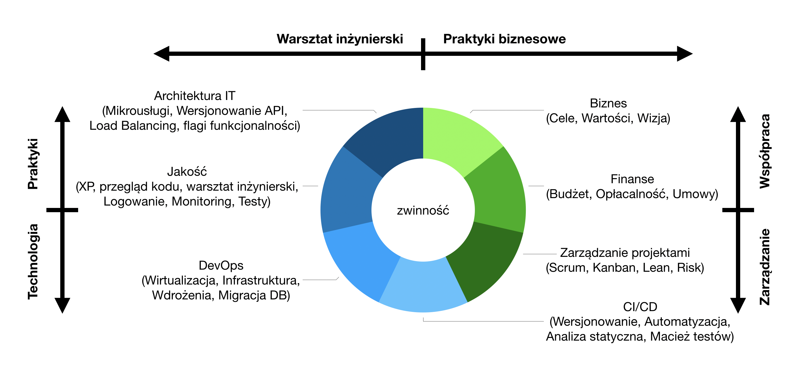
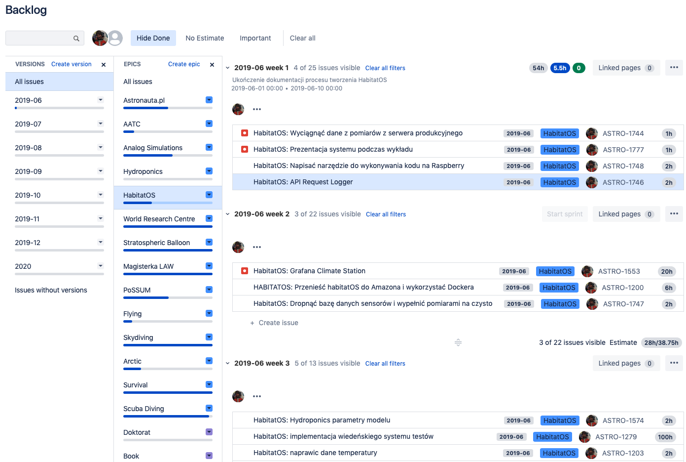
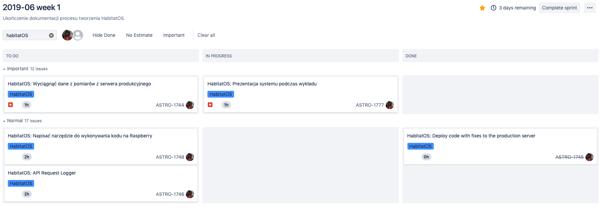
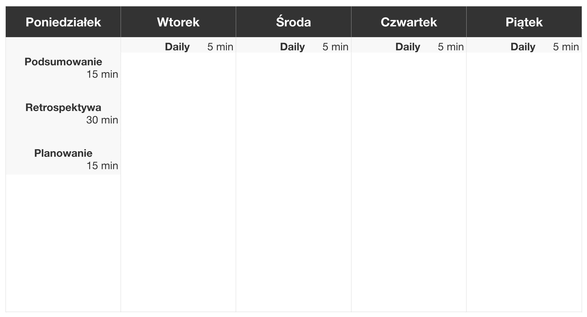
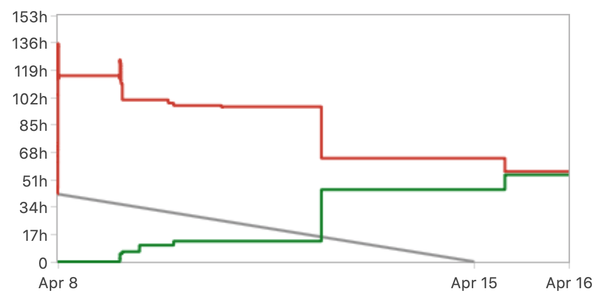

******************
Metodyki wytwórcze
******************

Projekt systemu operacyjnego jest dużym przedsięwzięciem wymagającym odpowiedniego planowania pracy, rozliczania przyrostów oraz wersjonowania kodu.

Do planowania pracy wykorzystano podejście zwinne (ang. *Agile*) wraz z metodyką *Scrum* :cite:`ScrumGuide2017`. Proces ten kładzie nacisk na terminowe rozliczanie niewielkich przyrostów funkcjonalności spełniających wartości biznesowe. Przyrosty te zwane są "iteracjami" lub "sprintami". Zgodnie z dobrymi praktykami iteracje nie powinny być dłuższe niż jeden miesiąc, ale zaleca się skrócenie takich pętli do tygodnia. Reguły dobrych praktyk podejścia zwinnego przedstawiono w załączniku ":ref:`Manifest zwinnego wytwarzania oprogramowania`".

Podejście zwinne wymaga połączenia umiejętności miękkich, zarządzania projektami oraz technicznych aspektów. Schemat :numref:`figure-process-agile-understanding` przedstawia sposób rozumienia pojęcia "Agile" przez autora pracy.

.. figure:: /_img/agile-understanding-simple.png
    :scale: 75%
    :align: center

    Agility is achieved only by combining Business Practices and Technical Craftsmanship. Agile is not only about Scrum.

    Schemat rozumienia przez autora pojęcia zwinność w kontekście wytwarzania oprogramowania.

Planowanie pracy
================
Planowanie długoterminowe jest prowadzone przy wykorzystaniu tzw. rejestru produktu (ang. *backlog*) (:numref:`figure-process-scrum-backlog`). Jest to lista przypadków użycia systemu wraz z podziałem na wartości biznesowe (ang. *epic*). W rejestrze produktu zadania są ułożone zgodnie z priorytetem, gdzie najbardziej krytyczne funkcjonalności znajdują się na górze listy. W *backlogu* stale zaplanowane są trzy iteracje na przód. Dzięki czemu możliwa jest synchronizacja zespołów zewnętrznych oraz wczesne poinformowanie ośrodków, gdzie wdrożony jest system o planowanym rozwoju.

    Wizualizacja rejestru produktu prowadzonego w systemie *JIRA* z podziałem na wartości biznesowe oraz planowanie czasowe.

Większe komponenty systemu oraz wartości biznesowe są przedstawione za pomocą umiejscowionych w czasie map drogowych (ang. *roadmap*). Jest to graficzna wizualizacja wyglądem przypominająca wykres *Gantt* (:numref:`figure-process-scrum-roadmap`). Głównym elementem wykresu jest pozioma oś czasu na której naniesione są planowane zadania. Długość bloku zadania świadczy o jego pracochłonności i rozciąga się od daty planowanego rozpoczęcia do daty przewidywanego zakończenia prac. Dzięki mapom drogowym możliwe jest poglądowe przedstawienie postępów oraz kontrola oddawania funkcjonalności w czasie.

.. figure:: img/scrum-roadmap.png
    :name: figure-process-scrum-roadmap

    Wizualizacja mapy drogowej projektu prowadzonego w systemie *JIRA*. Kolory zadań określają przynależność do kategorii. Czerwony marker w postaci pionowej linii przedstawia obecną datę.

Częstsze oddawanie przyrostów pozwala na szybsze i łatwiejsze wdrożenia. W rezultacie kod trafia na serwer mniejszymi paczkami. Ilość miejsc potencjalnie narażonych na błędy jest również znacznie mniejsza. Częstsza integracja prowadzi do wykrywania problemów na wczesnym etapie wytwarzania oprogramowania. W tym okresie koszt poprawy jest zdecydowanie mniejszy niż po wdrożeniu. W celu śledzenia postępów oddawania pracy podczas sprintu wykorzystywany jest tzw. *sprintlog*, który przedstawiono na :numref:`figure-process-scrum-sprintlog`

    Wizualizacja tablicy śledzenia postępu prac w ramach iteracji dla projektu prowadzonego w systemie *JIRA*.

Rozliczanie przyrostów
======================
W trakcie tworzenia systemu praca planowana jest w przyrostach tygodniowych (:numref:`figure-process-scrum-week`), w których rozliczenie następuje w każdy poniedziałek o 9:00 rano. Podsumowywane są wtedy zrealizowane tematy, kod wdrażany jest na środowisko produkcyjne i dokonywane jest planowanie następnego przyrostu. Ponadto 30 minut dedykowane jest również na inspekcję skuteczności procesu oraz na propozycje zmian w działaniu w nadchodzącym sprincie.

    Plan tygodnia z przedstawiający orientacyjne umiejscowienie spotkań zgodnie z metodyką *Scrum*.

Każde z zadań w *backlogu* posiada wstępnie oszacowaną pracochłonność, która jest precyzowana w miarę zbliżania się terminu podjęcia zadania do iteracji i deklaracji jego rozwiązania. Podczas rozliczenia następuje podsumowanie skuteczności wdrożenia oraz planowania iteracji. Informacja o oszacowanym czasie oraz faktycznie wykorzystanym na realizację funkcjonalności zapisywana jest jako skuteczność planowania. Taki wkład pozwala na naukę w trakcie wytwarzania systemu dokładniejszego precyzowania czasochłonności wykonania co przekłada się na lepsze określanie wysokopoziomowej mapy drogowej (ang. *roadmap*).

Powyższa metodologia odznacza się większą skutecznością w dostarczaniu systemów ze zmieniającymi się wymaganiami w określonym reżimie czasu od tradycyjnego podejścia kaskadowego (ang. *Waterfall*) zwanego *Software Development Life Cycle* (*SDLC*). Proces *Scrum* jest obecnie najszerzej wdrożonymi praktykami w środowisku wytwarzania oprogramowania :cite:`ScrumGuide2017`. Znajduje zastosowanie w wiodących firmach informatycznych, jak również w organizacjach przemysłu obronnego, lotniczego, kosmicznego i sektora publicznego.

Mierzenie postępu oraz efektywności prac
========================================
W trakcie iteracji na podstawie pracochłonności wyliczana jest ilość pozostałej pracy. Jest to stosunek ilości zrealizowanej funkcjonalności do całości zaplanowanej na przyrost. Wyliczone wartości można zobrazować na wykresie uzyskując tzw. "wykres spalania" (ang. *burndown chart*). Zależność ta pozwala na kontrolę czy zadania realizowane są w odpowiednim tempie umożliwiającym dotrzymanie terminu wdrożenia. Przykładowy wykres spalania przedstawiono na :numref:`figure-process-scrum-burndown`

    Przykładowy wykres spalania wygenerowany dla projektu prowadzonego w systemie *JIRA*. Wykres przedstawia ilość pracy zrealizowanej (zielona linia), ilość pracy pozostałej (czerwona linia) oraz linia pomocnicza idealnego przebiegu (szary kolor). Przedstawiony wykres ukazuje zakres pozostałej pracy po zamknięciu iteracji, który odbył się jeden dzień po planowanym terminie.

Ilość pracy zrealizowanej w danym przyroście to tzw. "prędkość". Wykres prędkości (ang. *velocity chart*) obrazuje stosunek zaplanowanej pracy do wykonanej. W celu otrzymania średniej prędkości iteracji należy wyliczyć średnią arytmetyczną z siedmiu ostatnich przyrostów :cite:`ScrumGuide2017`. Otrzymane wartości pozwalają na wkład do planowania i umożliwiają trafne określanie zakresu przyrostów. Skuteczność tej metody zmienia się wraz z odkrywaniem zależności w systemie oraz doprecyzowywaniem działania poszczególnych jego elementów.

.. figure:: img/scrum-velocity.png
    :name: figure-process-scrum-velocity

    Przykładowy wykres prędkości  wygenerowany dla projektu prowadzonego w systemie *JIRA*. Wykres przedstawia ilość pracy zrealizowanej (zielona słupek) oraz ilość pracy zaplanowanej (szary słupek). Różnica wysokości wykresów pozwala na określenie niedoszacowania lub przeszacowania pracochłonności zakresu iteracji.

W celu zwiększania precyzji szacowania, przewidywania czasu oddania przyrostów wartości biznesowych oraz inspekcji wąskich gardeł procesu wykorzystywane są również inne wykresy, tj.:

    - Burnup Chart,
    - Sprint Report,
    - Cumulative Flow Diagram,
    - Version Report,
    - Epic Report,
    - Control Chart,
    - Epic Burndown,
    - Release Burndown,
    - Resolution Time Report,
    - Version Workload Report,
    - Time Tracking Report.
