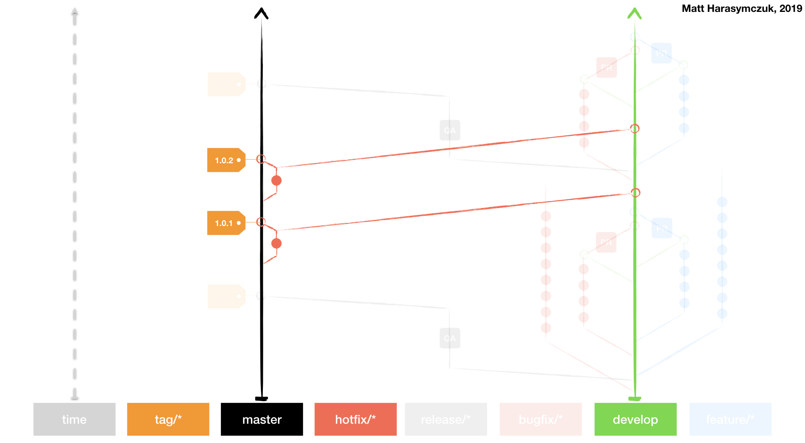
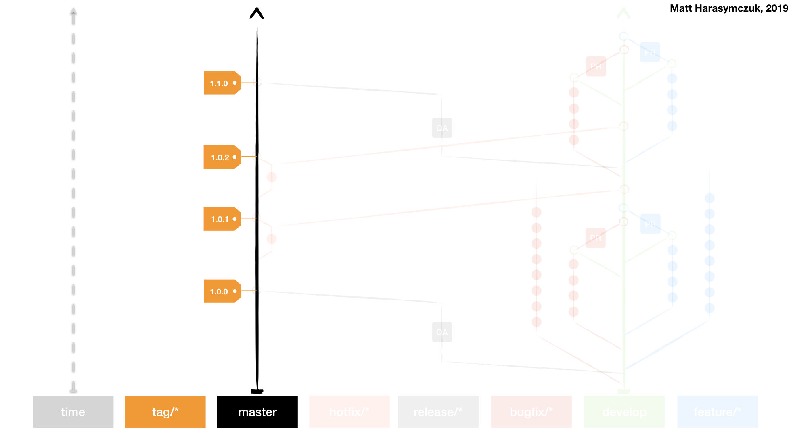

******************************
Proces kontroli wersji i zmian
******************************

W ramach projektu zadbano o jakość opracowanych rozwiązań. Dla poprawy kodu aplikacji stworzonego w ramach systemu mają zastosowanie ogólnie przyjęte dobre praktyki wytwarzania oprogramowania oraz konwencje nazewnicze zgodne o ogólnoświatowym standardem.

Projekty informatyczne, w których wytwarzanie zaangażowane jest wiele osób wymagają odpowiedniego podejścia do zarządzania zarówno wersjami jak i kodem źródłowym. W każdym oprogramowaniu, które jest aktywnie rozwijane zachodzi konieczność wprowadzenia systemu kontroli wersji takiego jak np. *GIT*. Narzędzie to pozwala w prosty i efektywny sposób na scalanie i śledzenie zmian wprowadzanych przez programistów. Największą zaletą tego typu systemu jest możliwość równoległej pracy nad systemem przez wiele osób. Zaproponowany system kontroli zmian pozwala na dowolne skalowanie zespołu programistów i jest zgodny ze standardem dobrych praktyk inżynierii oprogramowania na świecie.

Aby utrzymać przejrzystość oraz możliwość szybkiego śledzenia zmian, w systemie kontroli wersji został przyjęty standard nazewnictwa kolejnych przyrostów (ang. *commit*) oraz gałęzi (ang. *branch*) z nowymi funkcjonalnościami oraz poprawkami błędów. Przyjęta konwencja jest standardem opartym na schemacie *GIT Flow*.

Aby zachować spójność ze standardem opisu zmian w systemach informatycznych zastosowano opisy w języku angielskim. Każda zmiana w systemie kontroli wersji jest opisana według następującego przykładu:

    ``ID-1337 Moduł: Opis przyrostu funkcjonalności #time 120m``

Powyższy przykład pokazuje zastosowanie odpowiedniego identyfikatora zadania w systemie do zarządzania projektem. Następny element w opisie zmiany określa etykietka modułu, w którym wprowadzono usprawnienia. Pozostała część opisu powinna jak najlepiej oddawać charakter wprowadzonej poprawki opisując dokładnie zmiany. Na końcu całego opisu zastosowano identyfikator ``#time`` informujący o ilości minut, która została poświęcona na wprowadzanie zmiany. Zastosowanie takiego formatu pozwala na raportowanie czasu pracy oraz umożliwia lepsze planowanie zmian w systemie zadań. Długość pierwszej linii opisu wraz z identyfikatorem nie powinna przekraczać 80 znaków.

Dzięki zastosowaniu takiej konstrukcji system do przechowywania repozytorium może wymieniać informacje z aplikacją do zarządzania zadaniami oraz przyporządkowywać dany kod przypadkom użycia. Umożliwia to także łatwą weryfikację oraz śledzenie postępu pracy nad konkretną funkcjonalnością.

Zarządzanie głównymi gałęziami rozwoju oprogramowania
=====================================================
W ramach konwencji nazewniczej *GIT Flow* wyróżnia się szereg specyficznych gałęzi rozwojowych oprogramowania. Każda z nich posiada unikalną rolę. Do głównych gałęzi można zaliczyć:

    - stabilna gałąź kodu produkcyjnego - ``master``,
    - "żyjąca" gałąź integracyjna - ``develop``,
    - rodzina gałęzi przygotowania wdrożenia wersji - ``release/X.Y``,
    - rodzina gałęzi nowych funkcjonalności - ``feature/*``,
    - rodzina gałęzi poprawek błędów planowanych - ``bugfix/*``,
    - rodzina gałęzi poprawek błędów środowiska produkcyjnego - ``hotfix/*``,
    - rodzina gałęzi procesu *Pull Request* - ``pr/*``.

W powyższej liście zastosowano ogólnie przyjętą konwencję użycia znaku gwiazdki * aby określić dowolny ciąg znaków po podanym wyrażeniu. Litery ``X`` i ``Y`` odnoszą się do wersji odpowiednio ``major`` i ``minor`` z semantycznego wersjonowania.

Proces i umiejscowienie poszczególnych gałęzi rozwojowych w ramach projektu zobrazowano na :numref:`figure-process-gitflow-overview` zamieszczonym poniżej. Strzałki oznaczają kierunek przyrostu a oś czasu biegnie z dołu do góry grafiki. Skierowanie osi czasu w górę jest ogólnie przyjętą zasadą na świecie przy określaniu przepływów w systemach kontroli wersji. Strzałki określają kierunek scalania zmian, a kropki poszczególne commity.

.. figure:: img/gitflow-all.png
    :name: figure-process-gitflow-overview

    Schemat konwencji nazewniczej *GIT Flow* obrazujący rozmieszczenie gałęzi rozwojowych oprogramowania.

Gałąź kodu produkcyjnego
========================
W repozytorium główną gałęzią jest ``master``. Przechowywana jest w nim stabilna wersja kodu będąca odpowiednikiem zmiany znajdującej się na środowisku produkcyjnym. Scalenie kodu do *brancha* ``master`` jest równoważne z wydaniem nowej wersji. Jest to dopuszczalne jedynie, gdy testy automatyczne, funkcjonalne, regresyjne i jednostkowe nie pozostawiają wątpliwości na temat stabilności oraz braku defektów we wprowadzonych zmianach. Branch ten odpowiada sytuacji na serwerze produkcyjnym z działającą aplikacją operującą na rzeczywistych danych. Grafika poglądowa :numref:`figure-process-gitflow-master` przedstawia wizualizację procesu wprowadzania zmian do gałęzi ``master``.

.. figure:: img/gitflow-lean.png
    :name: figure-process-gitflow-master

    Schemat scalania funkcjonalności z gałęzią kodu produkcyjnego.

Gałąź integracyjna
==================
W dużych repozytoriach, nad którymi pracuje wiele osób równocześnie, tj. więcej niż jeden 6±3 osobowy zespół, zachodzi konieczność wprowadzenia integracyjnej gałęzi rozwojowej. Zabieg ten ma na celu zabezpieczenie brancha ``master`` przez scalaniem kodu mogącego zaburzyć jego stabilność. Dzięki takiemu podejściu proces staje się nieznacznie bardziej skomplikowany, ale za to pewniejszy i przewidywalny.

W takim przypadku w repozytorium główną gałęzią rozwojową staje się *branch* ``develop``. Przechowywana jest w nim najnowsza wersja oprogramowania ze scalonymi ukończonymi funkcjonalnościami. Gałąź ``develop`` powinna przechowywać kod, co do którego poprawności nie ma zastrzeżeń. Kod powinien się budować oraz być odpowiednio przetestowany. Z gałęzi rozwojowej ``develop`` w każdym momencie można stworzyć tzw. kandydata do wdrożenia (ang. *release candidate*) i branch ``release/X.Y``, gdzie litery ``X`` i ``Y`` symbolizują kolejną wersję zgodną z semantic versioning.

.. figure:: img/gitflow-master-develop.png
    :name: figure-process-gitflow-develop

    Schemat scalania funkcjonalności z gałęzią integracyjną.

Dopuszcza się możliwość niewykorzystywania gałęzi ``develop`` w komponentach systemu, gdy ich wielkość jest nieznaczna a wprowadzenie dodatkowego procesu przejściowego jest nadmierne. Nie zwalnia to z obowiązku utrzymywania stabilnego kodu w gałęzi głównej (``master``) i wymaga wprowadzenia podobnego procesu weryfikacji zmian dla każdej poprawki lub/i funkcjonalności. Proces ten musi być tożsamy z testowaniem wdrożenia na środowisko produkcyjne.

Przy takim podejściu kod jest scalany mniejszymi, lecz częstszymi przyrostami (:numref:`figure-process-gitflow-github`). Powoduje to, iż problemy integracyjne ujawniają się znacznie szybciej. Rozwiązywanie małych konfliktów jest nie tylko łatwiejsze, ale również nie wymaga dużej ingerencji w projekt. Stan powyżej opisany jest wysoce pożądany wraz z wprowadzeniem tzw. *Continuous Delivery*. Do czasu uzyskania odpowiedniej dojrzałości procesowej, zaleca się stosowanie pośredniczącej gałęzi ``develop`` w celu integrowania zmian. Grafika :numref:`figure-process-gitflow-develop` przedstawia wizualizację umiejscowienia zmian w tej gałęzi rozwojowej.

.. figure:: img/gitflow-github.png
    :name: figure-process-gitflow-github

    Schemat scalania funkcjonalności z gałęzią kodu produkcyjnego przy braku gałęzi integracyjnej.

Rodzina gałęzi wdrożeniowych
============================
Wprowadzenie gałęzi integracyjnej, która w standardzie *GIT Flow* nazywana jest ``develop``, nakłada konieczność wprowadzenia procesu wdrażania kodu, tj. scalania go z kodem produkcyjnym ``master``. W trakcie wdrożenia następuje moment wydzielenia gałęzi tzw. kandydata do wdrożenia (ang. *release candidate*) o nazwie:

    ``release/X.Y``

gdzie sekwencja numeryczna odpowiadająca kolejnej wersji np. ``release/1.4`` lub ``release/1.12``. Schemat procesu zobrazowano na :numref:`figure-process-gitflow-release` Identyfikatory ``X.Y`` oznaczają numer wersji zgodnie z wcześniejszym opisem konwencji *semantic versioning*, tj. ``major.minor``. Konwencja nazewnicza wersji przedstawiona jest w podrozdziale ":ref:`Konwencja nazewnicza wersji`".

Następnie na gałęzi z rodziny ``release/*`` uruchamiane są testy oraz w razie konieczności wprowadzane są poprawki przedwdrożeniowe. Po pozytywnym przejściu przez proces weryfikacji jakości gałąź jest scalana z ``master`` a zmiana jest oznaczana numerem wersji wdrożenia. Wszelkie akcje użytkownika końcowego oraz testera są zautomatyzowane tak, aby proces weryfikacji odbywał się autonomicznie.

.. figure:: img/gitflow-release.png
    :name: figure-process-gitflow-release

    Schemat scalania gałęzi integracyjnej z gałęzią kodu produkcyjnego za pośrednictwem gałęzi wdrożeniowych.

Rodziny gałęzi nowych funkcjonalności i poprawek błędów
=======================================================
Aby ułatwić wyszukiwanie wprowadzanych zmian w repozytorium oraz powiązania ich z przypadkami użycia i zgłoszeniami błędów w systemie zarządzania projektami, w projekcie przyjęto konwencję nazywania gałęzi według następującego schematu:

    ``feature/ID-1337-opis-nowej-funkcjonalnosci``

    ``bugfix/ID-1337-opis-planowanej-poprawki-bledu``

    ``hotfix/ID-1337-poprawka-krytycznego-bledu-na-srodowisku-produkcyjnym``

Zgodnie z powyższym przykładem, nowa funkcjonalność powinna być poprzedzona stosownym przedrostkiem ``feature/`` a poprawka błędów ``bugfix/``. Następnie po prefiksie następuje unikalny identyfikator zadania, później zwięzły kilkuwyrazowy opis wprowadzonych modyfikacji. W opisie stosowany jest wyłącznie język angielski. Spacje w opisie funkcjonalności lub błędu są zamieniane na myślniki. Nie wykorzystuje się znaków specjalnych, interpunkcyjnych i diakrytycznych. Długość całej nazwy wraz z identyfikatorem nie powinna przekraczać 80 znaków.

Dzięki zastosowaniu powyższej konwencji w repozytorium wszystkie zmiany należą do odpowiednich gałęzi i są klarownie i jednoznacznie opisane. Ponadto uzyskano separację i pełną przejrzystość jak również możliwość śledzenia historii wprowadzanych zmian w projekcie. Dodatkowo możliwe jest dokładne śledzenie wszystkich zmian i łączenie ich z odpowiednimi zleceniami prac w systemie do zarządzania projektem.

Gałęzie nowych funkcjonalności
==============================
Gałęzie rozwojowe z rodziny ``feature/*`` (:numref:`figure-process-gitflow-feature`) służą do wprowadzania nowych funkcjonalności do systemu. Ich nazewnictwo jest ściśle powiązane z systemem kontroli zadań (ang. *issue tracker*). Gałęzie te nie powinny istnieć dłużej niż sprint, gdyż wszystkie planowane funkcjonalności muszą zostać zgranulowane do zadań odpowiednich w stosunku do długości iteracji.

.. figure:: img/gitflow-feature-pr.png
    :name: figure-process-gitflow-feature

    Schemat scalania gałęzi funkcjonalności z gałęzią kodu produkcyjnego.

Gałęzie poprawek planowanych
============================
Gałęzie ``bugfix/*`` (:numref:`figure-process-gitflow-bugfix`) służą do wprowadzania poprawek błędów znalezionych podczas produkcji oprogramowania a system scalania ich z kodem źródłowym jest podobny do obsługi zmian w ramach kategorii ``feature/*``. Podobnie jak w przypadku wdrażania planowanych funkcjonalności gałęzie te nie powinny istnieć dłużej niż sprint. Wszystkie planowane zmiany muszą zostać zgranulowane do zadań odpowiednich w stosunku do iteracji.

.. figure:: img/gitflow-bugfix.png
    :name: figure-process-gitflow-bugfix

    Schemat scalania zmian z rodziny gałęzi poprawek planowanych do kodu źródłowego aplikacji.

Gałęzie poprawek produkcyjnych
==============================
Branche z kategorii ``hotfix/*`` (:numref:`figure-process-gitflow-hotfix`) odpowiadają za przechowywanie kodu poprawek błędów znalezionych na środowisku produkcyjnym. Dzięki takiej konwencji nazewniczej i separacji gałęzi ich obsługa, np. wdrożenie na środowisko, może być przyspieszona. Wszystkie zmiany, które znajdą się w gałęziach ``hotfix/*`` mogą omijać standardową procedurę wdrożenia, tj. stworzenie brancha ``release/X.Y`` i uruchamianie testów.

Zmiany priorytetowe mają na celu natychmiastowe przywrócenie działania oprogramowania, np. po krytycznym błędzie na środowisku produkcyjnym, gdzie każda sekunda zwłoki powoduje straty. Zmiany te dopiero w późniejszym etapie poddawane są normalnemu procesowi testowania i weryfikacji. Powyższy mechanizm pozwala na szybkie przywrócenie stabilności systemu. Ta funkcjonalność jest używana jedynie w uzasadnionych i ściśle kontrolowanych przypadkach.

    Schemat scalania zmian z rodziny gałęzi poprawek produkcyjnych do kodu źródłowego aplikacji.

Gałęzie procesu przeglądu kodu i scalania zmian
===============================================
Przed wprowadzeniem jakichkolwiek zmian do gałęzi integracyjnych wymagany jest proces tzw. scalenia zmian (ang. *Pull Request*) przedstawiony na :numref:`figure-process-pr-branch` Polega on na stworzeniu podsumowania zmienionego kodu, tj. dodane i usunięte linijki wraz ze zmodyfikowaną treścią.

.. figure:: img/gitflow-feature-pr.png
    :name: figure-process-pr-branch

    Schemat procesu scalania zmian.

Na karcie *Pull Request* zgodnie ze schematem :numref:`figure-process-pull-request` system ciągłej integracji zamieszcza informacje o wyniku statycznej analizy oraz testów. Gdy wszystkie testy zakończą się bez błędów, a zmiana uzyska zgodę (ang. *approve*) innych członków zespołu wytwarzającego oprogramowanie, pojawia się możliwość scalenia funkcjonalności do docelowej gałęzi (zwykle ``develop``).

.. figure:: img/gitflow-pull-request.png
    :name: figure-process-pull-request

    Karta podsumowania proces scalania zmian z informacją dotyczącą wyników z systemu budowania i ciągłej integracji.

Proces ten uodparnia kod na przypadkowe błędy. Większa ilość osób zaangażowanych w przegląd kodu procentuje w postaci zmniejszenia długu technicznego. Ponadto powyższe rozwiązanie spełnia funkcję edukacyjną, gdzie osoby z większym doświadczeniem przekazują wiedzę dotyczącą architektury systemu oraz konsekwencji wprowadzonych zmian.

Oznaczanie etykietą wersji
==========================
Po scaleniu gałęzi ``release/X.Y`` następuje proces oznaczania odpowiedniego momentu w historii przez tzw. oznaczanie etykietką (ang. *tag*). Proces przedstawiono na schemacie :numref:`figure-process-pr-tag` Każda etykieta ma nazwę zgodną z konwencją wersjonowania semantycznego. Dzięki temu w każdej chwili istnieje możliwość szybkiego powrotu do dowolnego wdrożenia w celu identyfikacji i usunięcia zgłaszanych przez użytkowników błędów.

    Schemat scalania gałęzi integracyjnej do gałęzi kodu produkcyjnego za pośrednictwem rodziny gałęzi wdrożeniowych. Na schemacie przedstawiony jest również moment tworzenia etykiety wersji.

Konwencja nazewnicza wersji
===========================
W ramach projektu na poziomie systemowym ma zastosowanie konwencja nazewnicza semantycznego wersjonowania (ang. *Semantic Versioning*). Kolejnym przyrostom aplikacji przyporządkowana jest unikalna nazwa zobrazowana na listingu poniżej:

    ``X.Y.Z``

Każda z kolejnych części rozdzielonych kropką jest liczbą naturalną (przykład ``1.23.1``). Pierwszy segment oznacza tzw. wersję ``major``, środkowy ``minor``, a ostatni ``bugfix``.

Wersja ``major`` jest używana do określania zmian niekompatybilnych wstecznie lub przełomowych względem publicznie dostępnego interfejsu systemu (ang. *Application Programming Interface*, *API*). Wszystkie narzędzia produkowane wewnętrznie lub zewnętrznie powinny precyzyjnie określać wersję zależności ``major`` aplikacji, gdyż ma to krytyczny wpływ na ich działanie oraz kompatybilność.

Wersja ``minor`` jest używana do określenia kolejnych przyrostów funkcjonalności aplikacji. Zgodnie z konwencją nazewniczą funkcjonalności w publicznym *API* dla danej wersji powinny wyłącznie przyrastać, chyba że jest to jasno określone i przeprowadzone zgodnie z polityką wyprowadzania zmian z użycia (ang. *deprecation policy*). Wprowadzone zmiany w wersji ``minor`` nie powinny powodować niekompatybilności pomiędzy oprogramowaniem zewnętrznym i wewnętrznym. Pozwala to na bezpieczną aktualizację systemów bez obawy o błędne działanie systemu. Z doświadczenia autora wynika, iż reguła ta jest często naruszana i należy bezwzględnie zwracać uwagę na testy oprogramowania przy jakichkolwiek nawet najmniejszych zmianach zależności.

Wersja ``bugfix`` jest przeznaczona do wyłącznie dla numeracji poprawek bezpieczeństwa oraz funkcjonalności, wprowadzonych omyłkowo lub zauważonych podczas zwiększenia wersji ``minor``. Aktualizacja systemu do najnowszej wersji ``bugfix`` w ramach tej samej ``major`` i ``minor`` powinna być bezproblemowa i nie powinna wprowadzać, żadnych zmian w systemie poza eliminacją wykrytych błędów. Podobnie jak w przypadku aktualizacji oprogramowania z wersją ``minor`` tak również wersje ``bugfix`` potrafią być sporadycznie nośnikiem nowych błędów. Należy wykonywać testy automatyczne przy każdej aktualizacji zależności zewnętrznych nawet dotyczących wersji ``bugfix``.

Wszystkie narzędzia w ramach projektu są opatrzone odpowiednią zależnością konkretnej wersji. Dla ułatwienia odbiorcom systemu wprowadzono również wersję ``latest`` ułatwiającą określenie najnowszej wersji projektu. Docelowo na wszystkich zainstalowanych instancjach powinna być zawsze najnowsza wersja systemu, zawierająca najbardziej aktualne poprawki bezpieczeństwa oraz przyrosty funkcjonalności.
