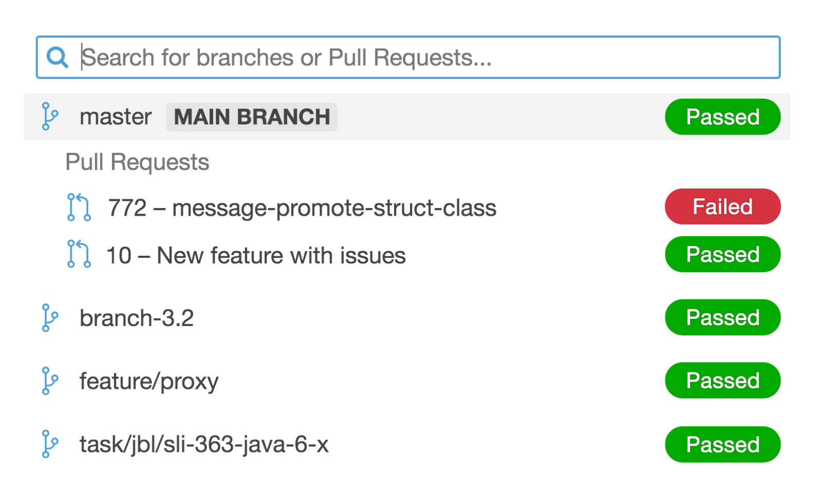
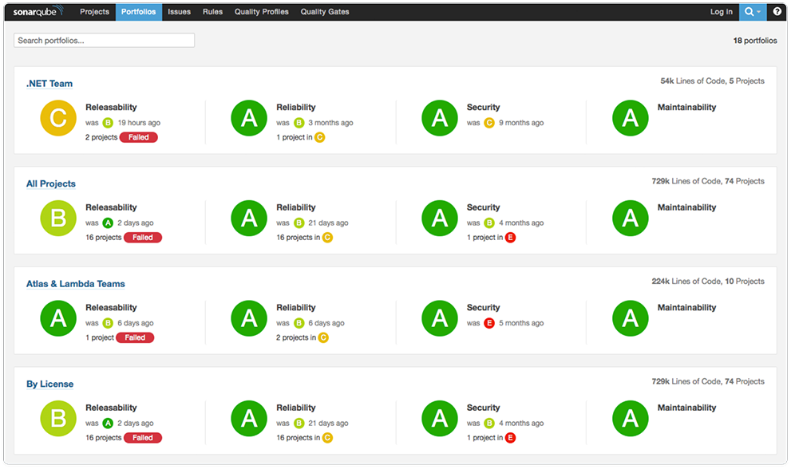

********
Licenses
********

Rationale
=========
Plans & Pricing https://www.sonarsource.com/plans-and-pricing/

* Community
* Developer (https://www.sonarqube.org/developer-edition/)
* Enterprise (https://www.sonarqube.org/enterprise-edition/)
* Data Center (https://www.sonarsource.com/plans-and-pricing/data-center/)

LOC are computed by summing up the LOC of each project analyzed.
The LOC count for a project is the LOC count of the project's largest branch.

.. figure:: img/sonarqube-license-a.png
    :scale: 33%
    :align: center

    SonarQube Plans & Pricing [planandpricing]_

Pricing
=======
SonarQube is priced per instance per year and based on your lines of code (LoC). An instance is an installation of SonarQube. You pay per instance for a maximum number of LoC to be analyzed.

LOCs are computed by summing up the main/program LoCs of each project analyzed. Lines of test code are never included in this number. The LoCs used for a project are the LoCs found during the most recent analysis of this project. If you start using the branch analysis feature, then the counted LOCs of a project will be the ones of the biggest branch of that project.

If you are getting close to the threshold you will be notified to either upgrade your plan or reduce the number of LOCs in your projects.

If you reach the limit, your SonarQube instance will stop accepting new analyses.

Community Edition
=================
* Cost: Free & Open Source
* SonarQube & 60+ plugins
* SonarLint
* 15 languages

    * Java
    * JavaScript
    * C#
    * TypeScript
    * Kotlin
    * Ruby
    * Go
    * Scala
    * Flex
    * Python
    * PHP
    * HTML
    * CSS
    * XML
    * VB.NET

Developer Edition
=================
* Free, 14-day evaluation license
* Licensed by Lines of Code
* Available up to 20M Lines of Code.
* Beyond, you surely need governance features which come with Enterprise Edition.
* Cost: Starts at €120 (per year) [pricingde]_

    * 100,000 LoC - €120
    * 250,000 LoC - €900
    * 500,000 LoC - €1,800
    * 1 Million LoC - €3,000
    * 2 Million LoC - €6,000
    * 5 Million LoC - €17,500
    * 10 Million LoC - €36,000
    * 20 Million LoC - €50,000

* Branch Analysis
* Pull Request Decoration
* Detection of injection flaws
* SonarLint notifications
* Security Vulnerabilities
* Security Hotspots
* 22 languages

    * Java
    * JavaScript
    * C#
    * TypeScript
    * Kotlin
    * Ruby
    * Go
    * Scala
    * Flex
    * Python
    * PHP
    * HTML
    * CSS
    * XML
    * VB.NET
    * **C**
    * **C++**
    * **Objective-C**
    * **PL/SQL**
    * **ABAP**
    * **T-SQL**
    * **Swift**

    Branch Analysis [licde]_

.. figure:: img/sonarqube-feature-pr-a.png
    :scale: 50%
    :align: center

    Pull Request decoration [licde]_

.. figure:: img/sonarqube-feature-security-a.png
    :scale: 50%
    :align: center

    Security Vulnerabilities and Security Hotspots [licde]_

Enterprise Edition
==================
* Free, 14-day evaluation license
* Licensed by Lines of Code
* Cost: starts at €15'000 [pricinee]

    * 1 Million LoC - €15,000
    * 5 Million LoC - €25,000
    * 10 Million LoC - €37,500
    * 20 Million LoC - €50,000
    * 30 Million LoC - €75,000
    * 50 Million LoC - €90,000
    * 75 Million LoC - €125,000
    * 100 Million LoC - €180,000

* All Developer Edition features
* Portfolio Management
* Security Reports
* Executive Reporting
* Project Transfer
* 27 languages

    * Java
    * JavaScript
    * C#
    * TypeScript
    * Kotlin
    * Ruby
    * Go
    * Scala
    * Flex
    * Python
    * PHP
    * HTML
    * CSS
    * XML
    * VB.NET
    * C
    * C++
    * Objective-C
    * PL/SQL
    * ABAP
    * T-SQL
    * Swift
    * **Apex**
    * **COBOL**
    * **PL/I**
    * **RPG**
    * **VB6**

.. figure:: img/sonarqube-feature-portfolio-a.png
    :scale: 75%
    :align: center

    Portfolio Management  [licee]_

.. figure:: img/sonarqube-feature-portfolio-b.png
    :scale: 75%
    :align: center

    Portfolio Management  [licee]_

.. figure:: img/sonarqube-feature-security-b.png
    :scale: 33%
    :align: center

    OWASP / SANS security reports in projects and portfolios [licee]_

Data Center Edition
===================
* Free, 14-day evaluation license
* Cost: starts at €100,000
* Designed for High Availability
* All Enterprise Edition features
* Component redundancy
* Data Resiliency
* Horizontal Scalability
* Expert technical support

Data Center Edition is ideal for mission-critical enterprise deployments that need a secure and reliable infrastructure to manage code quality and security. It allows distributed teams to collaborate on large projects by combining SonarSource's industry-leading, open source code quality and security tools, ensuring maximum uptime and data resiliency.

    Portfolio Management Portfolios, Metrics consolidation, Executive reporting, Project Transfer (from multiple SonarQube servers into a central instance) [licdce]_

References
==========
.. [licpricing] https://www.sonarsource.com/plans-and-pricing/
.. [licde] https://www.sonarqube.org/developer-edition/
.. [licee] https://www.sonarqube.org/enterprise-edition/
.. [licdce] https://www.sonarsource.com/plans-and-pricing/data-center/
.. [pricingde] https://www.sonarqube.org/trial-request/developer-edition/
.. [pricingee] https://www.sonarqube.org/trial-request/enterprise-edition/
