*******
Quality
*******

Rationale
=========
* Jim McCall Software Quality Model (1977)
* Barry W. Boehm Software Quality Model (1978)
* FURPS/FURPS+ software quality model
* R. Geoff Dromey Software Quality Model
* ISO/IEC 9126 Software Quality Model (1993)
* ISO/IEC 25010 Software Quality Model (2011)

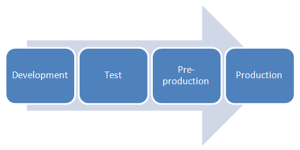

    Software phases [trevinchow]_

.. figure:: img/qualitymodels-capers1996-a.png
    :scale: 100%
    :align: center

    Capers, Jones. Applied Software Measurement: Global Analysis of Productivity and Quality. 1996. [Capers1996]_

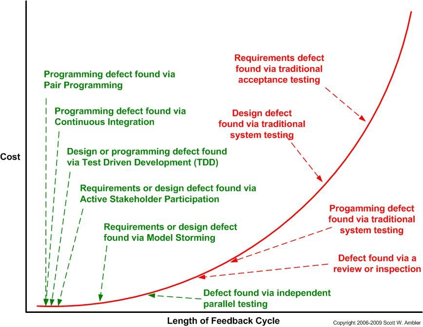

    Ambler, Scott W. Length of Feedback Cycle. 2009. [Ambler2009]_

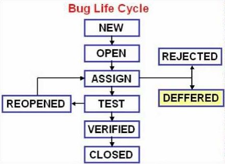

    Software Bug Life Cycle [softwaretestingvideos]_

Jim McCall Software Quality Model (1977)
========================================
Jim McCall's software quality model is also known as the GE model (General Electrics Model). It originally originated in the US Air Force, mainly for system developers and system development processes. McCall tries to bridge the gap between developers and end users through a series of software quality attribute indicators.

The McCall quality model uses 3 perspectives to define and identify the quality of software products:

* Product revision (ability to change).
* Product transition (adaptability to new environments).
* Product operations (basic operational characteristics).

The McCall model details these three perspective definitions (product modification, product transfer, and product operation) through hierarchical elements, standards, and indicators.

11 Factors (To specify): Describe the external perspective of the software, that is, the perspective of the customer or user.
23 Criterias (To build): Describe the internal perspective of the software, that is, the developer's perspective.
Metrics (To control): Define metrics and methods
In the figure below, there are 11 quality elements on the left and 23 quality standards on the right.

.. figure:: img/qualitymodel-mccall1977-a.png
    :scale: 50%
    :align: center

    Product Quality as defined in Jim McCall Software Quality Model (1977) [gaochundong]_

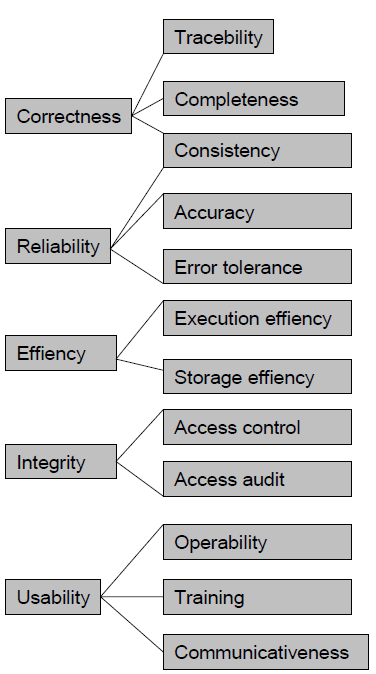

    Product Quality as defined in Jim McCall Software Quality Model (1977) [gaochundong]_

.. figure:: img/qualitymodel-mccall1977-c.png
    :scale: 50%
    :align: center

    Product Quality as defined in Jim McCall Software Quality Model (1977) [gaochundong]_

Barry W. Boehm Software Quality Model (1978)
============================================
The Boehm software quality model attempts to quantify software quality through a series of attribute indicators. Boehm's quality model includes hardware attributes that are not in the McCall model. The Boehm model is also similar to McCall's quality model, using a hierarchical quality model structure, including high-level attributes, middle-level attributes and original attributes.

High-level attributes mainly focus on 3 issues:

    * As-is utility
    * Maintainability
    * Portability

The middle attribute contains 7 quality elements:

    * Portability (General utility characteristics)
    * Reliability (As-is utility characteristics)
    * Efficiency (As-is utility characteristics)
    * Usability (As-is utility characteristics, Human Engineering)
    * Testability (Maintainability characteristics)
    * Understandability (Maintainability characteristics)
    * Flexibility (Maintainability characteristics, Modifiability)

It can be seen that the Boehm model is somewhat similar to the McCall model. The difference is that the McCall model mainly focuses on the accurate measurement of high-level attributes ("As-is utility"), while the Boehm model is based on a wider range of attributes, and maintains the maintainability. More attention.

.. figure:: img/qualitymodel-boehm1978-a.png
    :scale: 50%
    :align: center

    Product Quality as defined in Barry W. Boehm Software Quality Model (1978) [gaochundong]_

.. figure:: img/qualitymodel-boehm1978-b.png
    :scale: 50%
    :align: center

    Product Quality as defined in Barry W. Boehm Software Quality Model (1978) [gaochundong]_

FURPS/FURPS+ software quality model
===================================
The FURPS model was originally proposed by Robert Grady, and was later extended to FURPS+ by Rational Software.

The FURPS model includes:

    * Functionality
    * Usability
    * Reliability
    * Performance
    * Supportability

FURPS includes two different types: functional and non-functional.

R. Geoff Dromey Software Quality Model
======================================
The Dromey software quality model consists of 3 main elements.

Product properties that influence quality:

    #. High level quality attributes
    #. Means of linking the product properties with the quality attributes.
    #. Constructing the quality model includes the following 5 steps:

Chose a set of high-level quality attributes necessary for the evaluation.

    #. List components/modules in your system.
    #. Identify quality-carrying properties for the components/modules (qualities of the component that have the most
    #. impact on the product properties from the list above).
    #. Determine how each property effects the quality attributes.
    #. Evaluate the model and identify weaknesses.

.. figure:: img/qualitymodel-dromey-a.png
    :scale: 75%
    :align: center

    Product Quality as defined in R. Geoff Dromey Software Quality Model [gaochundong]_

ISO/IEC 9126 Software Quality Model (1993)
==========================================
ISO/IEC 9126: Software Product Evaluation: Quality Characteristics and Guidelines for their Use-standard

The ISO/IEC 9126 model is based on the McCall and Boehm models, while adding functional requirements, and also includes identifying the internal and external quality attributes of software products.

6 quality characteristics of software:

    #. Functionality: When the software is used under specified conditions, the software product's ability to provide functions that meet explicit and implicit needs;
    #. Reliability: The ability of a software product to maintain a specified performance level when used under specified conditions;
    #. Usability (Usability): When used under specified conditions, the software product's ability to be understood, learned, used and attracted to users;
    #. Efficiency (Efficiency): Under specified conditions, relative to the amount of resources used, the software product's ability to provide appropriate performance;
    #. Maintainability: The ability of a software product to be modified. Modifications may include corrections, improvements or the degree of adaptation of the software to changes in the environment, requirements and functional specifications;
    #. Portability: The ability of a software product to migrate from one environment to another.

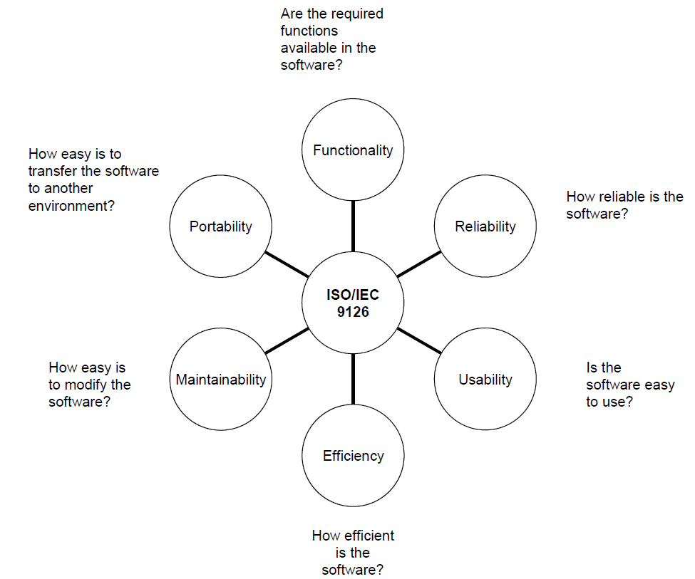

    Product Quality as defined in ISO/IEC 9126 [gaochundong]_

.. figure:: img/qualitymodel-iso9126-b.png
    :scale: 75%
    :align: center

    Product Quality as defined in ISO/IEC 9126 [gaochundong]_

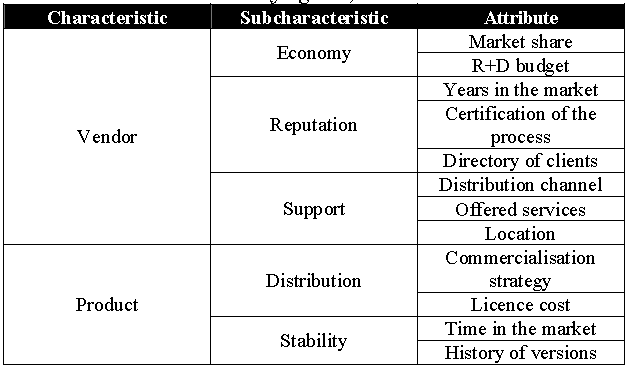

    Product Quality as defined in ISO/IEC 9126 [gaochundong]_

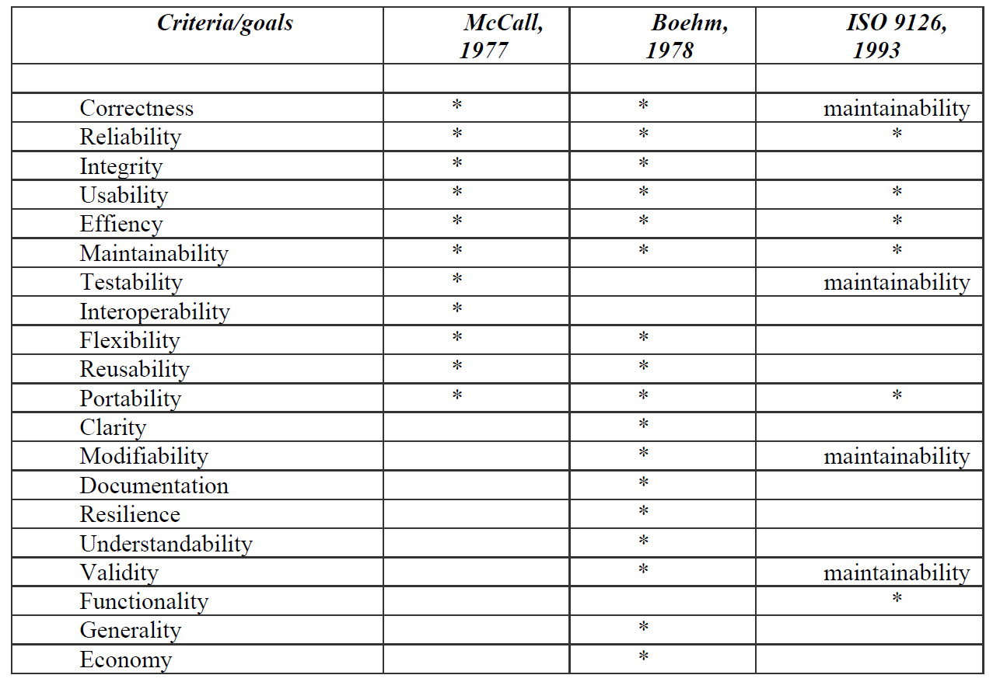

    Product Quality as defined in ISO/IEC 9126 [gaochundong]_

ISO/IEC 9128
============
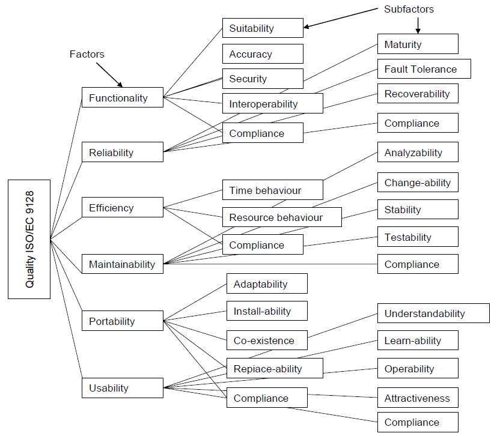

    Product Quality as defined in ISO/IEC 9128 [gaochundong]_

ISO/IEC 25010 Software Quality Model (2011)
===========================================
ISO/IEC 9126-1:2001 has been replaced and repealed by ISO/IEC 25010:2011.

The figure above illustrates the organization of the ISO/IEC 25000 SQuaRE series of standards, and its components are called divisions. The divisions within the SQuaRE series of international standards are:

ISO/IEC 2500n Quality Management Division. The standards that make up this division define all common models, terms, and definitions referenced by all other standards in the SQuaRE series of standards. Citation paths and advanced practical advice on the use of appropriate standards for specific applications are helpful to all types of users. This division also provides requirements and guidelines for supporting functions responsible for managing software product requirements and evaluation.

ISO/IEC 2501n Quality Model Division. The standards that make up this division give a detailed quality model that includes the characteristics of software internal quality, software external quality, and software usage quality. In addition, the internal and external software quality characteristics are broken down into sub-characteristics, and practical guidelines for using the quality model are provided.

ISO/IEC 2502n Quality Measurement Division. The standards that make up this division include software product quality measurement reference models, mathematical definitions of quality measurement and practical guidelines for its application. The measurement applied to the internal quality of the software, the external quality of the software and the quality of use is given. The quality measurement elements that constitute the basis of subsequent measurement are defined and given.

ISO/IEC 2503n Quality Requirements Division. The standards that make up this division help users specify quality requirements. These quality requirements can be used in the process of extracting the quality requirements of the software product to be developed or used as input to the evaluation process. The requirements definition process can be mapped to the technical process defined in ISO/IEC 15288.

ISO/IEC 2504n Quality Evaluation Division. The standards that make up this division give the requirements, recommendations and guidelines for software product evaluation whether performed by the evaluator, the demander or the developer. It also provides measurement documentation support as an evaluation module.
ISO/IEC 25050 to ISO/IEC 25099 are reserved for SQuaRE expansion of international standards and/or technical reports.

The software quality model contains 8 features and is further decomposed into multiple sub-features that can be measured internally and externally.

ISO/IEC 25010 adds new software usage quality, which contains 5 characteristics and is further divided into multiple sub-characteristics that can be measured.

Use quality: In a specific use environment, the software product's ability to enable specific users to achieve specific goals of effectiveness, productivity, safety, and satisfaction.

.. figure:: img/qualitymodel-iso25010-a.jpeg
    :scale: 125%
    :align: center

    Product Quality as defined in ISO/IEC 25010 [ISO25010a]_

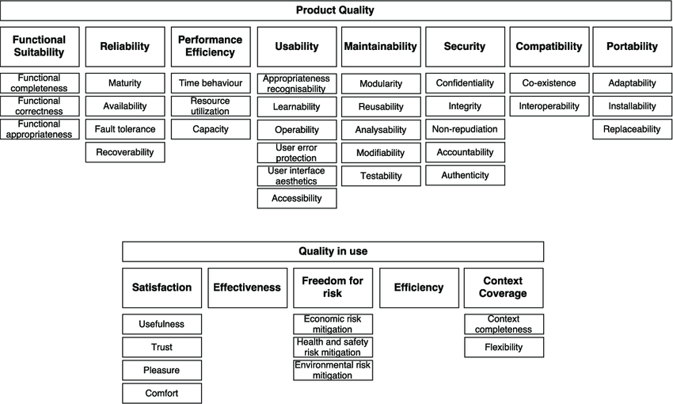

    Product Quality as defined in ISO/IEC 25010 [ISO25010b]_

.. figure:: img/qualitymodel-iso25010-c.png
    :scale: 100%
    :align: center

    Product Quality as defined in ISO/IEC 25010 [ISO25010c]_

.. figure:: img/qualitymodel-iso25010-d.png
    :scale: 100%
    :align: center

    Product Quality as defined in ISO/IEC 25010 [gaochundong]_

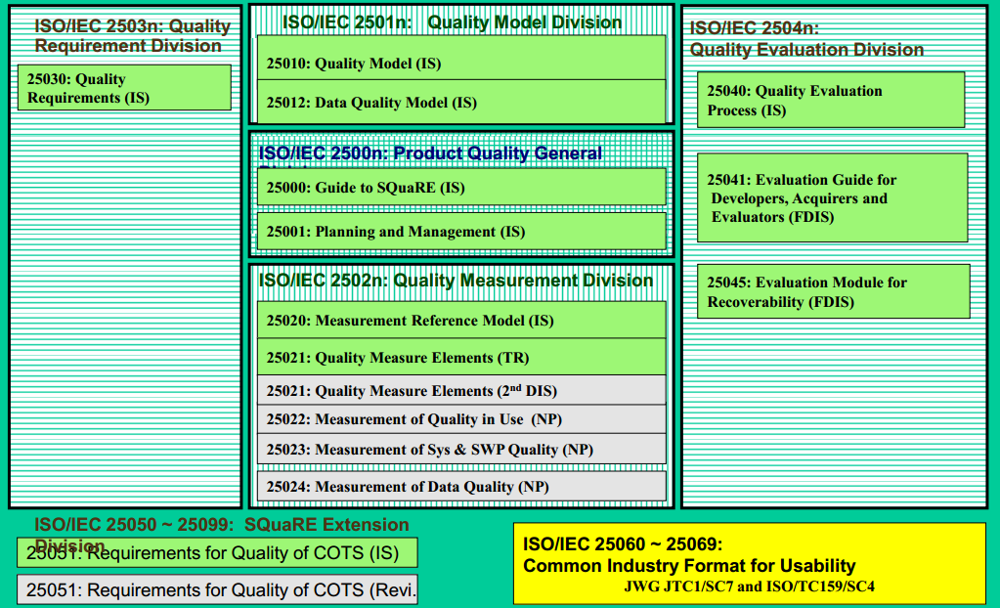

    Product Quality as defined in ISO/IEC 25010 [gaochundong]_

.. figure:: img/qualitymodel-iso25010-f.png
    :scale: 100%
    :align: center

    Product Quality as defined in ISO/IEC 25010 [gaochundong]_

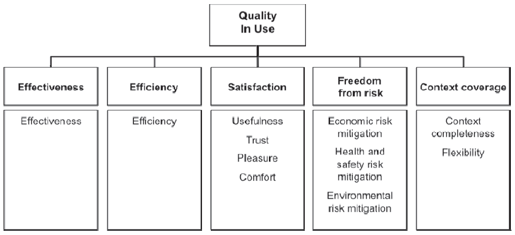

    Product Quality as defined in ISO/IEC 25010 [gaochundong]_

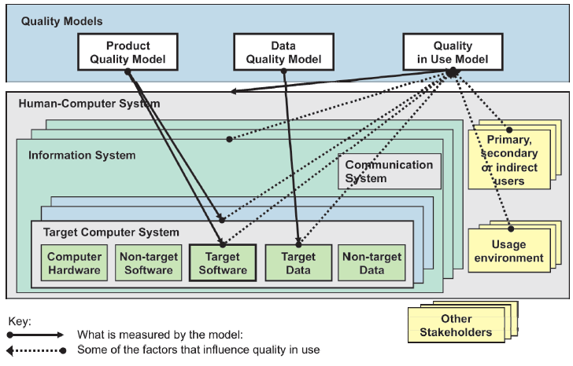

    Product Quality as defined in ISO/IEC 25010 [gaochundong]_

.. figure:: img/qualitymodel-iso25010-i.png
    :scale: 100%
    :align: center

    Product Quality as defined in ISO/IEC 25010 [gaochundong]_

References
==========
.. [ISO25010a] https://imgv2-2-f.scribdassets.com/img/document/359403248/original/7a4d41d66f/1571558160?v=1

.. [ISO25010b] https://www.researchgate.net/profile/Lina_Garces4/publication/326584873/figure/download/fig2/AS:652083346808834@1532480193500/Standard-ISO-IEC-25010-Software-product-quality-model-and-system-quality-in-use-model.png

.. [ISO25010c] https://www.researchgate.net/profile/Kristof_Szabados/publication/263765466/figure/download/fig2/AS:296093788196866@1447605668147/Software-product-quality-according-to-ISO-IEC-25010.png

.. [gaochundong] The Pleasure Of Craftsmanship. Sangmado. 2013. https://www.cnblogs.com/gaochundong/p/3492353.html

.. [Capers1996] Caperes, Jones. Applied Software Measurement: Global Analysis of Productivity and Quality. https://www.stickyminds.com/sites/default/files/shared/2018-12-10%20ArthurHicken%20The%20Shift-Left%20Approach%20to%20Software%20Testing%20image3.png

.. [Ambler2009] https://i.pinimg.com/originals/03/56/d5/0356d5b67c51ebbb14dde386896bcb83.jpg

.. [trevinchow] http://trevinchow.com/blog/wp-content/uploads/2007/08/image1.png

.. [softwaretestingvideos] https://i.pinimg.com/736x/99/02/d8/9902d84f84b9987661bb6b9696b83d2c.jpg
