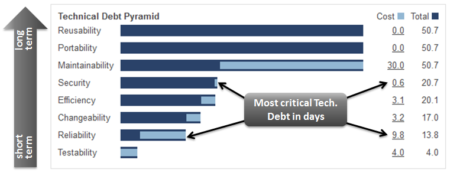

*************
Quality SQALE
*************

Rationale
=========
SQALE (Software Quality Assessment based on Lifecycle Expectations) is a method to support the evaluation of a software application source code. It is a generic method, independent of the language and source code analysis tools, licensed under the Creative Commons Attribution-NonCommercial-NoDerivs 3.0 Unported license.[1] Software editors can freely use and implement the SQALE method. [SQALEwiki]_

Principles
==========
* The quality of the source code is a non-functional requirement.
* The requirements in relation to the quality of the source code have to be formalised according to the same quality criteria as all other requirements.
* Assessing the quality of a source code is in essence assessing the distance between its state and its expected quality objective.
* The SQALE method assesses the distance to the conformity with the requirements by considering the necessary remediation cost for bringing the source code to conformity.
* The SQALE method respects the representation condition.
* The SQALE method uses addition for aggregating the remediation costs and for calculating its quality indicators.
* The SQALE method's quality model is orthogonal.
* The SQALE method's quality model takes the software's lifecycle into account.

Concepts
========
* The quality model
* The analysis model
* The indices
* The indicators
* The quality model

The quality model
=================
The SQALE Quality Model is used for formulating and organising the non-functional requirements that relate to the code's quality. It is organised in three hierarchical levels. The first level is composed of characteristics, the second of sub-characteristics. The third level is composed of requirements that relate to the source code's internal attributes. These requirements usually depend on the software's context and language.

The analysis model
==================
The SQALE analysis model contains on the one hand the rules that are used for normalising the measures and the controls relating to the code, and on the other hand the rules for aggregating the normalised values. The SQALE method normalises the reports resulting from the source code analysis tools by transforming them into remediation costs. To do this, either a remediation factor or a remediation function is used. The SQALE Method defines rules for aggregating the remediation costs, either in the Quality Model's tree structure, or in the hierarchy of the source code's artefacts.

The indices
===========
All SQALE indices represent costs. These costs can be calculated in work unit, in time unit or in monetary unit. In all cases, the indices values are on a scale of ratio type. They can be handled with all the allowed operations for this type of scale. For any element of the hierarchy of the source code artefacts, the remediation cost relating to a given characteristic can be estimated by adding all remediation costs linked to the requirements of the characteristic. The indices of SQALE characteristics are the following:

    * SQALE Testability Index : STI
    * SQALE Reliability Index : SRI
    * SQALE Changeability Index : SCI
    * SQALE Efficiency Index : SEI
    * SQALE Security Index : SSI
    * SQALE Maintainability Index : SMI
    * SQALE Portability Index : SPI
    * SQALE Reusability Index : SRuI

The method also defines a global index: For any element of the hierarchy of the source code artefacts, the remediation cost relating to all the characteristics of the quality model can be estimated by adding all remediation costs linked to all the requirements of the quality model. This derived measurement is called: SQALE Quality Index: SQI For the AGILE Software Development, the SQI index correspond to the design debt (or technical debt) of the project. The method also defines index densities which allow comparing the products quality of different size (for example SQID: SQALE Quality Density Index).

    Technical Debt Pyramid. In this example, the amount of critical debt (that means related to the « Reliability » and “Security ” layers of the pyramid) is 10.4 days, or 20% of total. [SQALE]_

.. figure:: img/qualitymodel-sqale-b.png
    :scale: 100%

    Technical Debt Pyramid. The reliability of your application depends also on other efforts performed on additional activities like peer reviews, beta testing, etc. [SQALE]_

.. figure:: img/qualitymodel-sqale-c.png
    :scale: 100%

    Technical Debt Pyramid. Business Impact [SQALE]_

The indicators
==============
The SQALE method defines three synthesised indicators. Each user can define indicators according to his needs.

References
==========
.. [SQALEwiki] https://en.wikipedia.org/wiki/SQALE
.. [SQALE] http://www.sqale.org
