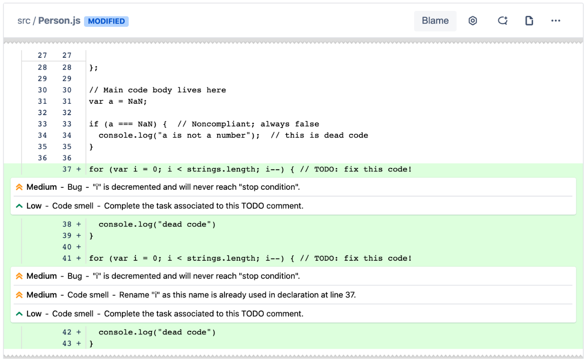

*********
SonarQube
*********

Issues
======
* Cykl życia
* Poziom istotności
* Zagadnienia ręczne

Quality Profiles
================
* Reguły jakościowe
* Dostosowanie do potrzeb projektu
* Jednonolita polityka jakościowa
* Zasady dziedziczenia

Quality Gates
=============
* Statusy
* Notyfikacje
* Definiowanie bram

Kokpity
=======
* Widgety

Widoki różnicowe
================
* W zakresie miar
* W zakresie zagadnień

Administracja i bezpieczeństwo
==============================
* Konta użytkowników
* Grupy
* System uprawnień
* Konfiguracje globalne

Rozszerzenia systemu
====================
* Integracja
* Zarządzanie
* Języki
* Analizatory zewnętrzne
* Metryki
* Wizualizacja i raportowanie

Dobre i złe praktyki
====================
* Pre-commit check

Bitbucket Integration
=====================
* Sonar for Bitbucket
* https://www.sonarqube.org/atlassian-bitbucket-integration/
* https://github.com/mibexsoftware/sonar-bitbucket-plugin
* https://marketplace.atlassian.com/apps/1212735/sonar-for-bitbucket-server?hosting=server&tab=overview
* https://ch-mibex-sonar4bitbucket.herokuapp.com/webhook

.. code-block:: json
    :caption: sonar.json

    {
      "sonarHost": "https://sonarcloud.io",
      "sonarProjectKey": "MyProjectKey"
    }

SonarQube Commercial Editions tightly integrate with Atlassian Bitbucket Server so your team can write clean, quality code all day long!

    Atlassian Bitbucket Server integration [sqbb]_

.. figure:: img/sonarqube-integrations-bitbucket-b.png
    :scale: 50%
    :align: center

    Atlassian Bitbucket Server integration [sqbb]_

.. figure:: img/sonarqube-integrations-bitbucket-c.png
    :scale: 75%
    :align: center

    Atlassian Bitbucket Server integration [sqbb]_

References
==========
.. [sqbb] https://www.sonarqube.org/atlassian-bitbucket-integration/
