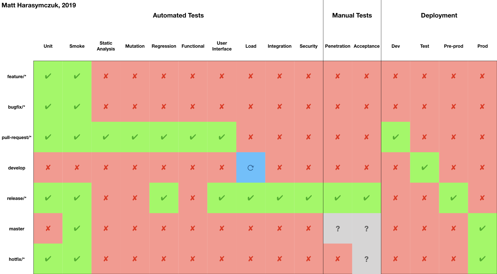
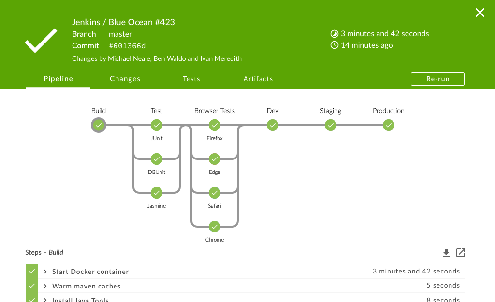

Continuous Integration
======================

.. contents::

Jenkins
-------
* ``jenkins/jenkins:alpine`` - jenkins latest
* ``jenkinsci/blueocean`` - jenkins:lts + blue ocean

.. literalinclude:: src/run-jenkins.sh
    :language: sh

Configuration for Java
----------------------
.. literalinclude:: src/Jenkinsfile.java
    :language: groovy

Configuration for Python
------------------------
.. literalinclude:: src/Jenkinsfile.python
    :language: groovy

Slides
------
.. figure:: img/ecosystem-big-picture.png
    :width: 90%
    :align: center

.. figure:: img/cicd-failing.png
    :width: 90%
    :align: center

Alternatives
------------
Server:

    * Jenkins https://www.jenkins.io
    * Team City https://www.jetbrains.com/teamcity/
    * Bamboo https://www.atlassian.com/software/bamboo
    * GitLab https://about.gitlab.com

Cloud:

    * Bitbucket Pipelines https://bitbucket.org/product/features/pipelines
    * GitHub Actions https://github.com/features/actions
    * Travis for Open Source https://travis-ci.org
    * Travis for Organizations https://www.travis-ci.com
    * Circle CI https://circleci.com
    * GitLab Cloud https://about.gitlab.com
    * Tekton https://tekton.dev
