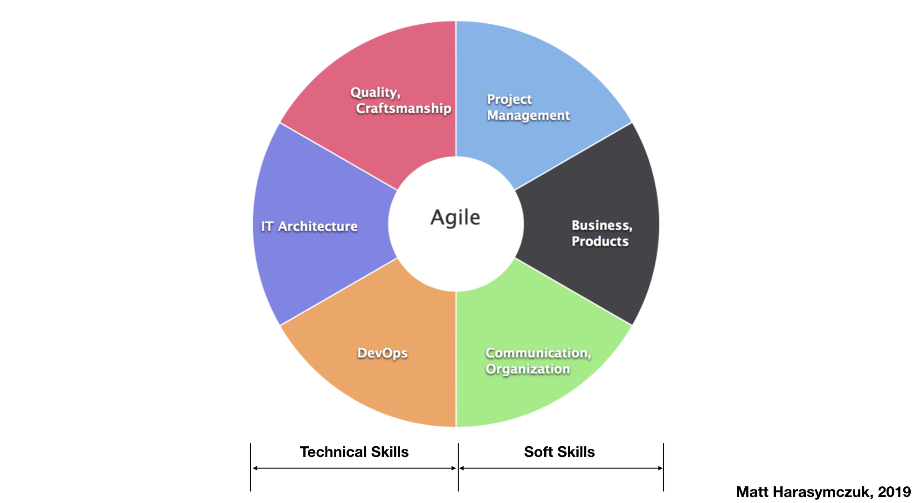
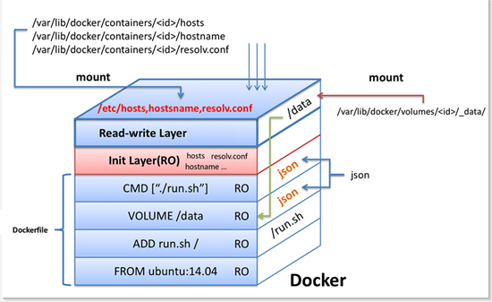
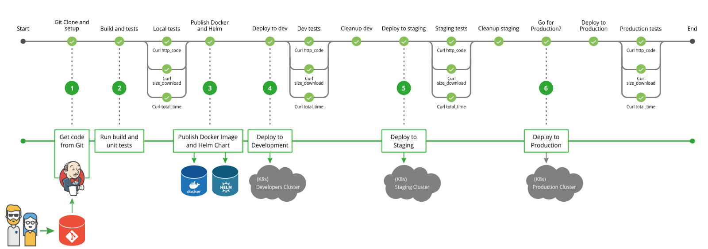
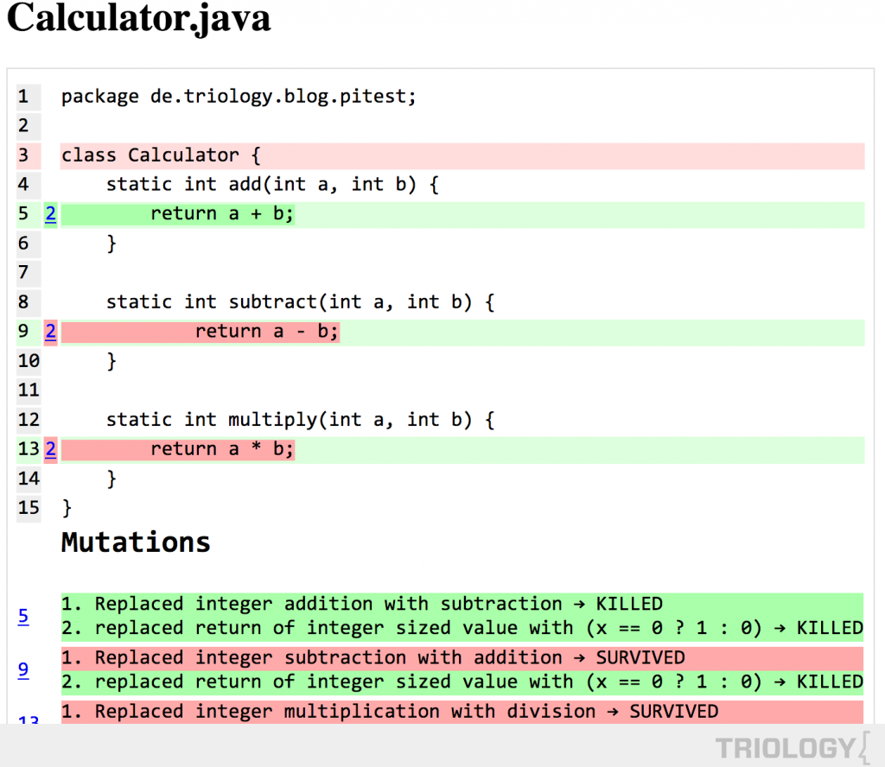
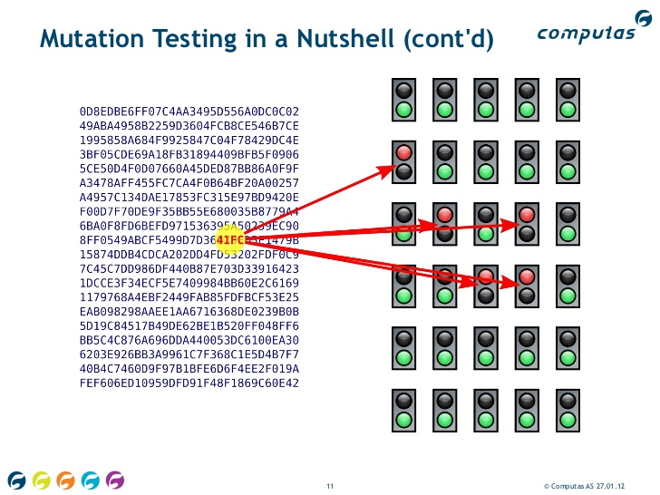

*******
Summary
*******

Agility
=======

.. figure:: img/agility-v2.png
    :scale: 50%

Scrum
=====
.. figure:: img/scrum-week.png
    :scale: 50%

Ecosytem
========
.. figure:: img/ecosystem-big-picture.png
    :scale: 50%

.. figure:: img/ecosystem-tools.png
    :scale: 50%

Docker
======

Git and Git Flow
================
.. figure:: img/gitflow-all.png
    :scale: 50%

.. figure:: img/gitflow-github.png
    :scale: 50%

.. figure:: img/gitflow-lean.png
    :scale: 50%

.. figure:: img/gitflow-pull-request.png
    :scale: 50%

CI/CD
=====

.. figure:: img/cicd-failing.png
    :scale: 50%

.. figure:: img/cicd-success.png
    :scale: 50%

.. figure:: img/cicd-strategy.png
    :scale: 50%

Testing
=======
.. figure:: img/testing-mutation-1.jpg
    :scale: 50%

