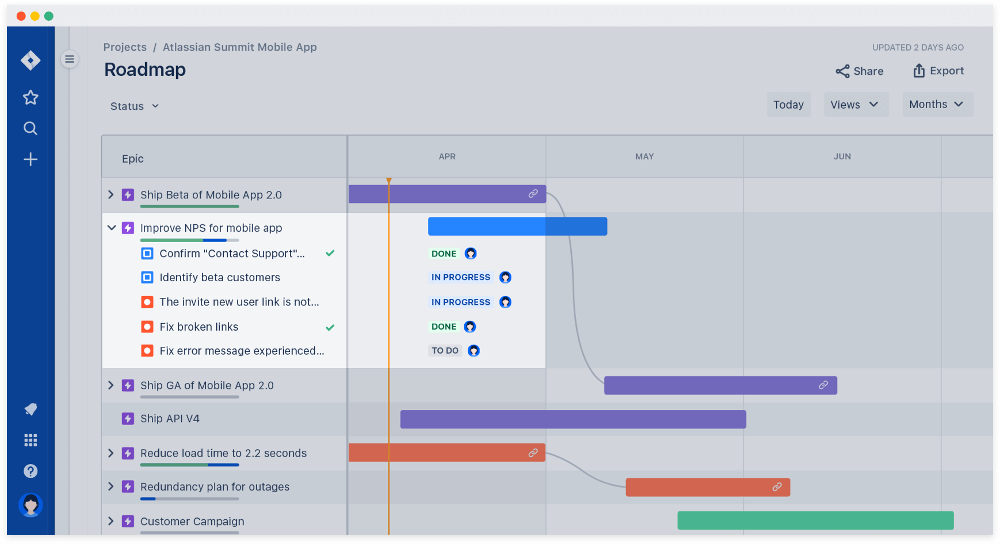
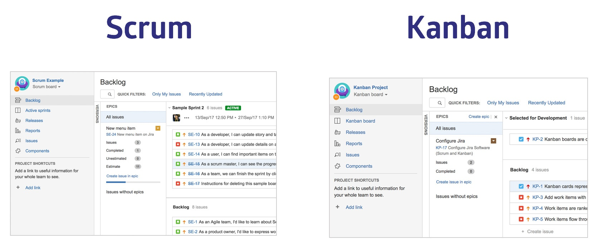
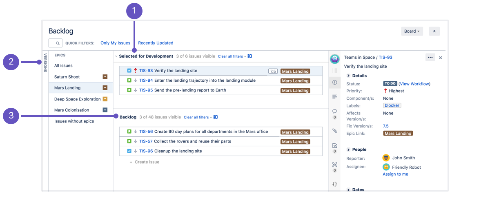
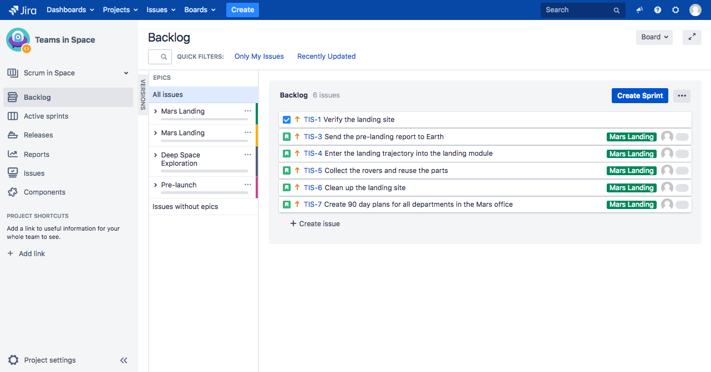

*******************
Summary in Pictures
*******************

Agility
=======
.. figure:: img/agility-v2.png
    :width: 90%
    :align: center

Ecosystem
=========
.. figure:: img/ecosystem-big-picture.png
    :width: 90%
    :align: center

.. figure:: img/ecosystem-tools.png
    :width: 90%
    :align: center

Git and Git Flow in CI/CD
=========================
.. figure:: img/gitflow-all.png
    :width: 90%
    :align: center

.. figure:: img/gitflow-github.png
    :width: 90%
    :align: center

.. figure:: img/gitflow-lean.png
    :width: 90%
    :align: center

CI/CD
=====
.. figure:: img/cicd-strategy.png
    :width: 90%
    :align: center

.. figure:: img/cicd-success.png
    :width: 90%
    :align: center

.. figure:: img/cicd-failing.png
    :width: 90%
    :align: center

Scrum
=====
.. figure:: img/scrum-week.png
    :width: 90%
    :align: center

Jira
====

.. figure:: img/jira-builds.png
    :width: 90%
    :align: center

.. figure:: img/jira-devpanel-1.png
    :width: 90%
    :align: center

.. figure:: img/jira-devpanel-3.png
    :width: 90%
    :align: center

.. figure:: img/jira-devpanel-2.png
    :width: 90%
    :align: center

.. figure:: img/bitbucket-create-branch.png
    :width: 90%
    :align: center

.. figure:: img/jira-pullrequest.png
    :width: 90%
    :align: center

.. figure:: img/jira-trigger.png
    :width: 90%
    :align: center

.. figure:: img/jira-versions.png
    :width: 90%
    :align: center

.. figure:: img/jira-release.png
    :width: 90%
    :align: center
